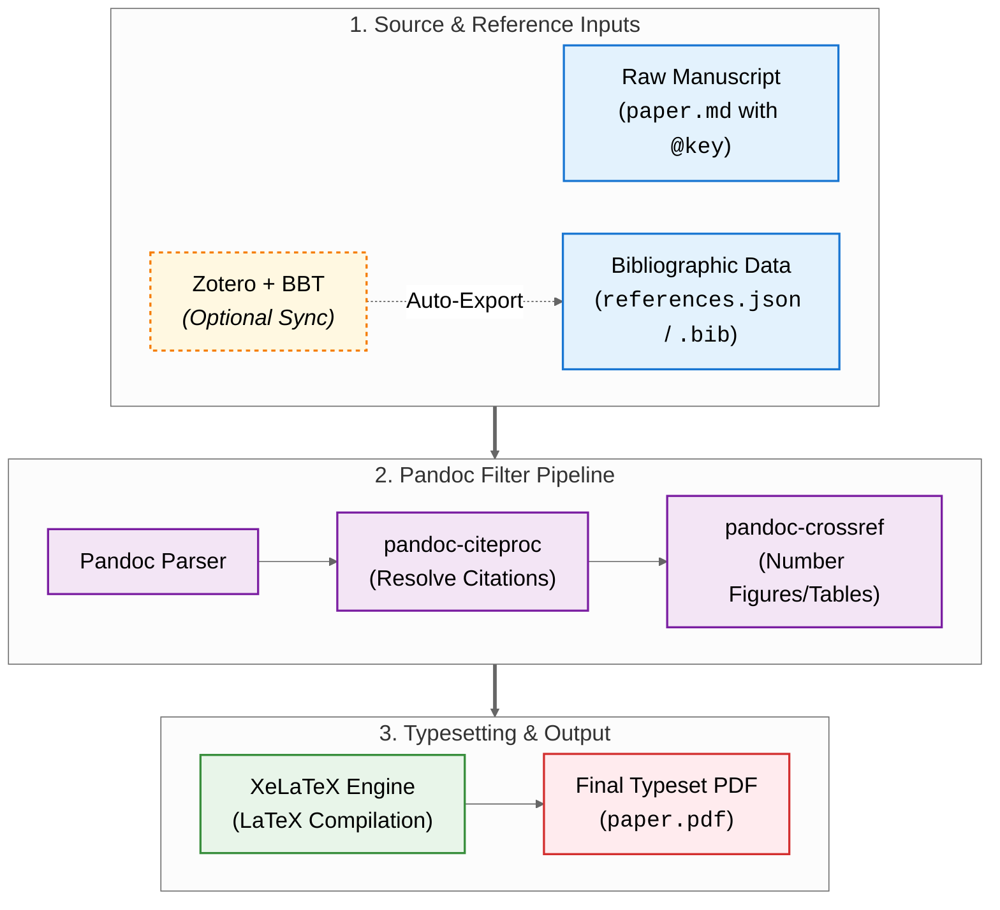

# Introduction: The Philosophy of Plain-Text Academia

The choice of writing tools in academic work is not merely a matter of technical preference; it is a philosophical commitment to a particular mode of scholarship. The modern plain-text academic workflow, built upon the foundation of Markdown, Pandoc, and LaTeX, is designed around a core principle: the complete **separation of content from presentation**. By authoring in plain-text Markdown, a researcher focuses exclusively on the substantive arguments, narrative structure, and data of their work, free from the distractions of visual layout [@healy2018plain].

Furthermore, this workflow is uniquely suited for the rigorous demands of modern research. Plain-text files integrate seamlessly with **version control systems** like Git, enabling meticulous tracking of every change, non-destructive experimentation with drafts, and transparent collaboration among authors—a process notoriously fraught with difficulty when using binary files [@healy2018plain]. The entire process, from the initial draft to the final PDF, can be automated with simple scripts, ensuring perfect **reproducibility** at any point in the future, a cornerstone of scientific and scholarly integrity.

This system is best understood not as a collection of disparate tools, but as a linear, modular data processing pipeline. The raw manuscript (`.md`) and bibliographic data (`.json` or `.bib`) serve as the initial inputs. While bibliographic entries can be manually curated or copied directly from scholarly repositories (e.g., [Google Scholar](https://scholar.google.com/), [arXiv](https://arxiv.org/)) into a plain-text `.bib` file, larger research projects often leverage reference managers like [Zotero](https://www.zotero.org/) with [Better BibTeX (BBT)](https://retorque.re/zotero-better-bibtex/) for automated library synchronization. These inputs are then passed through Pandoc and its filter chain: `pandoc-citeproc` resolves citation markers; `pandoc-crossref` numbers figures and equations [@lierdakil2021crossref]; and finally, a LaTeX engine like XeLaTeX performs the final typesetting to produce a PDF.



Each stage is discrete and transparent. This contrasts fundamentally with the monolithic, "black box" environment of a word processor, where these processes are intertwined and hidden from the user. The power of this workflow lies in the ability to control this pipeline, to swap out components, insert new processing stages, and debug any issue by inspecting the intermediate output at any point—for instance, by generating the intermediate `.tex` file to diagnose a LaTeX error. This level of control and transparency is the key to solving the complex, bespoke formatting challenges inherent in academic writing.

## Section 1: The Historical Context: From Hot Metal to Typewriters and TeX

Understanding the power of the modern plain-text workflow is enhanced by appreciating the profound technical challenges it solves. Before the advent of TeX and LaTeX, academic typesetting was a highly specialized, manual process defined by severe physical and mechanical constraints. The era of **hot metal typesetting** and later **"typewriter" composition** involved immense manual effort to produce complex documents.

The development of TeX by Knuth in the late 1970s and LaTeX by Lamport in the early 1980s marked a revolutionary shift [@knuth1984tex; @lamport1986latex]. They introduced the concept of programmatic, algorithmic typesetting based on semantic commands. The modern Pandoc user operates at an even higher level of abstraction, using a simple, universal syntax that can be compiled to LaTeX or other formats entirely.

# Part I: The Core Toolchain

## Section 2: Assembling Your Digital Workbench

Before embarking on the plain-text writing process, a robust environment is required. While one can install tools individually, this project demonstrates a modern, **containerized approach** to academic writing.

**Docker: The Reproducible Environment** A significant challenge in academic workflows is dependency management—ensuring that Pandoc, LaTeX packages, and helper scripts work consistently across different machines. To solve this, we utilize **[Docker](https://www.docker.com/)**. The entire toolchain is encapsulated in a Docker image (derived from [dalibo/pandocker](https://github.com/dalibo/pandocker)). This ensures that the build process is perfectly reproducible: if it builds on one machine, it will build on any machine with Docker installed. The complex "plumbing" of the workflow is abstracted away behind simple wrapper scripts (`./devops.sh` / `./devops.ps1`), allowing the author to focus solely on writing.

**The Scripted Build System** Behind the scenes, the `devops.sh` script orchestrates the build process. To manage complexity and ensure cross-platform compatibility (Linux, macOS, Windows), implementation details have been extracted into modular shell scripts in the `tools/` directory. These scripts handle tasks like font detection, PDF merging, and dependency checks, running transparently inside the Docker container.

**A Plain-Text Editor: The Writing Environment** The writing itself is done in a plain-text editor. Modern, extensible editors like [Visual Studio Code (VSCode)](https://code.visualstudio.com/), [Atom](https://atom-editor.cc/), or the academic-focused [Zettlr](https://www.zettlr.com/) are ideal choices.

**Reference Management: Lightweight Files vs. Automated Integration (Optional)** While citation processing in Pandoc strictly requires only a valid bibliography file (`.bib` or `.json`), managing growing literature collections benefits from dedicated tooling. Authors can choose between two main paths:

-   **Zero-Dependency Manual Approach:** For smaller projects or concise papers, authors can directly maintain a plain-text `references.bib` file by pasting BibTeX entries directly from services like [Google Scholar](https://scholar.google.com/), [arXiv](https://arxiv.org/), or publisher websites. No external software is required.
    
-   **Automated Scaled Approach with Zotero and Better BibTeX (BBT):** For extensive manuscripts such as theses and dissertations, [Zotero](https://www.zotero.org/) paired with the **[Better BibTeX (BBT)](https://retorque.re/zotero-better-bibtex/)** extension provides invaluable automation. BBT guarantees deterministic, human-readable citation keys (preventing key collisions) and provides background auto-export to keep your bibliography file (`references.json` or `.bib`) synchronized whenever literature is added or modified in the Zotero library.

The components are summarized in @tbl:workbench.

| Component                    | Purpose                                                  | Recommended Software    | Key Configuration Notes                                                               |
| ---------------------------- | -------------------------------------------------------- | ----------------------- | ------------------------------------------------------------------------------------- |
| Container Runtime            | Provides a consistent, reproducible build environment.   | [Docker](https://www.docker.com/) | Use `./devops.sh` to run builds without local dependency issues.                      |
| Document Converter           | Parses Markdown and orchestrates the conversion process. | [Pandoc](https://pandoc.org/) (in Docker) | No local installation required when using the Docker workflow.                        |
| Typesetting Engine           | Compiles LaTeX code generated by Pandoc into a PDF.      | [TeX Live](https://www.tug.org/texlive/) (in Docker) | Included in the Docker image.                                                         |
| Text Editor                  | The environment for writing in plain-text Markdown.      | [VSCode](https://code.visualstudio.com/) | Install extensions: [Markdown Preview Enhanced](https://shd101wyy.github.io/markdown-preview-enhanced/) and [Pandoc Citer](https://marketplace.visualstudio.com/items?itemName=notZaki.pandoc-citer). |
| Reference Manager (Optional) | Manages bibliographic data and exports it for Pandoc.    | [Zotero](https://www.zotero.org/) + [BBT](https://retorque.re/zotero-better-bibtex/) (Optional) | Optional for large projects; small projects can directly edit a .bib file.           |

: The Digital Scholar's Workbench. {#tbl:workbench}

## Section 3: The Pandoc Conversion Engine: From Markdown to PDF

With the toolchain installed, the conversion process is driven by the Pandoc command-line interface, configured primarily through a metadata block within the Markdown file itself, as seen at the top of this very document.

**The Basic Conversion Command** The fundamental command to convert a Markdown file to a PDF is straightforward: `pandoc input.md -o output.pdf`. Pandoc typically infers the input and output formats from the file extensions.

**The YAML Metadata Block: The Document's Control Panel** Rather than relying on long and cumbersome command-line flags, Pandoc configurations are best managed within a YAML metadata block at the very top of the Markdown file, delimited by `---` on either side. This approach is superior because it keeps the document's essential metadata and its compilation settings version-controlled alongside the content itself.

**The Standalone Flag (`-s`)** A critical option for generating a complete document is `--standalone` (or its shorthand, `-s`). This flag instructs Pandoc to use a template to wrap the converted content with the necessary header and footer material—for example, the `\documentclass{...}` and `\begin{document}...\end{document}` commands in LaTeX—to create a self-contained, compilable file rather than a mere fragment.

**A Minimal End-to-End Example** To illustrate the complete conversion pipeline, consider a simple Markdown source file (`document.md`):

**Input: Markdown Source (`document.md`)**

> ```markdown
> ---
> title: "Sample Academic Note"
> author: "Alex Rivers"
> date: "August 16, 2026"
> numbersections: true
> ---
> 
> # Introduction
> 
> Plain-text writing separates **content**
> from *presentation*.
> 
> - Clean, human-readable syntax
> - Seamless version control with Git
> 
> # Methodology
> 
> Automated build pipelines ensure
> reproducibility without manual intervention.
> ```

**Conversion Command**

```bash
pandoc document.md -s -o document.pdf
```

**Output: Rendered Document in PDF**

> \begin{center}
> {\LARGE \textbf{Sample Academic Note}} \\[0.5em]
> {\large Alex Rivers} \\[0.3em]
> {\small \textit{August 16, 2026}}
> \end{center}
>
> \vspace{1em}
>
> \noindent {\large \textbf{1 Introduction}}
>
> \vspace{0.5em}
>
> \noindent Plain-text writing separates \textbf{content} from \textit{presentation}.
>
> \begin{itemize}
>   \item Clean, human-readable syntax
>   \item Seamless version control with Git
> \end{itemize}
>
> \vspace{1em}
>
> \noindent {\large \textbf{2 Methodology}}
>
> \vspace{0.5em}
>
> \noindent Automated build pipelines ensure reproducibility without manual intervention.

# Part II: Managing Scholarly Apparatus

## Section 4: Automated Citations and Bibliographies with `pandoc-citeproc`

A cornerstone of academic writing is the correct management of citations and bibliographies. The Pandoc workflow automates this process with exceptional precision using its citation processing filter, `pandoc-citeproc`.

**Specifying the Bibliography File** The first step is to tell Pandoc where to find your bibliographic data. This is done in the YAML metadata block using the `bibliography` variable, which can point to a file in one of several supported formats, most commonly CSL-JSON (`.json`) or BibTeX (`.bib`). Pandoc processes these files directly from disk, meaning authors can freely choose between manual `.bib` curation or automated export from reference managers like [Zotero](https://www.zotero.org/).

**Formatting Citations with CSL Styles** The visual style of citations and the bibliography (e.g., APA, Chicago, IEEE) is governed by a Citation Style Language (CSL) file. You can download CSL files for almost any journal or style from the official [Zotero Style Repository](https://www.zotero.org/styles). To apply a style, specify the path to the `.csl` file in your YAML block: `csl: chicago-author-date.csl`.

**Citation Syntax in Markdown** In the body of your Markdown document, citations are inserted using an `@` symbol followed by the citation key defined in your bibliography file:

-   **Standard Parenthetical Citations:** `...as has been shown [@knuth1984tex; @lamport1986latex]`.
    
-   **Narrative (Author-in-Text) Citations:** `@macfarlane2022pandoc argues that...` renders as "MacFarlane (2022) argues that...".
    
-   **Suppressing the Author:** When an author is already mentioned, their name can be suppressed in the citation by adding a minus sign: `Healy's research [-@healy2018plain] confirms...` renders as "Healy's research (2018) confirms...".
    
-   **Prefixes, Locators, and Suffixes:** `[see @knuth1984tex, chap. 3]`.

**An Illustrative Citation Pipeline Example** To demonstrate how these components work together in practice:

**1. The Bibliography File (`references.bib`)**

> ```bibtex
> @article{knuth1984literate,
>   author  = {Knuth, Donald E.},
>   title   = {Literate Programming},
>   journal = {The Computer Journal},
>   volume  = {27},
>   number  = {2},
>   pages   = {97--111},
>   year    = {1984},
>   doi     = {10.1093/comjnl/27.2.97}
> }
> ```

**2. The Citation Style Specification (`chicago-author-date.csl`)**

> ```xml
> <citation collapse="year"
>           et-al-min="4">
>   <layout prefix="(" suffix=")"
>           delimiter="; ">
>     <group delimiter=", ">
>       <text macro="citation-item"/>
>       <text macro="source-locator"/>
>     </group>
>   </layout>
> </citation>
> ```

**3. In-Text Markdown Usage (`paper.md`)**

> ```markdown
> ---
> bibliography: references.bib
> csl: chicago-author-date.csl
> ---
> 
> As Knuth demonstrated, programs should be
> written for humans [@knuth1984literate, 99].
> 
> # References
> ```

**4. Output: Rendered PDF Document**

> \noindent As Knuth demonstrated, programs should be written for humans (Knuth 1984, 99).
>
> \vspace{1em}
>
> \noindent {\large \textbf{References}}
>
> \vspace{0.5em}
>
> \noindent Knuth, Donald E. 1984. ``Literate Programming.'' \textit{The Computer Journal} 27 (2): 97--111. \url{https://doi.org/10.1093/comjnl/27.2.97}.
    

## Section 5: Managing Figures, Tables, and Cross-References

While vanilla Markdown lacks a native method for sophisticated figure management, this workflow integrates powerful tools for both creation and referencing.

**Cross-Referencing with `pandoc-crossref`** This critical academic function is seamlessly added by using the `pandoc-crossref` filter [@lierdakil2021crossref].

**Installation and Activation** First, the `pandoc-crossref` executable must be installed. The filter is then activated by adding the `--filter pandoc-crossref` flag to the Pandoc command. If also using the citation processor, this flag must appear _before_ the `--citeproc` flag.

**Labeling and Referencing Syntax** The syntax for labeling and referencing elements is designed to be intuitive. For example, we can reference the table of tools from earlier: @tbl:workbench. We can also reference the plot in @fig:my-plot and the famous equation in @eq:relativity.

$$E=mc^2$$ {#eq:relativity}

{#fig:my-plot width=20%}

**Customization via YAML** The appearance of cross-references can be customized through YAML metadata variables, as demonstrated in the header of this file.

**An Illustrative Cross-Referencing Example** To demonstrate how `pandoc-crossref` resolves labels and prefixes in practice:

**1. YAML Metadata Configuration**

> ```yaml
> ---
> figPrefix: "Fig."
> tblPrefix: "Tab."
> eqnPrefix: "Eq."
> ---
> ```

**2. In-Text Markdown Usage (`document.md`)**

> ```markdown
> As shown in @eq:euler and @tbl:data:
> 
> $$e^{i\pi} + 1 = 0$$ {#eq:euler}
> 
> | Metric    | Score |
> | --------- | ----- |
> | Precision | 0.98  |
> | Recall    | 0.95  |
> 
> : Model Evaluation {#tbl:data}
> ```

**3. Conversion Command**

```bash
pandoc document.md --filter pandoc-crossref -s -o document.pdf
```

**4. Output: Rendered Document in PDF**

> \noindent As shown in Eq. 1 and Tab. 1:
>
> \begin{equation}
> e^{i\pi} + 1 = 0 \tag{1}
> \end{equation}
>
> \begin{center}
> \small
> \textbf{Tab. 1: Model Evaluation} \\[0.3em]
> \begin{tabular}{lc}
> \hline
> Metric & Score \\
> \hline
> Precision & 0.98 \\
> Recall & 0.95 \\
> \hline
> \end{tabular}
> \end{center}

**Programmatic Diagramming with Mermaid** Beyond static images, modern academic writing benefits from programmatic diagrams. This workflow integrates **[Mermaid.js](https://mermaid.js.org/)**, allowing flowcharts and diagrams to be defined directly in Markdown code blocks. The build system includes a specialized pre-processing step that detects Mermaid code blocks, renders them into high-resolution PNG images (scaled 3x for crisp print quality) using a headless Chrome instance ([Puppeteer](https://pptr.dev/)) inside the Docker container, and seamlessly substitutes them before the final PDF generation. The flowchart in the Introduction of this paper is generated using this exact method.

**An Illustrative Programmatic Diagramming Example** To illustrate how Mermaid diagrams are defined and rendered:

**1. Markdown Source with Mermaid Block (`document.md`)**

> ````markdown
> ```mermaid
> flowchart LR
>     A[Data Input] --> B[Model Training]
>     B --> C[Evaluation]
> ```
> ````

**2. Pre-processing & Conversion Command**

```bash
./devops.sh pdf
```

During the build, `tools/process-mermaid.sh` invokes `mermaid-cli` (`mmdc`) inside the Docker container to compile the Mermaid block into a standalone graphic (`images/mermaid-1.png`) and replaces the block with an image reference before invoking Pandoc.

**3. Output: Rendered Flowchart in PDF**

> \begin{center}
> \fbox{\textbf{Data Input}} $\;\longrightarrow\;$ \fbox{\textbf{Model Training}} $\;\longrightarrow\;$ \fbox{\textbf{Evaluation}} \\[0.5em]
> {\small \textit{Figure: Automated Flowchart Generated from Plain-Text Code}}
> \end{center}

# Part III: Advanced Customization and Multilingual Typesetting

## Section 6: Mastering Document Appearance with LaTeX Templates

The visual appearance of the final PDF is controlled almost entirely by LaTeX. Pandoc provides a powerful and flexible system for interfacing with LaTeX templates.

**Using a Custom Template** For any serious academic work, a custom template is usually required. A custom template is specified using the `--template` flag: `pandoc mydoc.md -o mydoc.pdf --template=eisvogel`. High-quality templates can be found on publisher websites, in large community repositories like [Overleaf](https://www.overleaf.com/gallery/tagged/templates), and on code-hosting platforms like [GitHub](https://github.com/) [@wandmalfarbe2020eisvogel].

**Case Study: The Eisvogel Template for a Custom Cover Page** The popular [Eisvogel](https://github.com/Wandmalfarbe/pandoc-latex-template) template provides a clear example of how template-specific variables, set in the YAML block, can be used for deep customization [@wandmalfarbe2020eisvogel].

**An Illustrative Template Customization Example** To see how template variables shape the final PDF output:

**1. YAML Metadata with Template Variables (`document.md`)**

> ```yaml
> ---
> title: "Deep Learning Architectures"
> author: "Alex Rivers"
> date: "August 2026"
> titlepage: true
> titlepage-color: "1E3A8A"
> titlepage-text-color: "FFFFFF"
> toc: true
> toc-own-page: true
> ---
> ```

**2. Compilation Command with Custom Template**

```bash
pandoc document.md --template=eisvogel -s -o document.pdf
```

**3. Output: Rendered Title Page in PDF**

> \begin{center}
> \colorbox[HTML]{1E3A8A}{
>   \parbox{0.80\linewidth}{
>     \vspace{1.2em}
>     \centering \color{white}
>     {\LARGE \textbf{Deep Learning Architectures}} \\[0.6em]
>     {\large Alex Rivers} \\[0.3em]
>     {\small August 2026}
>     \vspace{1.2em}
>   }
> }
> \end{center}
>
> \noindent {\small \textit{(Followed by a dedicated Table of Contents page before Chapter 1.)}}

## Section 7: A Guide to Traditional Chinese Typesetting

Producing high-quality documents in Traditional Chinese requires specific configuration. The Pandoc and LaTeX toolchain is exceptionally capable in this regard.

**The Engine Requirement: `pdflatex` vs. `xelatex`** For any work involving non-Latin scripts, it is essential to use a modern, Unicode-aware engine like **XeLaTeX**.

**Configuring Pandoc for `xelatex`** To instruct Pandoc to use XeLaTeX, one can set `pdf-engine: xelatex` in the document's YAML block.

**Font Selection for Traditional Chinese** The second critical requirement is to specify a font that contains the necessary glyphs for Traditional Chinese characters. This is also done via a variable in the YAML block: `CJKmainfont: "Source Han Serif TC"`.

This configuration allows for seamless typesetting of Traditional Chinese text, like this: 這是傳統中文的範例文字。

**An Illustrative Traditional Chinese Typesetting Example** To see how XeLaTeX and CJK fonts render Traditional Chinese:

**1. YAML Metadata with CJK Configuration (`document.md`)**

> ```yaml
> ---
> title: "學術寫作指南"
> author: "張研究員"
> date: "2026年8月"
> pdf-engine: xelatex
> CJKmainfont: "Noto Serif CJK TC"
> ---
> ```

**2. In-Text Markdown Usage (`document.md`)**

> ```markdown
> # 研究背景與方法
> 
> 本研究探討使用 **Markdown** 與 LaTeX
> 進行純文字學術排版的可行性。
> 
> - 確保文字與格式完全分離
> - 支援 Git 進行精確版本控制
> ```

**3. Conversion Command**

```bash
pandoc document.md -s -o document.pdf
```

**4. Output: Rendered PDF Document**

> \begin{center}
> {\LARGE \textbf{學術寫作指南}} \\[0.5em]
> {\large 張研究員} \\[0.3em]
> {\small 2026年8月}
> \end{center}
>
> \vspace{1em}
>
> \noindent {\large \textbf{1 研究背景與方法}}
>
> \vspace{0.5em}
>
> \noindent 本研究探討使用 \textbf{Markdown} 與 \LaTeX{} 進行純文字學術排版的可行性。
>
> \begin{itemize}
>   \item 確保文字與格式完全分離
>   \item 支援 Git 進行精確版本控制
> \end{itemize}

## Section 8: Granular Control over Page Numbering

Page numbering is a feature of the final typeset document, and as such, its control resides entirely at the LaTeX level. Pandoc provides several mechanisms to pass the necessary LaTeX commands from the Markdown source to the final compilation stage. The cleanest method is using the `header-includes` YAML field, as shown in this document's metadata, to inject raw LaTeX commands like `\setcounter{page}{1}`.

**An Illustrative Page Numbering Configuration Example** To demonstrate how to manage academic page numbering schemes:

**1. YAML Metadata & In-Text LaTeX Commands (`document.md`)**

> ````markdown
> ---
> title: "Dissertation Manuscript"
> header-includes:
>   - \pagenumbering{roman}
> ---
> 
> # Abstract
> 
> Summary of findings...
> 
> \newpage
> \pagenumbering{arabic}
> \setcounter{page}{1}
> 
> # Chapter 1: Introduction
> 
> Main thesis text begins here...
> ````

**2. Conversion Command**

```bash
pandoc document.md -s -o document.pdf
```

**3. Output: Rendered Page Structure & Numbering in PDF**

> \noindent \textbf{Front Matter Page (Abstract):}
> \begin{center}
> {\large \textbf{Abstract}} \\[0.5em]
> {\small Summary of findings...}
> \vspace{1.5em}
> 
> {\footnotesize \textit{--- Page Footer: \textbf{i} ---}}
> \end{center}
> 
> \vspace{1em}
> \hrule
> \vspace{1em}
> 
> \noindent \textbf{Main Body Page (Chapter 1):}
> \begin{center}
> {\large \textbf{1 Chapter 1: Introduction}} \\[0.5em]
> {\small Main thesis text begins here...}
> \vspace{1.5em}
> 
> {\footnotesize \textit{--- Page Footer: \textbf{1} ---}}
> \end{center}

## Section 9: Automated Multilingual Publishing with LLMs

A major barrier to internationalizing academic work is the effort required to translate while preserving the rigorous formatting of the manuscript. We have addressed this by integrating an **LLM-powered translation pipeline**.

**The AI-Assisted Workflow**: By running `./devops.sh translate`, the system translates both the Markdown manuscript and the LaTeX cover page into Traditional Chinese (configured via `zh-tw.ini`). The pipeline is designed to be **structure-aware**: it protects YAML metadata, citation keys (`[@key]`), cross-reference labels (`@fig:id`), and LaTeX commands, ensuring that the translated output is immediately compilable.

**Challenges and Methodologies**:

1.  **Preserving Structure**: The system uses carefully crafted prompts to instruct the LLM to translate only natural language text while leaving syntax markers untouched.
2.  **Font Handling**: The workflow automatically detects and switches to CJK-compatible fonts (e.g., Noto Serif CJK TC) for the translated build, avoiding "tofu" characters.
3.  **Cross-Reference Localization**: It translates the labels (e.g., "Figure" to "圖") in the metadata, ensuring the scholarly apparatus feels native to the target language.

This transforms the translation process from a manual typesetting nightmare into a single-command automated task.

**An Illustrative Automated Translation Pipeline Example** To demonstrate how the translation pipeline operates:

**1. Pipeline Configuration (`zh-tw.ini`)**

> ```ini
> DIR          = translated-zh-tw
> FROM         = English
> TO           = Traditional Chinese (zh-TW)
> FIGURE_LABEL = 圖
> TABLE_LABEL  = 表
> ```

**2. Automated Translation & Build Command**

```bash
./devops.sh translate
```

The system automatically calls the LLM API to translate `paper.md` while strictly preserving YAML keys, citations (`[@knuth1984tex]`), and cross-reference labels (`@fig:my-plot`), then injects CJK font configurations and compiles the localized PDF.

**3. Output: Source vs. Translated Markdown**

> ````markdown
> <!-- English Source (paper.md) -->
> As shown in @fig:my-plot, the plain-text workflow
> ensures full reproducibility [@healy2018plain].
> 
> <!-- Translated Result (translated-zh-tw/paper.md) -->
> 如 @fig:my-plot 所示，純文字工作流程確保了
> 完整的可重複性 [@healy2018plain]。
> ````

**4. Output: Rendered Translated PDF Document**

> \noindent 如 圖 1 所示，純文字工作流程確保了完整的可重複性 (Healy 2018)。

# Part IV: Standalone Cover Page Design and Multi-Document Packaging

## Section 10: Architecting a Dedicated LaTeX Cover Page

While Pandoc templates (e.g., Eisvogel) can generate integrated cover pages, institutional publications, master's theses, and formal research monographs frequently mandate a **standalone cover page** (`cover_page.tex`). A dedicated LaTeX cover page provides total typographic freedom, precise margin calibration, compliance with strict academic institutional guidelines, and seamless integration of high-resolution organizational emblems.

**Structural Anatomy of an Academic Cover Page** A standard academic or technical cover page is built around five essential metadata blocks:

1. Institutional Identification: Declares the parent organization, department, and official series or degree metadata (e.g., `\Organization`, `\DocumentType`, `\SeriesNumber`).
2. Visual Emblem & Insignia: Embeds an official vector or high-resolution emblem (`\includegraphics`), equipped with defensive conditional logic (`\IfFileExists`) so compilation succeeds even if the asset is temporarily absent.
3. Bilingual Title Hierarchy: Features the primary title alongside an optional localized translation (e.g., `\EnglishTitle` and `\Title`), separated by clean horizontal divider rules (`\HRule`).
4. Authorship and Affiliation: Specifies author credentials, research laboratory affiliations, and advisor details (`\Author`, `\Affiliation`).
5. Dynamic Date Tracking: Employs a dedicated date macro (`\ROCDate`), which the automated build pipeline dynamically updates to match the compilation timestamp.

**Multi-Document Assembly and Packaging** The build script orchestrates the end-to-end packaging via `./devops.sh printed`. It independently compiles `cover_page.tex` into `cover.pdf`, compiles `paper.md` into `paper.pdf`, scans for optional administrative forms (e.g., thesis recommendation or recognition certificates), and fuses them into a unified publication-ready document (`printed.pdf`) using `tools/merge-pdfs.sh` inside Docker.

**An Illustrative Cover Page Implementation Example** To demonstrate how a dedicated LaTeX cover page is structured and merged:

**1. LaTeX Cover Page Structure (`cover_page.tex`)**

> ````latex
> \documentclass[a4paper,12pt]{article}
> \usepackage[margin=2.5cm]{geometry}
> \usepackage{graphicx, xcolor, xeCJK}
> 
> \newcommand{\Organization}{Sustainable Group}
> \newcommand{\DocumentType}{Technical Report}
> \newcommand{\Title}{永續學術寫作工作流程}
> \newcommand{\EnglishTitle}{Sustainable Workflow}
> \newcommand{\Author}{An Old-Fashioned Researcher}
> \newcommand{\ROCDate}{August 16, 2026}
> 
> \begin{document}
> \thispagestyle{empty}
> \begin{center}
>   \includegraphics[width=45mm]{images/scholarship_logo.jpg}\\[3mm]
>   {\LARGE \bfseries \EnglishTitle}\\[2mm]
>   {\large \Title}\\[6mm]
>   \textbf{Author:} \Author \\[3mm]
>   \vfill
>   {\small \ROCDate}
> \end{center}
> \end{document}
> ````

**2. Assembly & Merging Command**

```bash
./devops.sh printed
```

The script compiles `cover_page.tex` with XeLaTeX, builds `paper.md` with Pandoc, and merges them sequentially into `printed.pdf`.

**3. Output: Rendered Publication Structure in PDF**

> \begin{center}
> \fbox{
>   \parbox{0.80\linewidth}{
>     \centering \vspace{0.8em}
>     {\small \textsc{Document Cover Page (\texttt{cover.pdf})}} \\[0.4em]
>     {\textbf{Sustainable Scholarship Workflow}} \\[0.2em]
>     {\footnotesize Author: An Old-Fashioned Researcher}
>     \vspace{0.8em}
>   }
> }
> 
> \vspace{0.6em}
> $\boldsymbol{\Downarrow}$ \textit{(Automated Docker PDF Merge)}
> \vspace{0.6em}
> 
> \fbox{
>   \parbox{0.80\linewidth}{
>     \centering \vspace{0.8em}
>     {\small \textsc{Manuscript Body (\texttt{paper.pdf})}} \\[0.4em]
>     {\textbf{1 Introduction $\;\cdot\;$ 2 Core Architecture $\;\dots$}}
>     \vspace{0.8em}
>   }
> }
> \end{center}

# Part V: Conclusion

## Section 11: Amplifying Scholarly Productivity with AI-Assisted Engineering

The defining advantage of a plain-text academic workflow is that text, citations, metadata, and build configurations exist in human-readable, machine-actionable formats. Unlike binary Word documents (`.docx`) or compiled PDFs, plain-text Markdown and LaTeX are natively parseable by Large Language Models (LLMs) and autonomous AI coding assistants. Integrating generative AI into this pipeline elevates thesis and paper development from manual typesetting into high-efficiency **scholarly software engineering**.

**The Modern Scholar's Toolchain Paradox and Learning Curve** A persistent challenge in academic computer science and higher education is that while tools like Pandoc, XeLaTeX, and Unix CLI filters originated decades ago and possess extraordinary capabilities, their steep learning curve and arcane syntax deter students, researchers, and faculty alike. Most authors resort to brittle, binary WYSIWYG processors simply because configuring TeX packages, bibliography filters, and containerized toolchains feels overwhelming. However, command-line plain-text tools offer unparalleled dual superpowers: **surgical precision** (fine-grained control over micro-typography, custom page metrics, and font fallback chains) and **mass-scale automation** (single-command PDF compilation, programmatic diagram generation, and batch multilingual translation). Autonomous AI agents resolve this paradox by serving as knowledgeable pair-programmers that bridge the gap between human intent and low-level CLI mechanics.

**Key Dimensions of AI Augmentation in Academic Writing**

1. Content Synthesis and Prose Polishing: LLMs excel at transforming rough technical notes into coherent, academically rigorous prose, eliminating passive-voice ambiguities, and restructuring complex argumentative paragraphs while preserving the author's substantive claims.
2. Bibliographic Curation and Citation Auditing: AI agents can scan a manuscript to ensure every citation key (e.g., `[@knuth1984tex]`) exists in `references.bib` or `references.json`, format missing BibTeX entries from DOI lookups, and detect stale or mismatched citation keys.
3. Automated Formatting and Semantic Structuring: Agents can rapidly translate raw data tables into Pandoc-compliant pipe tables, convert mathematical concepts into standard LaTeX syntax (`$$...$$`), and draft programmatic Mermaid flowcharts directly from natural language descriptions.
4. Intelligent Validation and Pipeline Repair: Shell-based AI scripts (such as `tools/validate-and-fix-translated-md.sh`) can autonomously inspect Markdown syntax before compilation, fixing broken table pipes, unescaped delimiters, and corrupted YAML metadata.
5. Flattening the Toolchain Learning Curve: AI assistants eliminate the intimidation factor of command-line tools by converting high-level author requests (e.g., configuring custom cover templates, adjusting CSL bibliography styles, or debugging Docker volume mounts) directly into executable shell workflows and LaTeX preamble hooks, democratizing institutional-grade typesetting for every scholar.

**An Illustrative AI-Assisted Editing and Validation Example** To demonstrate how an AI assistant refines a draft and repairs syntax:

**1. Unpolished Raw Input with Syntax Deficiencies (`draft.md`)**

> ````markdown
> We test model accuracy. Result:
> | Model | Acc |
> | Baseline | 82.4 |
> | Ours | 91.2 |
> (Knuth 1984 says literate code is good)
> ````

**2. AI Refinement Prompt & Execution**

```bash
# Prompt agent to polish prose, format table, and insert citation
agy "Refine draft.md with formal style, table label, and citation @knuth1984literate"
```

**3. Output: Optimized Plain-Text Source and Rendered PDF**

> ````markdown
> As evaluated in @tbl:accuracy, our proposed model
> significantly outperforms the baseline architecture,
> adhering to literate design principles [@knuth1984literate].
> 
> | Architecture | Accuracy (%) |
> | :----------- | :----------: |
> | Baseline     |    82.4      |
> | Proposed     |    91.2      |
> 
> : Classification Accuracy Comparison {#tbl:accuracy}
> ````
>
> \begin{center}
> \small
> \textbf{Tab. 2: Classification Accuracy Comparison} \\[0.3em]
> \begin{tabular}{lc}
> \hline
> Architecture & Accuracy (\%) \\
> \hline
> Baseline & 82.4 \\
> Proposed & 91.2 \\
> \hline
> \end{tabular}
> \end{center}

## Section 12: Synthesis and Recommendations: Building Your Sustainable Workflow

This report has detailed a comprehensive academic workflow. The very file you are reading is a tangible example of this process. By combining this Markdown file with the accompanying bibliography and `devops.sh` script, you can reproduce the final PDF with a single command. This demonstrates the power of a plain-text academic workflow: unparalleled control, robust versioning, seamless collaboration, and the assurance of future access to one's own work [@healy2018plain].