# 緒論

遊戲產品在開發的過程中，遊戲規格書(Game Design Specs)幾乎就是整個產品所有研發人員智慧及經驗的結晶。然而，開發的過程所有人員脈絡清楚，許多內隱知識往往不會特別寫進去。開發期可能不會是問題，但若是經過一段時間再回頭檢視，隨著記憶和脈絡資訊的遺失，規格書內含的知識，卻再也無法讓讀者繼續傳承重要的內隱知識。明明文件滿地都是，但卻都像是”乾涸”無用的庫存文件，往往導致新人只好從頭學習摸索，花費無謂的試錯成本，無法有更多的空間進行新規格的思考及試錯。

2023年開始，生成式人工智慧(Generative Artificial Intelligence, GenAI)技術爆發式成長，透過預訓練(Pre-Trained)的大語言模型(Large Language Model, LLM)能以超高效率理解和輸出文字。這為「活化規格書」開啟了新的可能：我們能否讓GenAI代替我們理解規格書？又能否讓GenAI補充規格書缺失的脈絡？因此本論文將深入研究，GenAI是否能解答上述問題，放大既有創意資產的優勢。

關鍵字：生成式人工智慧，遊戲規格書，創意資產

# 誌謝

所有對於研究提供協助之人或機構，作者都可在誌謝中表達感謝之意。論文口試時的論文初稿，請不要放這頁，因為你還沒畢業。

# 研究背景與動機

## 遊戲規格書：創意資產的基石與內隱知識的困境

遊戲規格書（Game Design Document, GDD）是遊戲產品開發的核心文件，它不僅是各部門協作的藍圖，更是承載產品設計哲學與所有技術細節的「創意資產」。在快速變化的遊戲產業中，GDD幾乎是所有研發人員智慧與經驗的結晶。然而，開發過程的脈絡清晰性與人際間的溝通，導致許多關鍵的「內隱知識」（Tacit Knowledge）——例如設計取捨的理由、特定功能決策的背景、以及測試時的限制條件——往往不會被充分記錄在文件之中。

隨著時間的推移，特別是當核心成員異動或項目進入維護階段後，這些內隱知識會迅速遺失。此時，GDD雖然文件齊備，卻喪失了原有的脈絡和「生命力」，成為如同摘要所述的「乾涸」庫存文件。這對遊戲開發公司造成了雙重挑戰：

1. 學習曲線陡峭與試錯成本高昂：新加入的開發者或維護團隊必須花費大量的時間進行重複性的摸索和試錯，以重新理解歷史決策的「為何（Why）」，這嚴重延遲了產品的迭代速度，並提高了無謂的研發成本。
2. 創意資產價值減損：規格書的核心價值在於傳承，當傳承能力受損，企業的既有創意資產價值隨之減損，資源被浪費在重現既有知識，而非新的規格思考及創新。

## 生成式人工智慧的興起與活化文檔的契機

自2023年起，以預訓練大語言模型（LLM）為核心的生成式人工智慧（GenAI）技術迎來爆發性成長。LLM具備超高效率的文字理解、語義連貫和脈絡推理能力，使得它能快速處理大量複雜文本並生成符合情境的回應。

本研究認為，GenAI的特性能為GDD的「活化」提供關鍵解決方案。我們不再需要耗費大量人力去追溯和補寫遺失的脈絡，而是可以探究GenAI是否能扮演以下兩個重要角色：

1. GDD脈絡化理解：利用GenAI強大的閱讀理解能力，快速吸收GDD中複雜的文字描述與結構，並建立知識圖譜或語義索引。
2. 內隱知識推論與補充：基於LLM的推理能力，結合GDD的「顯性知識」與其自身的「廣泛知識」，推論並補充缺失的設計意圖、決策邏輯和潛在限制，將「乾涸」的文件轉化為富有「脈絡」的知識庫。

因此，本研究的動機是希望藉由GenAI的導入，系統性地解決遊戲規格書中內隱知識流失的痛點，使規格書中的內容在遊戲研發的過程中，真正發揮複利效果(Compound Effect)，引出更多更有效的創意發想。

## 研究目的

「活化文檔」並不是一次性作業，而是要同時面對既有文件，新生資訊及效益評估等多面向，且無明確時間線的問題。因此，本研究的目的是嘗試回答以下三個問題：

1. 當面對非結構化(Non-structured)、甚至是非數位(Non-digital)的既有文件時，能規模化的萃取精確資訊及填補遺失脈絡的最佳實踐方式有哪些？
2. 當營運或研發的過程中，新生成的資料或資訊，有哪些可以捕捉並將其轉化為實際的知識的手段或策略？
3. 在應用GenAI萃取知識的處理上，如何對其效益進行量化？

## 研究架構與方法

本研究將採用個案研究法 (Case Study)。研究的重點將放在針對具代表性的遊戲規格書，驗證GenAI技術的理解能力是否足夠，也嘗試找出能優化理解能力的方法。本研究將基於既有的GenAI技術，提出針對不同資料類型的最佳萃取策略，並輔以概念、範例與成效比較 。

## 研究範圍與限制

GenAI產品和技術迭代迅速，為統一評估可行性標準，將會以2025年12月17日為截止日，所發表的Gemini 3.0產品，輔以Flash及Pro兩個模型，作為本次研究主要的GenAI模型能力代表。在進行規格書的理解測試時，也會以同樣的產品來測試如何優化理解能力的方法，最後是針對遇到的問題提出相關假設，並驗證是否有效能優化理解能力。透過提出相關假設並隨後驗證其在增強理解方面的有效性。這種方法的目標並不單純僅是判定GenAI在理解複雜規格方面的現狀，而是在開發在此關鍵任務中的可用策略。

## 論文架構

本論文將分為四個章節：

- 第一章 緒論：說明研究背景、動機、目的、範圍、方法與限制。
- 第二章 文獻探討：說明知識管理的重要性，知識管理流程的本質以及已知的業界解法
- 第三章 研究方法與流程：說明研究原則，「萃取」的定義及目標，以及實驗目標說明。
- 第四章 結論與建議：總結研究發現，並對未來的發展提出建議。

# 文獻探討

## 知識管理的重要性為何？

現今有許多知識密集性產業，只是輸出的型式不同而已。在個案遊戲公司就是一個鮮明的例子。拜科技進步所賜，製作遊戲已非高技術門檻的目標，成熟的遊戲引擎已可讓國中生就可以製作出一個可運行的遊戲。但若是要製作出高品質或是受歡迎的遊戲產品，這當中牽涉的環節就相當多。所謂的「環節」，就是各家遊戲公司或工作室所掌握的「內隱知識(Tacit Knowledge)」。

不論是遊戲產業或是工程領域，通常會稱呼這類知識叫做「Know-How」。許多的研究都表明，有組織有效率的「知識管理流程(Knowledge Management Process,KMP)」，會給企業帶來更多的「創新能力(Innovation Creation, IC)」以及更好的「組織效能(Organization Performance, OP)」[@mardaniRelationshipKnowledgeManagement2018]。為什麼呢？除了讓組織裡的成員能在更好的基礎上，去思考解決問題的可能性，研究表明，更好的KMP通常代表著具有更創新的空間[@huangMediatingEffectKnowledge2009]能讓成員去發展想法，更創新的想法就會有更高的機率去促成更好的OP[@grantKnowledgeManagementKnowledgeBased2006]。KMP, IC和OP三者的關係如「[@fig:image1]」：

![Research model[@mardaniRelationshipKnowledgeManagement2018]](images/image24.png){#fig:image1}

在這個概念下，《The effect of knowledge management practices on firm performance》[@palaciosmarquesEffectKnowledgeManagement2006] 的研究也證實了這一點。良好的知識管理，是確實可以直接影響到企業的實際表現的，不論是在營收成長，股東滿意度，或是競爭優勢，都和知識管理的成熟程度有高度相關。

## 知識管理流程的本質

據文獻，知識管理通常涉及知識的創造(Creation)[@popadiukInnovationKnowledgeCreation2006]，獲取(Acquisition)[@zhengImpactMultidimensionalSocial2025]及分享(Sharing)[@songKnowledgeSharingInnovation2008]。在網路基礎建設已十分發達的現在，「分享」是阻力最小的一環。各式各樣的瀏覽器(Browser)都可以讓文字和圖片簡單的複製貼上，影片也有足夠的頻寬可透過串流(Streaming)觀看。只要沒有權限的限制，我們可在一夜之間傳遞各種型態的知識給他人。

在GenAI技術逐漸成熟的現在，只要有知識的原始內容(Raw Material)，可能是一篇純文字內容，或是一份「可攜列印格式文件(Portable Document Format, PDF)」，丟進ChatGPT或是Gemini，我們就可以更高的效率輸出成梳理過的文章，具象化的圖片，甚至是生動的影音內容，來分享知識的內容。僅管，這已開始造成某些行業的破壞及變革，成為企業裁員的理由，造成許多人失業，但這都是不可逆的趨勢。

但，知識管理並不是只有分享一環而已，GenAI也不是真的什麼都能生成的出來，因為在「創造」和「獲取」這兩個任務，仍然是知識管理領域中最難克服的本質。不論是實務經驗，還是文獻研究，都表明一個殘酷的事實，創造和獲取知識因通常難以和績效或薪酬直接掛鉤[@ajmalCriticalFactorsKnowledge2010]，導致員工並沒有積極的動力將研發過程的知識整理出來。許多知識可能是在過程中「創造」出來的，亦或是透過和專家訪談「獲取」而來的，但這都只是最終產品的中間產物而已。因為績效不問中間過程，這種供需極度失衡的矛盾現象，導致多數組織就算定了目標，有意圖想把知識管理做好，最終都是落得一個虎頭蛇尾的結局。企業主或管理階段能想到的都是”只要有知識庫，我們就可以如何如何…”，但”只要有知識庫”這件事才是問題。知識管理的困難其實不是「管理」，而是「知識」。

## 知識管理的等級

知識管理其實不像是一個明確的目標，比較像是一個文化或是標準，因此國際標準組織(International Standard Organization, ISO)在2015年才在 [9001號標準](https://www.iso.org/standard/62085.html) 中，新增了 7.1.6 的要求：

> 組織應決定其流程運作和實現產品與服務符合性所需知識。這方面的知識應被保存,且可適用於需求的範圍。在處理變更需求和知識時,組織應考慮到其目前知識基礎,及決定如何獲得或使用所需的額外知識。

但這也是一個概念而已。之後的研究比較有共識的部分，當屬《A Model of Organisational Knowledge Management Maturity Based on People, Process, and Technology》[@peeModelOrganisationalKnowledge2009]提出的5個成熟度等級，如「[@tbl:table1]」：

: Characteristics of Non-CMM-based KMMMs[@peeModelOrganisationalKnowledge2009]「知識管理」的成熟度 {#tbl:table1}

| 成熟度 (Level) | 內涵 (Description)                                                                                         |
| -------------- | ---------------------------------------------------------------------------------------------------------- |
| Level 5        | 知識分享已經體制化，組織疆界極小化。知識技能及專業知識包裹為套裝知識，有能力加速知識生命循環，以創造優勢。 |
| Level 4        | 主要特色為知識分享，可對環境做出預先回應。知識生命循環清楚被界定，效益可以被量化。                         |
| Level 3        | 組織已察覺管理知識的需求且開始蒐集知識管理衡量方法且和企業生產力結合。                                     |
| Level 2        | 只分享例行及程序性的知識。                                                                                 |
| Level 1        | 知識未明確文件化，獨立零碎散落各部門。                                                                     |

在這樣的分級下，如前述，「分享」是阻力最小的，也就是說一但克服了1~3級的障礙，後面的就不困難了。因此，本研究主要的方向，主要是從等級1到等級3：關鍵在於散落在各部門的文件，是否能被適當的活化，填補遺失的脈絡，進而成為產生行動的依據。

## 目前為止有無終極解法？

早期的著作如《The data warehouse ETL toolkit: Practical techniques for extracting, cleaning, conforming, and delivering data》[@kimballDataWarehouseETL2004]，講述的都是純文字的資料處理(e.g. XML)或是資料庫的轉換。富比士的[統計](https://kommandotech.com/statistics/big-data-statistics/)也呼應了實務上的困境：企業中95%的資料都是無結構化(Unstructurized)型式的資料，也就是無法做為知識庫的資料。為了要能夠把無結構化的資料變成所謂的知識，各個時期的科技公司都有不同的做法，如「[@fig:image2]」。

![Evolution of the techniques used for information extraction from unstructured documents[@baviskarEfficientAutomatedProcessing2021]](images/image28.png){#fig:image2 fig-pos="H"}

最早期是完全人工處理，後來導入了光學字元辨識(Optical Character Recognition,OCR)技術，再加上機器程序自動化(Robotics Processes Automation,RPA)後，僅管已經減少了不少人力，但對於資訊的頡取還是有不足之處，因為有的文件已毀損不清，有的內容語焉不詳。到了基於變換器的雙向編碼器表示技術（Bidirectional Encoder Representations from Transformers，BERT）這種基於自然語言處理（Natural Language Processing,NLP）的預訓練技術加入後，文字的處理品質有了極大的提升，文字幾乎已經不再是問題。真正困難的問題只剩下表格(Tables)類及訊息圖表(Figures, Diagrams and Infographics)類的資訊。這類的文件就非常依賴領域知識(Domain Knowledge)才能做正確的解讀，如金融領域類的知識萃取雖然比較成熟[@pejicbachTextMiningBig2019]。但技術上還沒有太大的突破，還是需要有不少的資料前處理(Text Pre-Processing),如「[@fig:image3]」：

{#fig:image3}

即便要使用類神經網路來訓練萃取，還是要經過不少處理，才能繼續進行「特徵提取(Feature Extraction)」的步驟。

# 研究方向與結果

## 三大研究原則

回顧我們要解決的問題：

1. 當面對非結構化、甚至是非數位(Non-digital)的文件時，要能規模化(In Scale)的萃取其中精確資訊的最佳實踐方式有哪些？
2. 當營運或研發的過程在產生新資料或資訊，且其中仍包含重要知識時，有哪些可以捕捉並將其轉化為實際的知識的手段或策略？
3. 在應用GenAI萃取知識的處理上，如何對其效益進行量化？

本研究提出的因應原則為三：可規模化，可持續性，可量化。第一題的關鍵是可規模化。如果只是解決幾份文件，找人來執行即可。但實務狀況是文件滿地都是，大家手上都有”更重要”的事情要處理，完全用人力來萃取這些知識，是幾乎不可能，也不切實際的。第二題的關鍵是可持續性(Sustainable)。就算今天此時此刻，我們真的把所有的文件都萃取完成，但接下來呢？如果沒有改變作業流程，待萃取的文件會以難以控制的速度繼續增長，人力是負荷不了的。那，我們應該如何改變作業流程，讓新資訊的誕生就能被萃取成知識，就算不是100%轉化，也可以持續優化？第三題的關鍵則是，這其實也是數位轉型(Digital Transformation)的一環，而之所以要轉型，目標就是變得更好。那所謂”變得更好”如果沒有量化指標，就難以向利害關係人(Stakeholder)有所交待，也難以向所有員工說明，這樣的轉變意義何在？

儘管本研究的目標僅是針對一份規格書，但針對這份規格書我們發現的問題以及克服問題的方法，亦符合上述主要研究原則。

## 「萃取」的定義

本研究的重點目標為「萃取(Extraction)」。為了儘可能保證研究的客觀性和一致性，在這裡我們針對「萃取」進行一個兼具理論和實務的定義。

![資料(Data)，資訊(Information)和知識(Knowledge)的意義及價值[@ackoffDataWisdom1989]](images/image60.png){#fig:image4}

在《The wisdom hierarchy: representations of the DIKW hierarchy》[@rowleyWisdomHierarchyRepresentations2007]中，作者引用了《Business information management: improving performance using information systems》[@chaffeyBusinessInformationManagement2005]中提到的內容，說明了資料，資訊和知識的意義及價值的不同。如「[@fig:image4]」所示，知識和其他兩者最關鍵的不同，當屬其脈絡(Context)的成份有多少[@ackoffDataWisdom1989]，惟有加入足夠多的脈絡，知識才有可行動(Actionable)的價值和意義。

本研究的文件範圍，大多數都是介於資訊或資料的層級。但AI的理解能力已不斷進化，也已經超越大多數人們的智商，如果AI可以直接理解文件的內容，那我們即可基於文件的內容，搭配AI的檢索進而採取行動，這份文件在AI的輔助下亦可補回缺失的脈絡，就不需要再進行所謂的萃取；反之，如果AI在沒有足夠的脈絡的前提下，就無法正確回答文件中其實有記載的內容，我們就需要透過GenAI來輔助生成脈絡，或是由我們手動輸入補充，才能成為可讓我們採取下一步行動的內容，至此我們才能定義這份文件的相關知識，已被「萃取」出來。

## 目標文件及其驗收標準

本研究的目標遊戲是【宙斯】，在YouTube可以找到參考影片「[IGS宙斯悦华软件批发测试中](https://www.google.com/url?q=https://youtu.be/rZyODkoJsp0&sa=D&source=editors&ust=1765715299417045&usg=AOvVaw3h3Yk8MT6D7FfSYkFdE_ZQ)」，遊戲規格書是「[《宙斯》規格](https://www.google.com/url?q=https://docs.google.com/spreadsheets/d/1XdilZVbW5-I5X8Mg_FVIxUekvLGPw4TG4eeABJsl2y4/edit?usp%3Dsharing&sa=D&source=editors&ust=1765715299417211&usg=AOvVaw0QLJot2DO1UeW7HYFUyUwJ)」。這類的遊戲在業界通常簡稱為老虎機(Slot Game Machine)，玩法也是變化萬千，但在本文研究範圍及資源有限，且驗證標準要儘量一致的情況下，我們就以這一款產品為目標。

測試驗證的方向可簡單分為以下三類：純文字理解，內建圖像理解，以及表格內容理解。為了加速驗證假設是否正確，我們選擇用 **Gemini 3 的便捷(Fast), 思考(Thinking)以及專業(Pro)三種模式，對同樣的問題進行實際測試** 。這三種模式主要是[思考深度的差異](https://vertu.com/lifestyle/gemini-3-flash-outperforms-pro-in-coding-while-pro-suffers-critical-memory-issues/)，同時也是速度和深度的差異。如字義，便捷模式的思考主要是類似「膝反射」式，完全依賴模型預訓練知識及快速簡單推論的回答。思考模式會針對問題進行反思推論，是否有不合邏輯之處，而專業模式是拆解問題，進行多層次，接近「第一性原理(The First Principles)」的推論及思考。驗證的流程會先以便捷模式為優先，如果答案已經足夠，則不進行其他模式的後續驗證。若不行，則會進行其他兩個模式的驗證，確認同一個問題是否在更深的推論能力下即可得到品質足夠的答案。透過這三個程度的驗證就可以知道，以目前大語言模型的能力，能有多少程度正確理解規格書上的內容，進而成為可供我們採取下一步行動的知識。

## 實際測試

如前述，我們會透過Gemini 3的三種模式，對同樣的問題進行實際測試。Gemini只是其中一個成熟的大語言模型，同類(參數足夠大)的產品還有ChatGPT或是Grok等。理論上測試的效果差異不會太大，因此以下我們將用「AI」直接代稱。

### 純文字理解

為了驗證AI的理解能力，我們設計了一些不是”搜尋”得出來的內容，均是需要透過理解意圖(Intention)和文件語義(Semantics)內容才能正確回答的問題。測試的目的是想確認當文字分散在不同的工作表，以專有名詞或是過短的描述寫作時，AI是否能夠正確回答內容。

1. 這個遊戲有多少個符號？是幾輪幾線的遊戲？
2. 免費遊戲的條件是？
3. 在主遊戲有什麼特殊玩法？觸發條件是？
4. 跟特殊遊戲(Feature Game)有關的音效有哪些？
5. 「長條堆疊圖騰」在哪裡會出現？條件為何？何時消失？

#### 這個遊戲有多少個符號？是幾輪幾線的遊戲？

{#fig:image5 width=50%}

在規格書的內容如「[@fig:image5]」。純文字的內容算是連續排列，AI應可讀取完整內容，要測試的主要是AI的預訓練模型知識中，能否直接理解老虎機遊戲(Slot Game)常見行話(Jargon)以及會不會被其他內容誤解。3x5是「3列5欄」，但可以是15輪，也可以是5輪。至於有多少個「符號(Symbol)」也是一樣的道理，這個領域對轉出來的東西行話確實也就是「Symbol」。

> User：這個遊戲有多少個符號？是幾輪幾線的遊戲？
>
> AI：根據您 Google Drive 中 【《宙斯》規格】 文件的內容，這個遊戲的規格如下：
>
> 1.  符號數量：共有 13 個符號。
>     *   11 個一般 Symbol
>     *   2 個特殊 Symbol
> 2.  輪數與線數：這個遊戲是 5 輪 50 線的老虎機，其基本結構為 3x5 的顯示配置。

AI 的回答如上。完全正確。可見這部分已經無須多加脈絡，AI的預訓練知識已覆蓋老虎機基本領域知識。

#### 免費遊戲的條件是？

{#fig:image7 width=50%}

{#fig:image8 width=50%}

答案其實有兩個部分，如「[@fig:image7]」和「[@fig:image8]」。這裡要測試AI是否能夠理解「免費遊戲」跟「免費旋轉」是同一件事。而且在不同的位置，都有似是而非，模梭兩可的內容，還帶有一些”雜訊”，像是「MG出現3/4/5顆」或是「(FG不出現)」，都是測試的一部分。

> User：免費遊戲的條件是？
>
> AI：根據您 Google Drive 中 【《宙斯》規格】 文件的內容，免費遊戲的觸發規格如下：
>
> *   觸發機制：主要透過 Scatter 符號觸發。
> *   觸發條件與獎勵：
>     *   出現 3 個 Scatter：獲得 8 次免費旋轉
>     *   出現 4 個 Scatter：獲得 12 次免費旋轉
>     *   出現 5 個 Scatter：獲得 20 次免費旋轉
>
> 備註：Scatter 符號僅在主遊戲 (MG) 中出現。

AI 的回答如上。並沒有受到雜訊的影響，也可以理解「免費遊戲」和「免費旋轉」其實就是同一回事，算是完全正確理解。

#### 在主遊戲有什麼特殊玩法？觸發條件是？

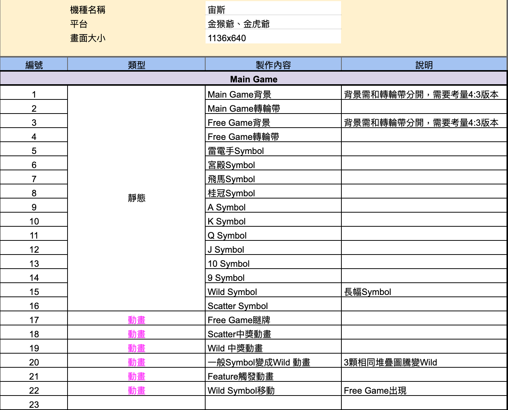{#fig:image10 width=50%}

如「[@fig:image10]」，答案在「Feature」這張工作表(Worksheet)中。試算表類型的文件和一般的文件最大的不同就是，它會含有不同的工作表，以區隔不同主題的內容。當然，這也是方便人類閱讀的設計之一，但AI是否能理解這還是在同一份文件的內容？會不會AI只看得到「規格文件(第一張工作表)」的內容而已？這是這項測試主要驗證的目標。

> User：在主遊戲有什麼特殊玩法？觸發條件是？
>
> AI：根據您 Google Drive 中 【《宙斯》規格】 文件的內容，主遊戲包含以下特殊玩法：
>
> 1.  堆疊 Wild (Stacked Wild)
>     *   說明：當轉輪 (Reel) 上出現 3 個連續的相同符號（堆疊）時，該輪將會變成整輪的 Wild 符號。
> 2.  Scatter 機制
>     *   說明：Scatter 符號主要用於觸發免費遊戲。
>     *   觸發條件：當畫面中出現 3 個或以上的 Scatter 符號時。

AI 的回答如上。它正確回答了規格書中的內容，看來它是可以讀取到不同工作表的內容的。

#### 跟特殊遊戲(Feature Game)有關的音效有哪些？

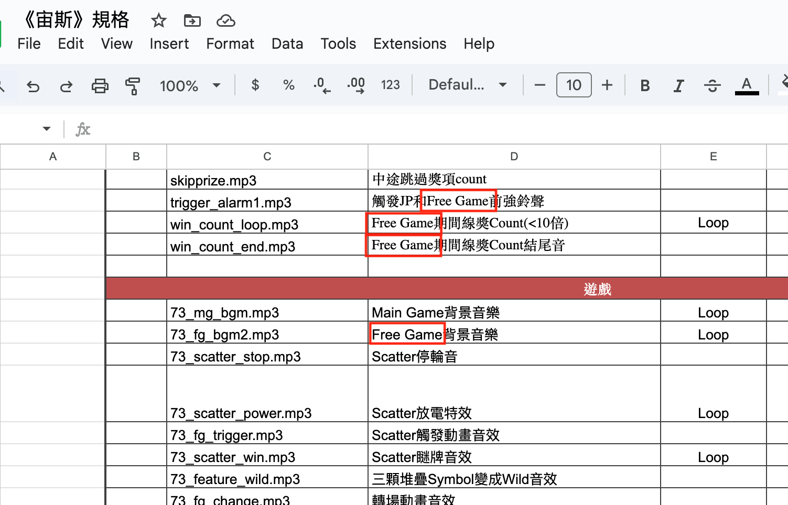{#fig:image12 width=50%}

如「[@fig:image12]」，在題目上我們再做了一個變化，同樣也是老虎機遊戲領域內的一個行話「特殊遊戲(Feature Game)」。這個行話的定義就比較會有分岐，有人認為特殊遊戲是綁定遊戲主題，有特殊玩法的「獎勵遊戲(Bonus Game)」；也有人認為只要不是主遊戲，其他像是免費遊戲，獎勵遊戲還是其他不同玩法的遊戲，因為絕大多數的設計也必然是綁定主題，或是法規需求的，所以皆可通稱為特殊遊戲，是一個分類名。我們也透過這樣的驗證，來瞭解AI對這個領域的認知是否跟我們的一致？如果它找不到答案，看看它的推論理由為何。

> User：跟特殊遊戲(Feature Game)有關的音效有哪些？
>
> AI：根據您 Google Drive 中 【《宙斯》規格】 文件的內容，目前沒有找到直接標註為「特殊遊戲 (Feature Game)」的相關音效設定。
>
> 文件中提到的特殊玩法主要是「整輪 Wild (Stacked Wild)」，但在音效列表中並未找到與此玩法對應的專屬音效項目。

AI 的回答如上，明確反映規格書中沒有相關的內容。它的理由是僅將「整輪Wild」這樣的玩法視為是一種特殊玩法。可即便如此，它仍然沒有將其視為特殊遊戲相關的音效。因此，接下來我們試著用「思考型」模式來測試看看，「多想想」能不能找到該有的答案。

> 在《宙斯》這類主題的遊戲規格中，與特殊遊戲（Feature Game）相關的音效設計通常涵蓋以下幾個核心範疇：
>
> 1. 模式轉換與進入音效：當觸發特殊遊戲模式時，通常會設計強烈的轉場音，例如雷鳴聲、神殿大門開啟的厚重摩擦聲，或是一段極具史詩感的過場樂曲，用以提醒進入高獎勵階段。
> 2. 特定功能的觸發音效：
> * 閃電打擊聲：若特殊遊戲中包含宙斯施展神力（如將符號變為百搭 Wild、增加乘數），通常會搭配震撼的雷擊或電力流動的聲音。
> * 能量匯聚音：在加成效果累積、符號升級或解鎖額外捲軸時使用的上升音階音效。
> 3. 背景音樂（BGM）的變更：進入特殊遊戲後，音樂通常會切換至節奏更為明快、張力更強的編曲版本，以營造緊張感並與主遊戲區隔。
> 4. 獎勵結算與慶祝音效：
> * 贏分跳動聲（Win Count Up）：贏分快速累積時的連續叮噹聲或音階攀升聲。
> * 大獎達成音（Big Win/Mega Win SFX）：伴隨慶祝樂句與虛擬硬幣落下的音效。
> 5. 角色語音（Voice Over）：如宙斯的威嚴笑聲、低沈的喊話（如「By the beard of Zeus!」）或宣告勝利的語音，增加遊戲的互動感與角色帶入感。
> 這些音效規格共同構成了特殊遊戲的視聽層次，旨在透過聽覺回饋來強化玩家在特殊環節中的沉浸體驗。

切換AI到思考模式後，"過度"的思考反而產生了「幻覺(Hallucination)」，它開始編造規格書中沒有的內容。因此初步我們可以判定，這部分不但是需要補充脈絡的部分，而且也給我們一個明確的警示，在試算表這種型式的文件中，AI的理解可能是很零碎的，是沒有整體概念的，某些問題能正確回答，不代表”同類”的其他問題一樣可以正確的回答。

#### 「長條堆疊圖騰」在哪裡會出現？條件為何？何時消失？

{#fig:image15 width=50%}

如「[@fig:image15]」，這需要AI先理解「長條堆疊圖騰」，在規格書中其實被拆成2段說明。一個是「堆疊圖騰」，另一個則是「長幅WILD圖騰」。這就是實務上的知識庫，和單純的搜尋的不同之處，如果僅是搜尋「長條堆疊圖騰」是搜不到”正確”答案的，因為其實在規格書是有另一種說法的，但只要是有內隱知識的企劃人員，都會理解那就是同一回事。其次，在規格書中，這個流程也被拆成多段分別說明了，我們要測試的目標，就是看看AI能否串連所有的文字一併理解。

> User：`@Google` 雲端硬碟 在「《宙斯》規格」中，「長條堆疊圖騰」在哪裡會出現？條件為何？何時消失？
>
> AI：在《宙斯》規格文件中，關於「長條堆疊圖騰」的相關資訊如下：
>
> - 圖騰名稱：文件中描述的是「3顆堆疊的一般圖騰」。
> - 出現條件：當出現3顆堆疊的一般圖騰時，會將該輪變成整輪Wild（整輪Wild）。
> - 出現位置：文件中並未明確指出會在哪一輪或哪些輪出現該圖騰。
> - 消失時間：文件中並未提及該圖騰「何時消失」的資訊。
>
> 您希望我再查找《宙斯》規格文件中其他關於特殊符號 (Special Symbol) 的資訊嗎？

從上述對話可見，僅管AI可以找到「哪裡會出現」及「何時出現」，但意外的是對於「何時消失」卻無法從「移動到第一輪的WILD，下一輪將消失」的說明理解及回答出正確答案。

#### 正確率小結

簡單的5個題目在AI的測試，整理出來的正確率如下：

: 文字理解的正確率小結 {#tbl:table2}

| 編號 | 題目簡述                                           | 正確率 |
| ---- | -------------------------------------------------- | ------ |
| 1    | 有多少個符號？是幾輪幾線的遊戲？                   | 100%   |
| 2    | 免費遊戲的條件是？                                 | 100%   |
| 3    | 在主遊戲有什麼特殊玩法？觸發條件是？               | 100%   |
| 4    | 跟特殊遊戲有關的音效有哪些？                       | 0%     |
| 5    | 「長條堆疊圖騰」在哪裡會出現？條件為何？何時消失？ | 60%    |
| 總分 | ---                                                | 72% |

### 內嵌圖片理解

多樣式文件中很常會有圖片。各種文件對於圖片的處理方法基本上大同小異，不是嵌入(Embedded)在文件中，像是Microsoft的Word, PowerPoint及Excel這類的文件，不然就是以外連(Image Link)的型式渲染出來，像是HTML或是Markdown這類的文件。由於遊戲規格書在以前，大多數是給人類閱讀的，正所謂「一圖抵千言」，因此常會有許多附圖，幫助讀者理解。但實務上，在開發期人類能夠”閱讀”它們，是因為在開發期人們對這個產品的所有脈絡是知根知底的，所以在閱讀上不會有什麼障礙。可如果產品已經釋出或銷售，多半這類文件就是進入封存狀態，等到幾個月後再去閱讀，甚至是幾年後再去閱讀，之前的脈絡訊息已經遺失，要再透過”閱讀”規格書來理解這個產品的規格，就會變得非常困難。因此，我們希望能透過GenAI的能力，測試看看GenAI是否能有足夠的脈絡理解規格書，如果可以的話，是否也能將這些脈絡給反向輸出到規格書中，幫助人類在之後需要回頭理解這個產品的規格時，更能快速掌握所有相關知識。

以下的問題基本上都是需要”看懂圖片”，而不是依賴理解文件上的片段文字推論出來的，以確保我們可以驗證得出來，AI對圖片中的的資訊，是否跟人類是對齊的。

- 「一般symbol」有哪些？它們的獎項表(Odds Table)為何？
- 「特殊symbol」長什麼樣子？
- 「堆疊圖騰擴張變成長幅WILD圖騰後進行對獎」中提到的「長幅WILD圖騰」是長什麼樣子的？
- 遊戲介面中，有哪些按鈕，又有哪些玩家資產相關的訊息？
- Info頁有幾頁內容？內容分別為何？

#### 「一般symbol」有哪些？它們的獎項表(Odds Table)為何？

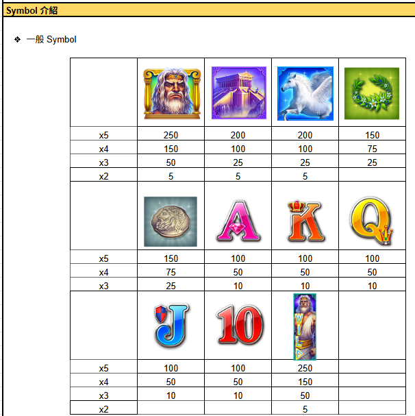{#fig:image17}

如「[@fig:image17]」，我們可以看到，規格書並沒有針對這些符號作出解釋或描述。我們幾乎可以預期得到，這個題目如果拿去詢問AI的話，在沒有文字的情況下，AI應該是無法正確的回答的。

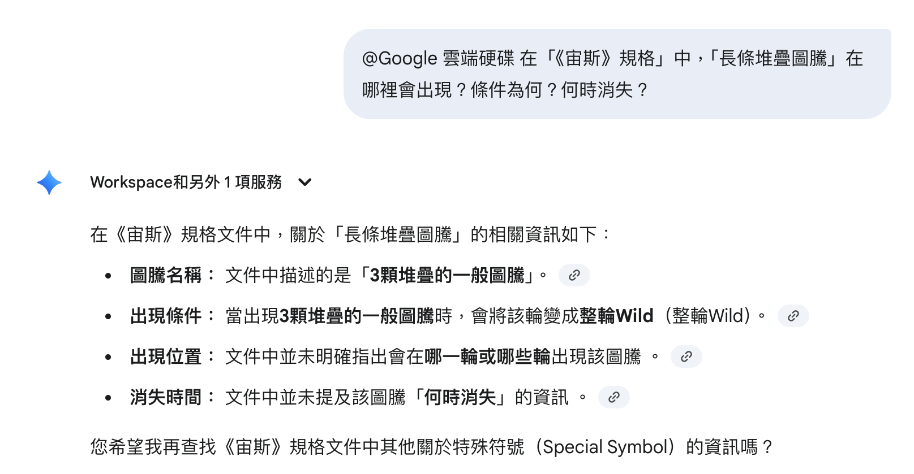{#fig:image18}

如「[@fig:image18]」，AI確實沒有辦法回答這些Symbol的名稱。而且表格中的那些數字對它而言，也是一堆無法理解的數字。

#### 「特殊symbol」長什麼樣子？

{#fig:image19}

如「[@fig:image19]」，和前一題類似，儘管在圖的右側有”SCATTER”這樣的文字註解，但其實正確答案並不是”SCATTER”，這個特殊symbol的描述應該是”紅底金字的FREE GAME”這類的內容，我們來看看AI會怎麼回答。

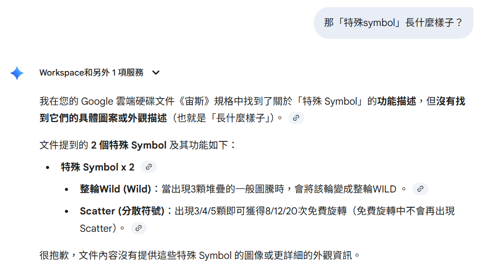{#fig:image20}

如「[@fig:image20]」，AI雖然找到了特殊Symbol，也找到了相關的規格，但對於symbol長什麼樣子，在沒有足夠的文字輔助的情況下，就是無法回答。

#### 「堆疊圖騰擴張變成長幅WILD圖騰後進行對獎」中提到的「長幅WILD圖騰」是長什麼樣子的？

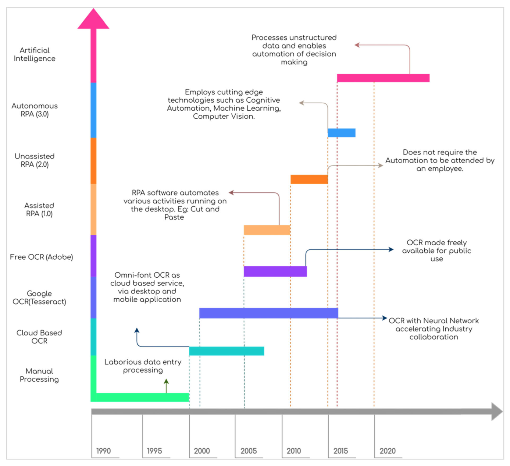{#fig:image21}

{#fig:image22}

如「[@fig:image22]」，規格書其實是使用了兩張圖作為展演的分鏡說明。上圖是說明當三個「神殿」符號堆疊在一起的時候，會擴展成一個如下圖的「宙斯長幅WILD圖騰」。這也是在考驗AI是否能正確理解，用戶的問題其實是在詢問下圖的內容。

{#fig:image23}

如「[@fig:image23]」，AI從既有的文字中雖然已經找到這個圖騰的形狀及屬性，但就是沒有辦法描述出這個「長幅WILD圖騰」的實際內容。

#### 遊戲介面中，有哪些按鈕，又有哪些玩家資產相關的訊息？

其實這一題所需要理解的圖，也是「[@fig:image22]」這一張。主要的按鈕就是「開始旋轉」，「最大押注」，「快速」，「+/-」或「購買」的這些。玩家的資產就是最上方「福」的右邊那串數字，「贏分」是正下方的數字，累積彩金是「購買」鈕的右側數字。接下來就看看AI能找到多少。

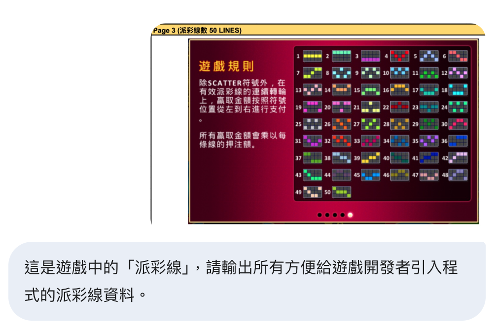{#fig:image24}

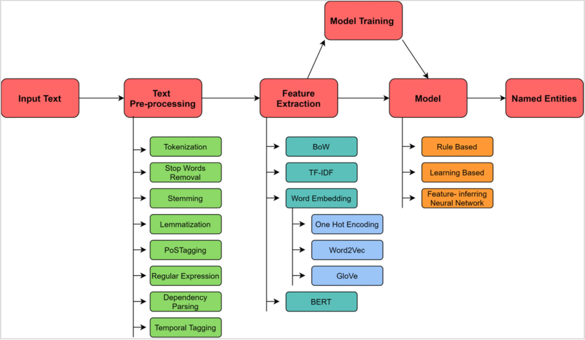{#fig:image25}

如「[@fig:image25]」，這個回答稍微有點意外，但結論基本上還是同一個。AI一樣是無法真的理解規格書中圖像的內容，但它會嘗試從找到的所有文字，拼湊出可能的答案告訴用戶。

#### Info頁有幾頁內容？內容分別為何？

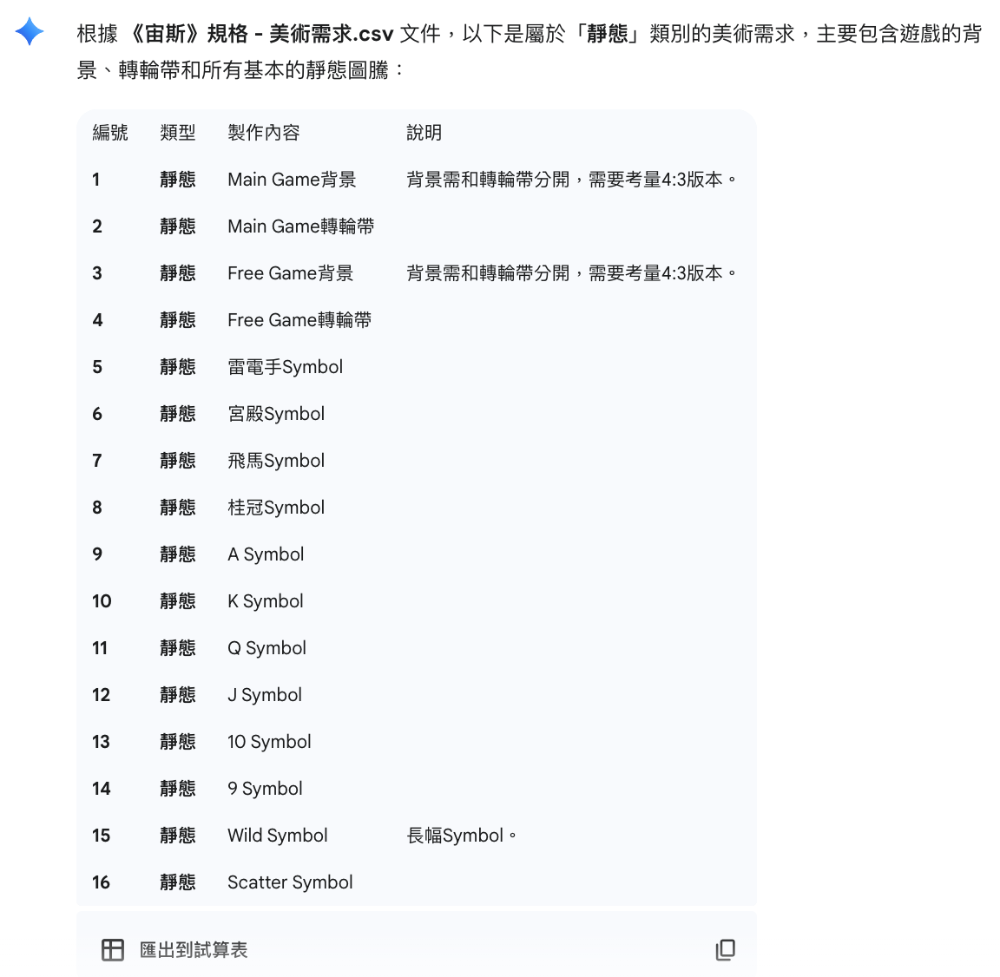{#fig:image26}

如「[@fig:image26]」，在「INFO」工作表中，最後一頁是「Page 3(派彩線數 50 LINES)」。如果只是問Info頁有幾頁內容，估計AI可透過”Page 3”得知有3頁，但「內容是什麼」這題就還是需要AI確實理解圖片內容才行，而且是三頁都要能理解。

{#fig:image27}

如「[@fig:image27]」，不出所料，AI確實找到了3頁的Info，裡面有寫字的都回答出來了，但圖片的內容無一正確描述。

#### 正確率小結

簡單的5個題目在AI的測試，整理出來的正確率如下：

: 內嵌圖片的正確率小結 {#tbl:table3}

| 編號 | 題目簡述                                             | 正確率 |
| ---- | ---------------------------------------------------- | ------ |
| 1    | 「一般symbol」有哪些？它們的獎項表(Odds Table)為何？ | 0%     |
| 2    | 「特殊symbol」長什麼樣子？                           | 0%     |
| 3    | 「長幅WILD圖騰」是長什麼樣子的？                     | 0%     |
| 4    | 有哪些按鈕，又有哪些玩家資產相關的訊息？             | 0%     |
| 5    | Info頁有幾頁內容？內容分別為何？                     | 0%     |
| 總分 | 0%                                                   |        |

### 表格理解

如前述，在試算表中，文字不是連續存放的。同樣是一句話，可以放在同一個儲存格中，也可以拆到2個儲存格存放。僅管人類”看”起來都一樣，但若是做為知識庫(Knowledge Base)讓AI嘗試去理解，那可能就會得到不同的結果。這也就是和人類認知不對齊(misaligned)的地方，也是許多人聽說過的幻覺(Hallucination)的來源之一。我們要測試的，也就是人類可以很簡單”看得懂”的那些內容，看看AI的認知是否跟人類一致。

- 這個遊戲的美術需求中，有哪些是「動畫」類的需求？
- 這個遊戲的美術需求中，有哪些是「靜態」的需求？
- 這個遊戲有使用「聽牌音」嗎？
- 共用音效有哪些？遊戲專屬音效有哪些？
- 「100倍獎線獎報獎」和「轉場動畫音效」的品質是多少KBits？

#### 這個遊戲的美術需求中，有哪些是「動畫」類的需求？

{#fig:image28}

如「[@fig:image28]」，我們先測試一個簡單的。從編號17的「Free Game瞇牌」到編號22的「Wild Symbol移動」6個項目就是動畫類的需求，儘管我們從編號1到編號16插入了合併儲存格，但這應該不影響AI判讀表格的內容。

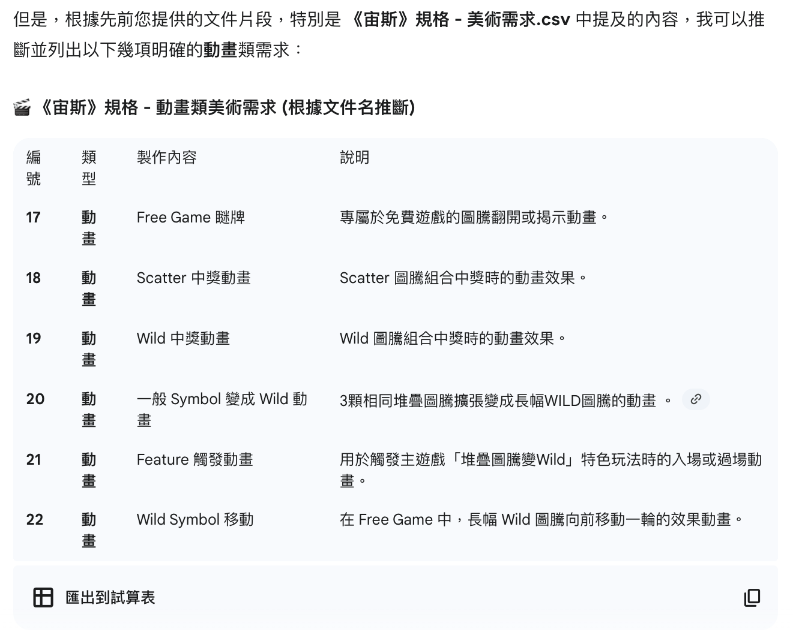{#fig:image29}

如「[@fig:image29]」，如預期，AI可以正確找到編號17到編號22的項目都算是「動畫」類型的製作內容。

#### 這個遊戲的美術需求中，有哪些是「靜態」類的需求？

如「[@fig:image28]」，這就是對著「合併儲存格」測試。即便在2025年09月的AI，仍然無法正確的理解合併儲存格的內容，現在我們再試試看是否有進步。

{#fig:image30}

如「[@fig:image30]」，AI已可正確的解讀帶有合併儲存格的表格內容。隨著基礎模型的能力不斷進化，看來再複雜的表格問題應該遲早都可以被攻克。

#### 這個遊戲有使用「聽牌音」嗎？

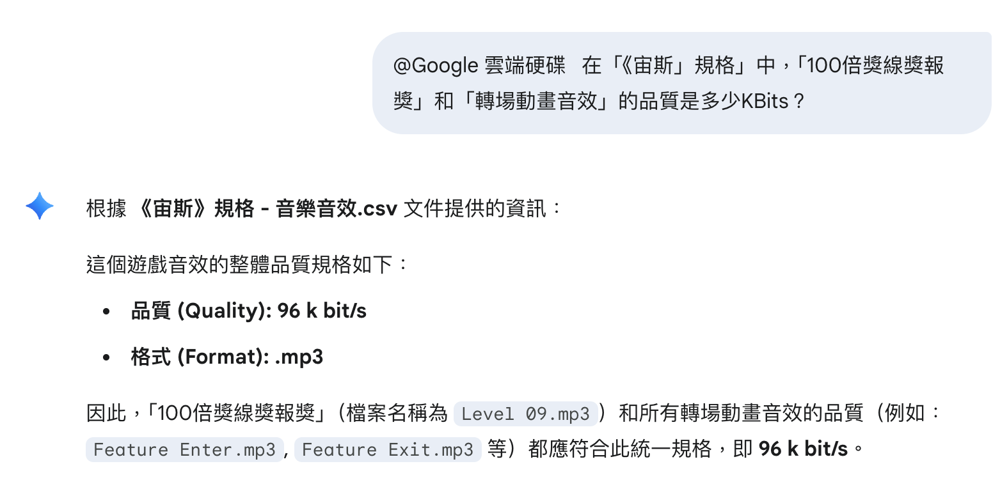{#fig:image31}

如「[@fig:image31]」，這是個很”狡猾”的問題。人類看到灰底的這一列，通常都會意識到，這應該是一筆有特殊意義的資料。以企劃人員而言，他們更是會很直覺的認為，這100%就是代表「不使用」的意思。但，AI會有同樣的”sense”嗎？

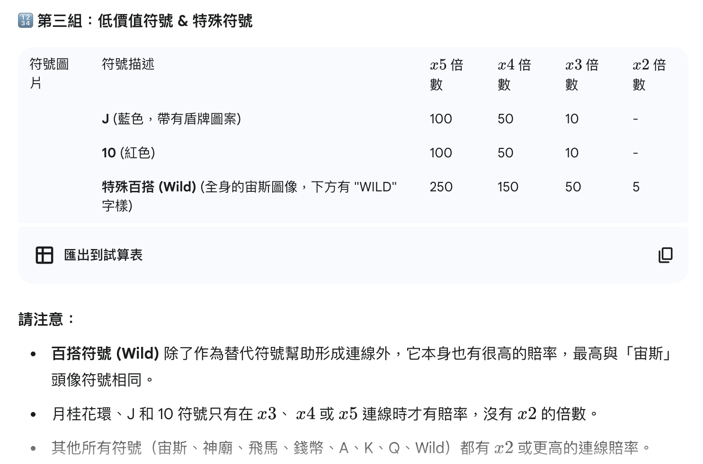{#fig:image32}

如「[@fig:image32]」，AI果然誤解了文件中的意思，誤以為”有”使用「聽牌音」。

#### 共用音效有哪些？遊戲專屬音效有哪些？

{#fig:image33}

如「[@fig:image33]」，這個題目另一種合併儲存格。典型的表格，欄位確實都是整齊排好的，但這次的「共用」及「遊戲」卻是在欄位列合併而成，用以表示同欄位的更高層分類。人類讀者一樣可以很容易理解這個概念，但AI是否一樣可以這樣理解？

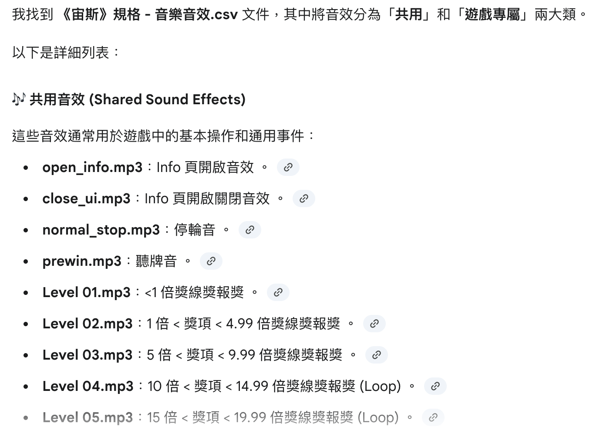{#fig:image34}

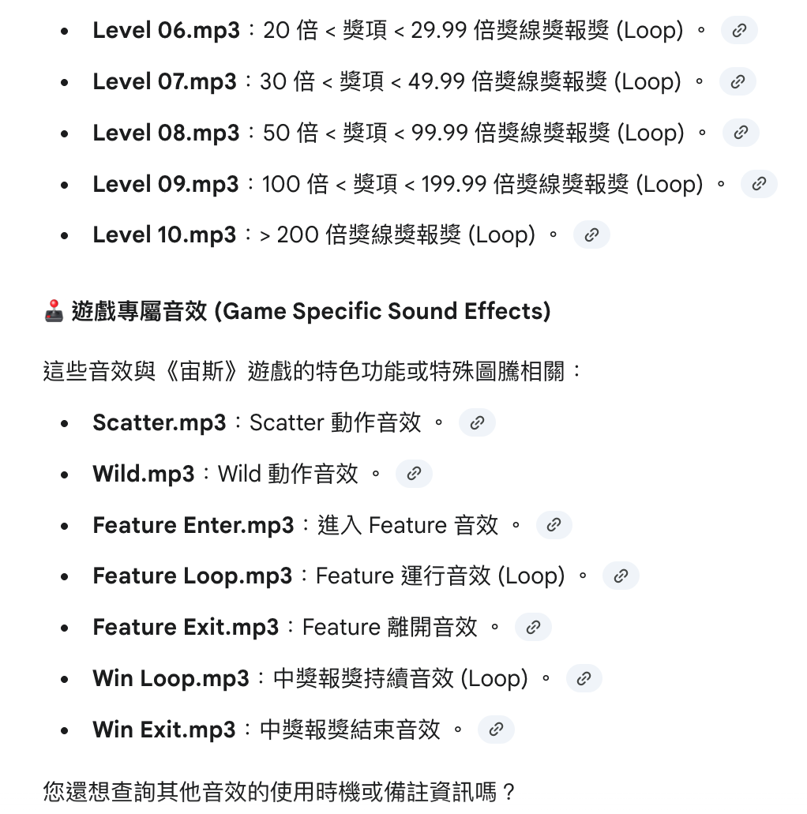{#fig:image35}

如「[@fig:image35]」，不僅在「列」的合併儲存格有正確理解表格內容，看來在「欄」的合併儲存格也有正確的理解表格內容。

#### 「100倍獎線獎報獎」和「轉場動畫音效」的品質是多少KBits？

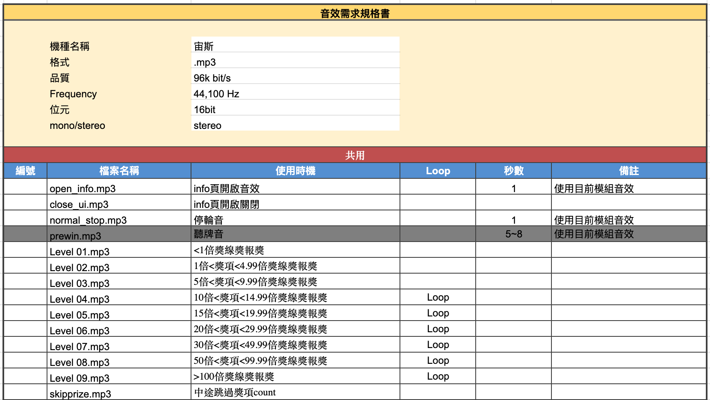{#fig:image36}

{#fig:image37}

如「[@fig:image37]」，這是一個跨度較大的理解題。人類讀者基本上是可以理解文件的「結構」的，也就是說，最上面的「機種名稱」，「品質」，「格式」或「位元」等這些欄位，是用來宣告下方這些資料的共通屬性的。那，AI能嗎？

{#fig:image38}

如「[@fig:image38]」，AI看來也有像人類一樣理解文件的結構，給出了正確的答案。

#### 正確率小結

: 表格理解的正確率小結 {#tbl:table4}

| 編號 | 題目簡述                                            | 正確率 |
| ---- | --------------------------------------------------- | ------ |
| 1    | 這個遊戲的美術需求中，有哪些是「動畫」類的需求？    | 100%   |
| 2    | 這個遊戲的美術需求中，有哪些是「靜態」類的需求？    | 100%   |
| 3    | 這個遊戲有使用「聽牌音」嗎？                        | 0%     |
| 4    | 共用音效有哪些？遊戲專屬音效有哪些？                | 100%   |
| 5    | 「100倍獎線獎報獎」和「轉場動畫音效」的品質是多少？ | 100%   |
| 總分 | 80%                                                 |        |

## 內嵌圖片的萃取發現

在三個面向的測試結果，我們初步歸納出幾個重點：

- 純文字的理解正確率夠高，已無須再行多餘萃取處理
- 表格文字的理解正確率也夠高，但AI對其他的”隱喻(e.g.顏色)”，理解能力仍不足
- 圖片可說是完全沒有理解能力，不論是小圖還是大圖，不論圖像結構是簡單還是複雜的。

因此，從規格書中需要萃取的重要對象之一，就是這些內嵌圖片。這些圖片對人類而言，是可以轉化成「理解(Understanding)」的，例如在「[@fig:image17]」中，我們其實是可以這樣”描述”出那些「一般symbol」是什麼的：

: 用文字描述遊戲中的符號 {#tbl:table5}

| 一般 Symbol（標準符號）                                                                                                                                                       | 特殊符號                                                                                                                        |
| ----------------------------------------------------------------------------------------------------------------------------------------------------------------------------- | ------------------------------------------------------------------------------------------------------------------------------- |
| 高價值符號                                                                                                                                                                    | 中等價值符號                                                                                                                    |
| 宙斯（Zeus）x5 = 250x4 = 150x3 = 50x2 = 5神殿（Temple）x5 = 200x4 = 100x3 = 25x2 = 5天馬（Pegasus）x5 = 200x4 = 100x3 = 25x2 = 5月桂冠（Laurel Wreath）x5 = 150x4 = 75x3 = 25 | 古幣（Coin）x5 = 150x4 = 75x3 = 25A（Ace）x5 = 100x4 = 50x3 = 10K（King）x5 = 100x4 = 50x3 = 10Q（Queen）x5 = 100x4 = 50x3 = 10 |

如「[@tbl:table5]」 (用表格是為了排版美觀，實際上輸出內容是連續文字內容)，當圖中的符號變成文字之後，同一個題目我們再問一次，是否能得到正確答案呢？

{#fig:image39}

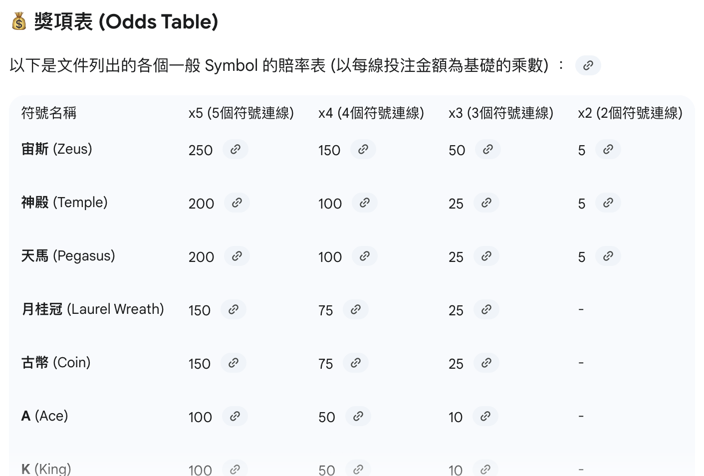{#fig:image40}

如「[@fig:image40]」，這次AI就可以像其他的文字題一樣，正確說出一般symbol有哪些，連倍數表的內容都可以正確理解。也就是說，如果我們能將圖片的內容描述成純文字，經過這樣的萃取過程，我們幾乎就可以確保，AI能正確理解規格書內容，能真正成為我們能採取行動的知識。

## 圖片知識萃取實驗

聽起來很完美。那，「[@tbl:table5]」 的內容是怎麼來的？在「三大研究原則」的前提下，我們不可能要透過人力，把這些內容給一字一句打出來。像「[@fig:image17]」的內容，或許OCR還有可能幫得上忙，但若是像「[@fig:image22]」的內容，OCR絕對是無法”辨識”出什麼內容的。我們需要的不是「辨識」，我們需要的是「描述」的能力。我們得試試怎麼樣可以透過GenAI的能力，儘量正確的描述出圖片裡面的內容，一但能掌握到原則，就可以透過撰寫工具程式來批次處理更多的文件，滿足三大原則的要求。

### 直接描述

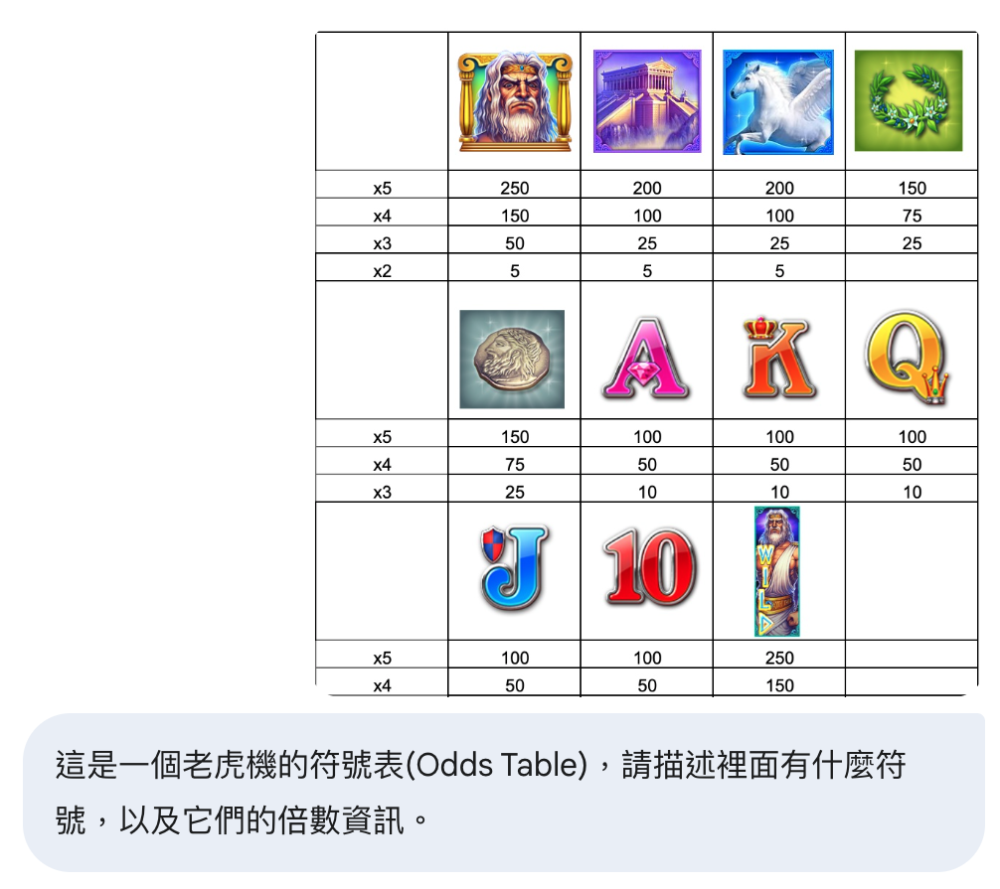{#fig:image41}

如「[@fig:image41]」，雖然說是”直接”，但還是必須要稍微解釋一下，這是老虎機的符號表，以及我們要AI做什麼。

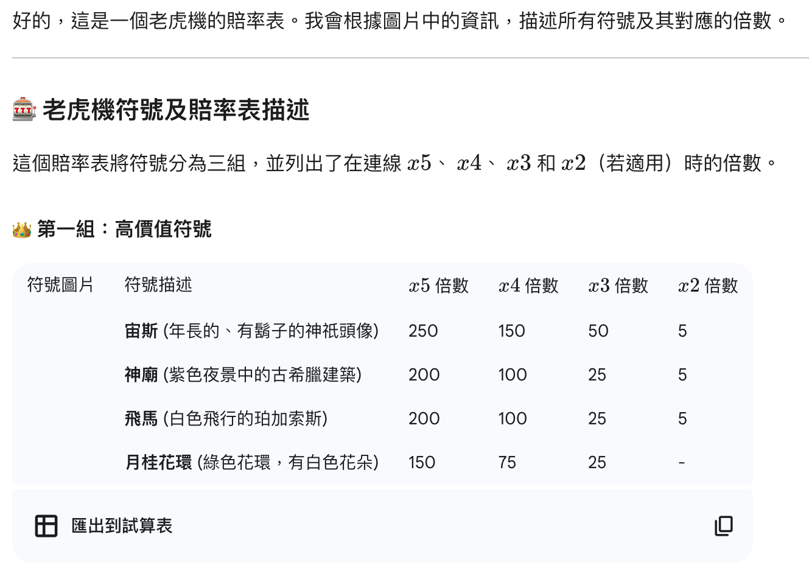{#fig:image42}

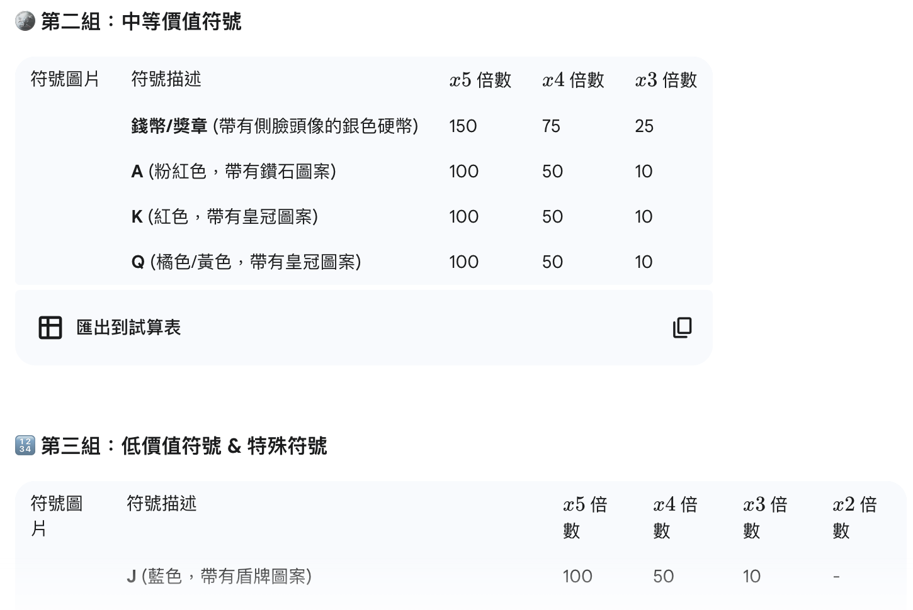{#fig:image43}

{#fig:image44}

如「[@fig:image44]」，AI不僅可以正確的描述出這些符號是什麼，甚至連「特殊百搭」是”全身的宙斯圖像，下方有WILD”這樣的描述都寫好了。至於那些「請注意」的內容，算是輔助資訊，也沒有寫錯，也可以成為知識庫的一部分。

### 帶入「遊戲開發者」的描述

對於單純的帶圖的表格及文字，我們幾乎直接叫AI描述就解決了。但若是像「[@fig:image22]」那樣的遊戲介面，只是叫它”描述”出來固然還是可以得到不少內容，可如果我們想要更多更關鍵的內容，我們可以帶入「遊戲開發者」的身份來叫AI描述：

{#fig:image45}

如「[@fig:image45]」，在我們的提詞中有幾個重要的項目。首先有宣告這是遊戲畫面的截圖，再來就是要以「遊戲開發人員」的身份去描述，要聚焦的重點是「介面」及「可能的規格」。

{#fig:image46}

{#fig:image47}

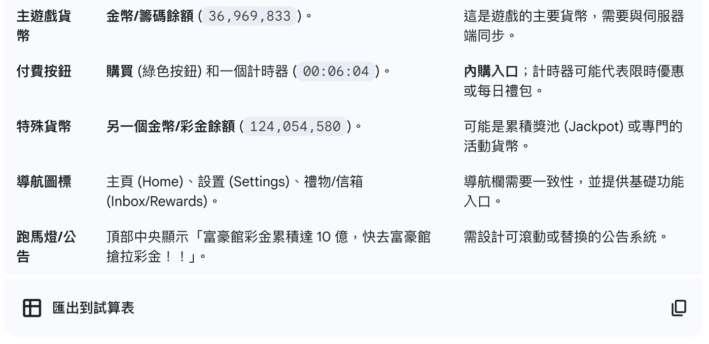{#fig:image48}

如「[@fig:image48]」，AI在帶入身份之後，真的是很徹頭徹尾的描述了所有開發者應該要注意的那些元素，即便是一顆「i」的按鈕都沒放過。這樣，我們就可以很大程度的把圖中的資訊給萃取出來，這些內容都是文字，都是可以完全被AI理解，可用來回答我們問題的知識。

### 產出「派彩線」資料

在「[@fig:image26]」中，我們知道規格書有「派彩線」的相關資料，這是50條派彩線的內容。但，這也是一個圖像資訊。如果我們沒有將其文字化，AI一樣是沒有辦法回答這部分的問題的。我們一樣可以透過遊戲開發者的身份，要求AI輸出”方便開發者引入程式”的型式的資料：

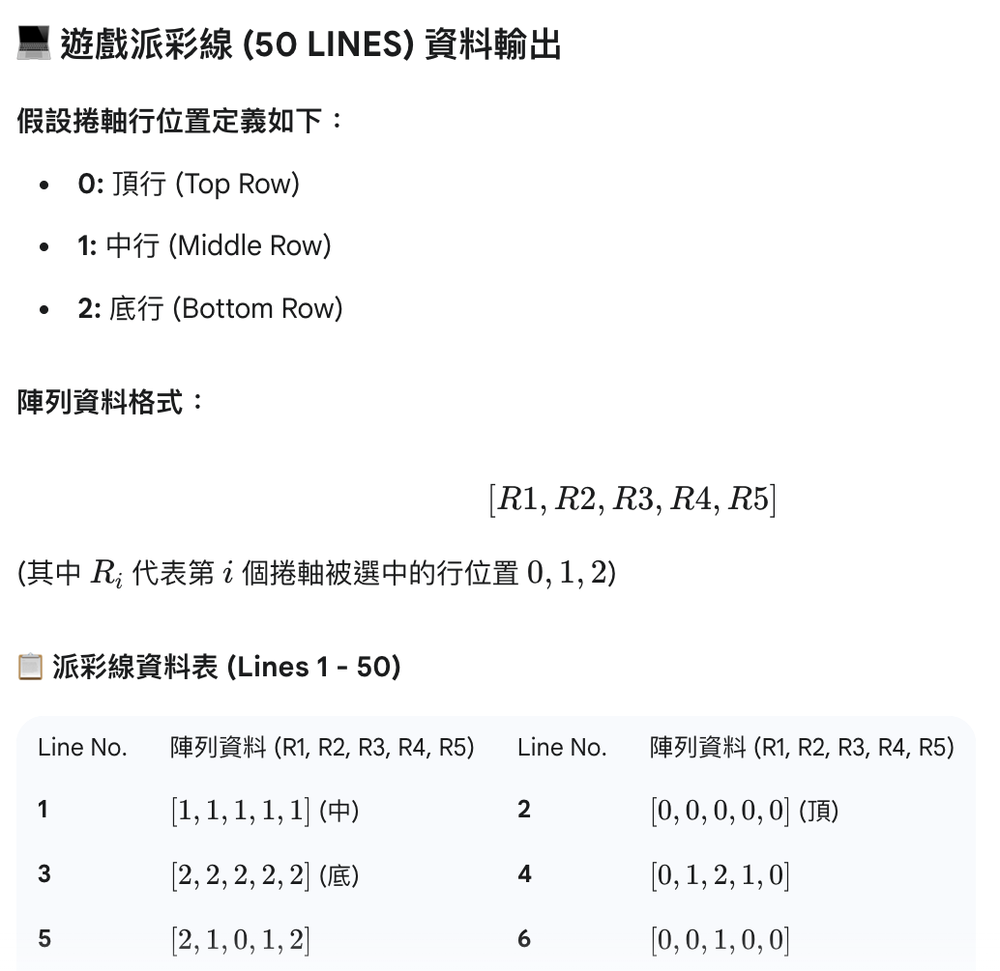{#fig:image49}

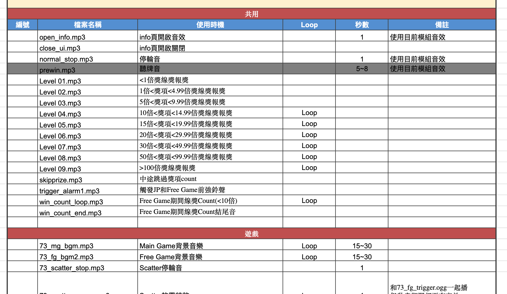{#fig:image50}

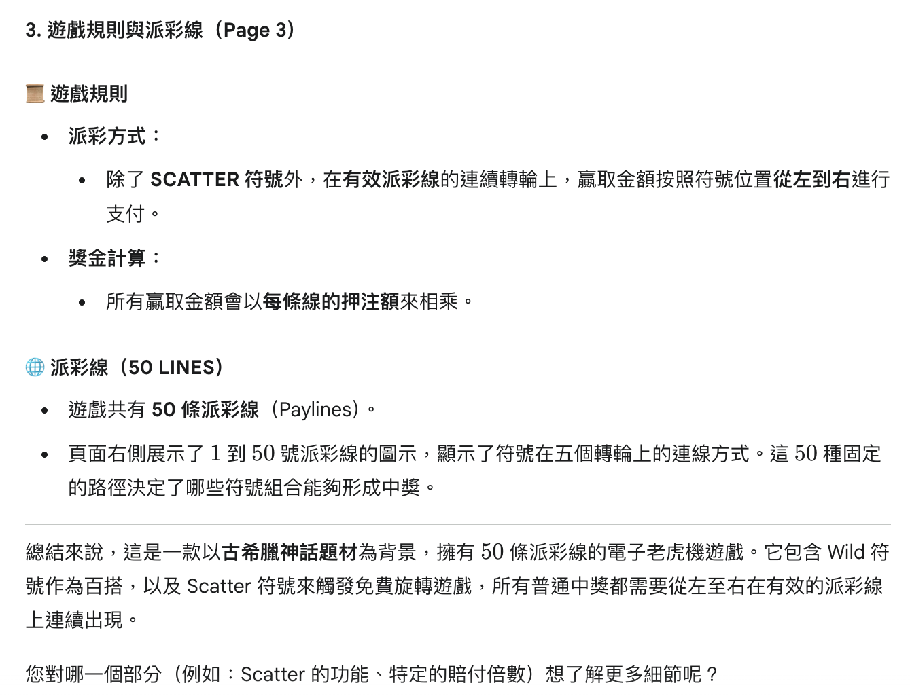{#fig:image51}

{#fig:image52}

如「[@fig:image52]」，AI不但能正確理解「派彩線」的意涵，輸出高達50條線的所有文字資訊，甚至還可以幫忙轉出Python的源碼。有了這樣的知識，不只是企劃人員可以清楚的知道是哪50條線，甚至軟體人員都可以不用再一行行的複製貼上，AI產出的內容整塊就可以複製進來使用了。

### 上下文空間(Context Length)不足

目前為止，我們的實驗都是一小塊一小塊的截圖測試，結果都讓人很滿意。如果一小塊驗證都沒問題了，那我們是否可以一口氣給一整頁，然後叫AI全部描述出來就好了？

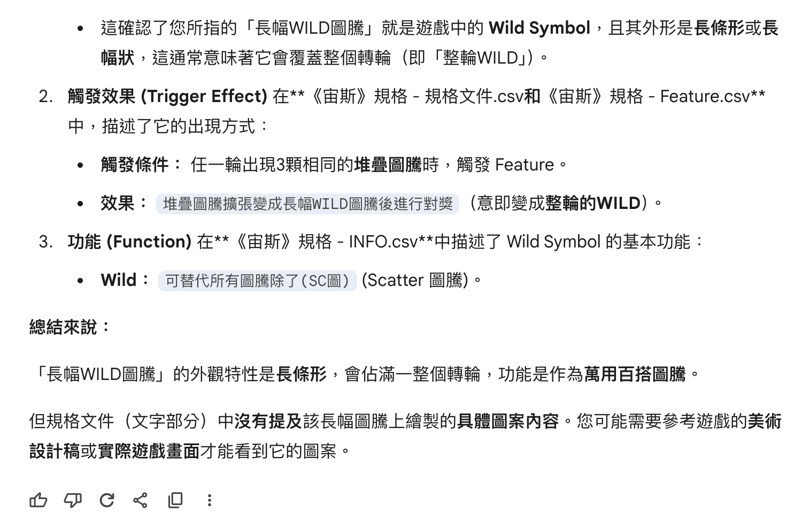{#fig:image53}

如「[@fig:image53]」，為了避免直接截一張大圖，解析度可能不足的狀況，我們直接截成三張圖。請AI詳細描述整個Info頁的內容。

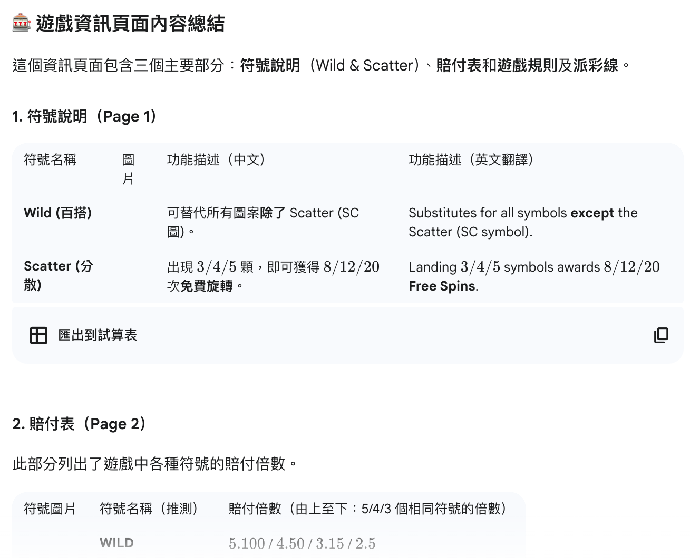{#fig:image54}

{#fig:image55}

如「[@fig:image55]」，AI並不會因為我們拆成三張圖，就以為這是3個不同的規格，起碼它認為這是一個Info頁中的3個區塊。但在「派彩線(50 LINES)」這一段我們就會發現一個奇怪的狀況，它只寫「1到50號派彩線…」這樣的內容，並沒有”詳細”輸出所有的內容。即便我們繼續要求下去，對AI而言，它就是沒有足夠的資訊：

{#fig:image56}

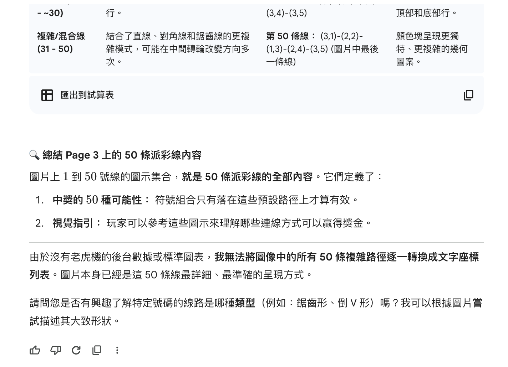{#fig:image57}

如「[@fig:image57]」，AI直接明說了，它做不到。這究竟是怎麼回事呢？明明在「產出派彩線資料」那次的測試很順利呀，怎麼這次卻做不到了呢？其實這就是目前各AI模型普遍的軟肋：「上下文空間不足(Insufficient Context Length)」的問題。

## 上下文空間工程(Context Engineering)

在規格書這個場景下，由於目前LLM對試算表的文件型式尚無法像人類一樣理解，因此，我們嘗試透過「圖片」這樣的媒介來讓LLM理解文件內容。

### 反推驗證

在《MQuant: Unleashing the Inference Potential of Multimodal Large Language Models via Full Static Quantization》(Yu et al., 2025)的研究中我們可以確認，理解圖像所需要的詞元(Tokens)數是遠超過純文字的。因此從前人的研究也可以印證我們在實測時推論的可能性，所以如果我們可以繼續按照我們的實驗結果繼續推論下去，是不是我們只要把規格書都描述成文字，只要將整份規格書的描述足夠詳細，這樣的知識是否就可以完全被100%使用，可以正確的指引我們在設計或實作面的開發方向，成為行動的依據？我們接下來就先試著反推驗證一次，看在”有正確答案”的前提下，之前的那些問題的正確率能提升多少。

### 「各個擊破再合併」的解法

在《Divide, Conquer and Combine: A Training-Free Framework for High-Resolution Image Perception in Multimodal Large Language Models》(Wang et al., 2024) 中也是在處理同一個問題，當面對4K或甚至8K的圖像的時候，即便是專屬的VLM(Visual Language

Model)的正確率也會雪崩式的下跌：

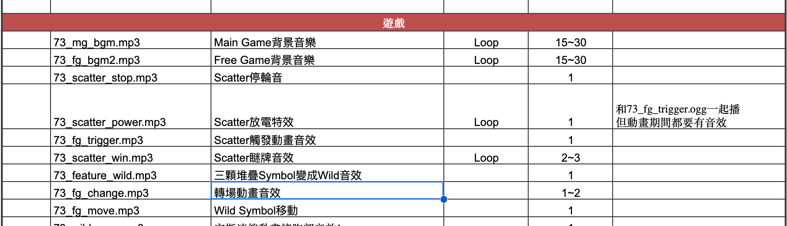{#fig:image58}

如「[@fig:image58]」，Microsoft發表的LLaVA，Alibaba發表的Qwen等這些頂尖模型，在FullHD的解析度下就大幅下降，更別說是到4K或8K了。在這篇論文中所採取的策略就如同論文的標題所述，是採取「各個擊破再合併」的策略，但它的策略並不那麼適合規格書的樣態：

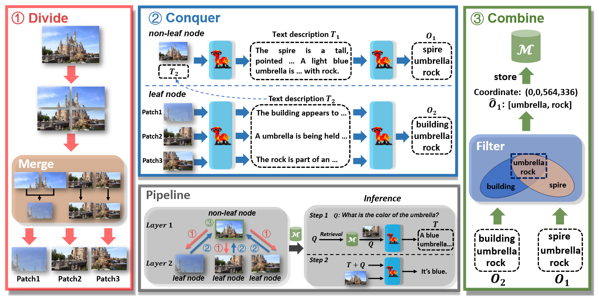{#fig:image59}

如「[@fig:image59]」，它的分割方式是無條件的等分。在這篇論文中的目標是要回答「找到藍色雨傘」這樣的問題，這算是正確的設計。但我們的目標是要正確的描述規格，等分的切法只會讓LLM描述出許多不符需求的雜訊，即便再經過合併，品質也會很難控制。

### 「文件佈局分析」的解法

這個問題的解法對應的關鍵字是「文件佈局分析(Document Layout Analysis, DLA)」. Microsoft知名的LayoutLMv3(Y. Huang et al., 2022)技術，也是高度依賴DLA提供輔助資料來達到Document AI的目標。目前比較成熟的DLA技術，則是來自於PP-DocLayout(Sun et al., 2025)這個模型的實作，它支援的元素分析非常多種：

{#fig:image60}

如「[@fig:image60]」，基本上我們會需要的，應該就只有圖，字，表為最大宗，頂多就是也把算式也含進來。透過這個模型產出的幾何資訊(Transformation)，再輔以適當的提詞，預期就可以描述出足夠詳細的規格書知識。

# 結論與建議

## 結論

## 未來發展建議

參考文獻

- Ackoff, R. L. (1989). From Data to Wisdom.Journal of Applied Systems Analysis,16, 3–9.
- Ajmal, M., Helo, P., & Kekäle, T. (2010). Critical factors for knowledge management in project business.Journal of Knowledge Management,14(1), 156–168. https://doi.org/10.1108/13673271011015633
- Baviskar, D., Ahirrao, S., Potdar, V., & Kotecha, K. (2021). Efficient Automated Processing of the Unstructured Documents Using Artificial Intelligence: A Systematic Literature Review and Future Directions.IEEE Access,9, 72894–72936. https://doi.org/10.1109/ACCESS.2021.3072900
- Chaffey, D., & Wood, S. (2005).Business information management: Improving performance using information systems. Financial Times Prentice Hall.
- Grant, R. (2006). Knowledge Management and the Knowledge-Based Economy. In L. Prusak & E. Matson (Eds.),Knowledge Management and Organizational Learning(pp. 15–29). Oxford University PressOxford. https://doi.org/10.1093/oso/9780199291793.003.0002
- Huang, J., & Li, Y. (2009). The mediating effect of knowledge management on social interaction and innovation performance.International Journal of Manpower,30(3), 285–301. https://doi.org/10.1108/01437720910956772
- Huang, Y., Lv, T., Cui, L., Lu, Y., & Wei, F. (2022).LayoutLMv3: Pre-training for Document AI with Unified Text and Image Masking(No. arXiv:2204.08387). arXiv. https://doi.org/10.48550/arXiv.2204.08387
- Kimball, R., & Caserta, J. (2004).The data warehouse ETL toolkit: Practical techniques for extracting, cleaning, conforming, and delivering data. Wiley.
- Mardani, A., Nikoosokhan, S., Moradi, M., & Doustar, M. (2018). The Relationship Between Knowledge Management and Innovation Performance.The Journal of High Technology Management Research,29(1), 12–26. https://doi.org/10.1016/j.hitech.2018.04.002
- Palacios Marqués, D., & José Garrigós Simón, F. (2006). The effect of knowledge management practices on firm performance.Journal of Knowledge Management,10(3), 143–156. https://doi.org/10.1108/13673270610670911
- Pee, L. G., & Kankanhalli, A. (2009). A Model of Organisational Knowledge Management Maturity Based on People, Process, and Technology.Journal of Information & Knowledge Management,08(02), 79–99. https://doi.org/10.1142/S0219649209002270
- Pejić Bach, M., Krstić, Ž., Seljan, S., & Turulja, L. (2019). Text Mining for Big Data Analysis in Financial Sector: A Literature Review.Sustainability,11(5), 1277. https://doi.org/10.3390/su11051277
- Popadiuk, S., & Choo, C. W. (2006). Innovation and knowledge creation: How are these concepts related?International Journal of Information Management,26(4), 302–312. https://doi.org/10.1016/j.ijinfomgt.2006.03.011
- Rowley, J. (2007). The wisdom hierarchy: Representations of the DIKW hierarchy.Journal of Information Science,33(2), 163–180. https://doi.org/10.1177/0165551506070706
- Song, Z., Fan, L., & Chen, S. (2008). Knowledge sharing and innovation capability: Does absorptive capacity function as a mediator?2008 International Conference on Management Science and Engineering 15th Annual Conference Proceedings, 971–976. https://doi.org/10.1109/ICMSE.2008.4669030
- Sun, T., Cui, C., Du, Y., & Liu, Y. (2025).PP-DocLayout: A Unified Document Layout Detection Model to Accelerate Large-Scale Data Construction(No. arXiv:2503.17213). arXiv. https://doi.org/10.48550/arXiv.2503.17213
- Wang, W., Ding, L., Zeng, M., Zhou, X., Shen, L., Luo, Y., & Tao, D. (2024).Divide, Conquer and Combine: A Training-Free Framework for High-Resolution Image Perception in Multimodal Large Language Models(No. arXiv:2408.15556). arXiv. https://doi.org/10.48550/arXiv.2408.15556
- Yu, J., Zhou, S., Yang, D., Wang, S., Li, S., Hu, X., Xu, C., Xu, Z., Shu, C., & Yuan, Z. (2025).MQuant: Unleashing the Inference Potential of Multimodal Large Language Models via Full Static Quantization(No. arXiv:2502.00425). arXiv. https://doi.org/10.48550/arXiv.2502.00425
- Zheng, L., Luo, G., & Peng, D. (2025). The impact of multi-dimensional social capital in collaborative R&D networks on firm innovation resilience: The moderation of knowledge network cohesion.Journal of Intellectual Capital, 1–24. https://doi.org/10.1108/JIC-11-2024-0382
