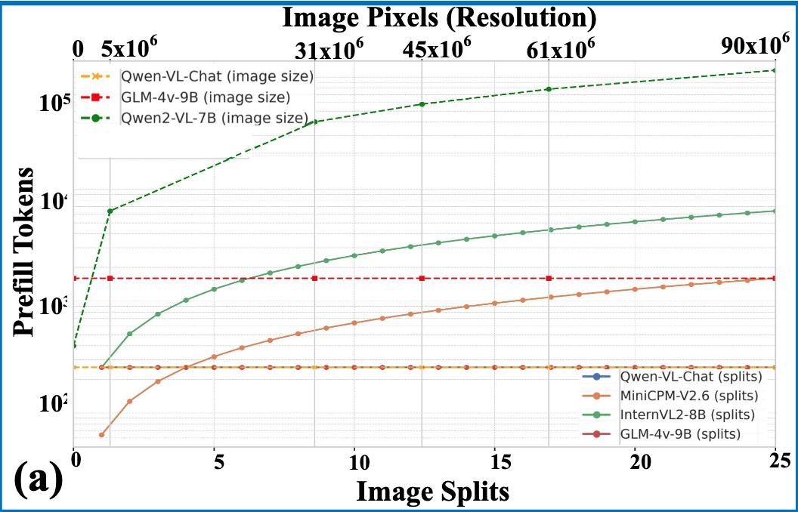
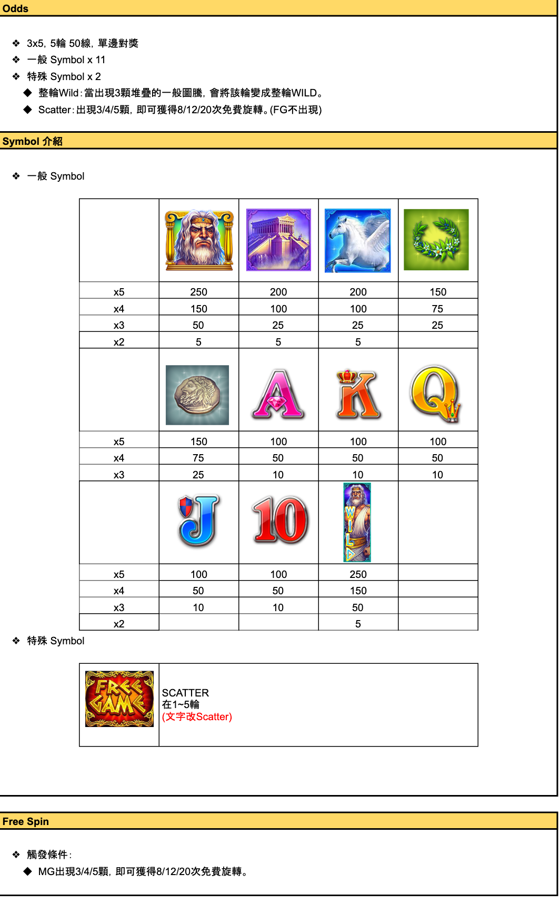
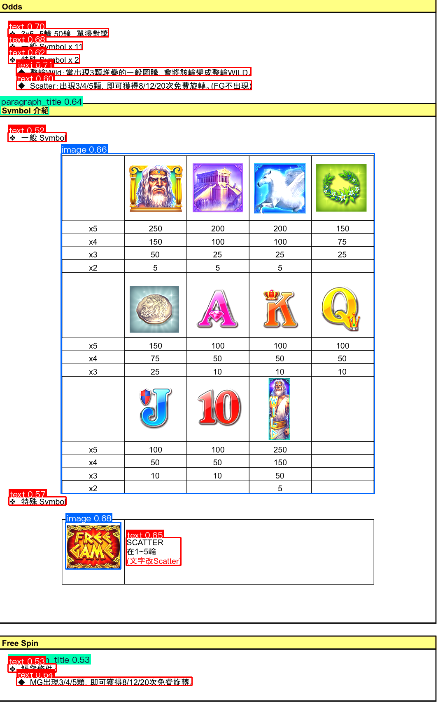

# 緒論

遊戲產品在開發的過程中，遊戲規格書(Game Design Specs, GDD)幾乎就是整個產品所有研發人員智慧及經驗的結晶。然而，開發的過程所有人員脈絡清楚，許多內隱知識往往不會特別寫進去。開發期可能不會是問題，但若是經過一段時間再回頭檢視，隨著記憶和脈絡資訊的遺失，規格書內含的知識，卻再也無法讓讀者繼續傳承重要的內隱知識。明明文件滿地都是，但卻都像是”乾涸”無用的庫存文件，往往導致新人只好從頭學習摸索，花費無謂的試錯成本，無法有更多的空間進行新規格的思考及試錯。

2023年開始，生成式人工智慧(Generative Artificial Intelligence, GenAI)技術爆發式成長，透過預訓練(Pre-Trained)的大語言模型(Large Language Model, LLM)能以超高效率理解和輸出文字。這為「活化規格書」開啟了新的可能：我們能否讓GenAI代替我們理解規格書？又能否讓GenAI補充規格書缺失的脈絡？因此本論文將深入研究，GenAI是否能解答上述問題，放大既有創意資產的優勢。

關鍵字：生成式人工智慧，遊戲規格書，創意資產

# 誌謝

所有對於研究提供協助之人或機構，作者都可在誌謝中表達感謝之意。論文口試時的論文初稿，請不要放這頁，因為你還沒畢業。

# 研究背景與動機

## 遊戲規格書：創意資產的基石與內隱知識的困境

遊戲規格書是遊戲產品開發的核心文件，它不僅是各部門協作的藍圖，更是承載產品設計哲學與所有技術細節的「創意資產」。在快速變化的遊戲產業中，GDD幾乎是所有研發人員智慧與經驗的結晶。然而，開發過程的脈絡清晰性與人際間的溝通，導致許多關鍵的「內隱知識」（Tacit Knowledge）——例如設計取捨的理由、特定功能決策的背景、以及測試時的限制條件——往往不會被充分記錄在文件之中。

隨著時間的推移，特別是當核心成員異動或項目進入維護階段後，這些內隱知識會迅速遺失。此時，GDD雖然文件齊備，卻喪失了原有的脈絡和「生命力」，成為如同摘要所述的「乾涸」庫存文件。這對遊戲開發公司造成了雙重挑戰：

1. 學習曲線陡峭與試錯成本高昂：新加入的開發者或維護團隊必須花費大量的時間進行重複性的摸索和試錯，以重新理解歷史決策的「為何（Why）」，這嚴重延遲了產品的迭代速度，並提高了無謂的研發成本。
2. 創意資產價值減損：規格書的核心價值在於傳承，當傳承能力受損，企業的既有創意資產價值隨之減損，資源被浪費在重現既有知識，而非新的規格思考及創新。

## 生成式人工智慧的興起與活化文檔的契機

自2023年起，以預訓練大語言模型為核心的生成式人工智慧技術迎來爆發性成長。LLM具備超高效率的文字理解、語義連貫和脈絡推理能力，使得它能快速處理大量複雜文本並生成符合情境的回應。

本研究認為，GenAI的特性能為GDD的「活化」提供關鍵解決方案。我們不再需要耗費大量人力去追溯和補寫遺失的脈絡，而是可以探究GenAI是否能扮演以下兩個重要角色：

1. GDD脈絡化理解：利用GenAI強大的閱讀理解能力，快速吸收GDD中複雜的文字描述與結構，並建立知識圖譜或語義索引。
2. 內隱知識推論與補充：基於LLM的推理能力，結合GDD的「顯性知識」與其自身的「廣泛知識」，推論並補充缺失的設計意圖、決策邏輯和潛在限制，將「乾涸」的文件轉化為富有「脈絡」的知識庫。

因此，本研究的動機是希望藉由GenAI的導入，系統性地解決遊戲規格書中內隱知識流失的痛點，使規格書中的內容在遊戲研發的過程中，真正發揮複利效果(Compound Effect)，引出更多更有效的創意發想。

## 研究目的

「活化文檔」並不是一次性作業，而是要同時面對既有文件、新生資訊的處理以及後續應用等多面向，且無明確時間線的問題。因此，本研究的目的是嘗試回答以下三個問題：

1. 當面對非結構化(Non-structured)、甚至是非數位(Non-digital)的既有文件時，能規模化的萃取精確資訊及填補遺失脈絡的最佳實踐方式有哪些？
2. 當營運或研發的過程中，新生成的資料或資訊，有哪些可以捕捉並將其轉化為實際的知識的手段或策略？
3. 在成功萃取並將規格書知識化後，能透過哪些具體的應用策略（如多條件檢索、競品分析、新規格重組孵化、素材與雛型生成）來最大化這些創意資產的商業與研發價值？

## 研究架構與方法

本研究將採用個案研究法 (Case Study)。研究的重點將放在針對具代表性的遊戲規格書，驗證GenAI技術的理解能力是否足夠，也嘗試找出能優化理解能力的方法。本研究將基於既有的GenAI技術，提出針對不同資料類型的最佳萃取策略，並輔以概念、範例與成效比較 。

## 研究範圍與限制

GenAI產品和技術迭代迅速，為統一評估可行性標準，將會以2025年12月17日為截止日，所發表的Gemini 3.0產品，輔以Flash及Pro兩個模型，作為本次研究主要的GenAI模型能力代表。在進行規格書的理解測試時，也會以同樣的產品來測試如何優化理解能力的方法，最後是針對遇到的問題提出相關假設，並驗證是否有效能優化理解能力。透過提出相關假設並隨後驗證其在增強理解方面的有效性。這種方法的目標並不單純僅是判定GenAI在理解複雜規格方面的現狀，而是在開發在此關鍵任務中的可用策略。

## 論文架構

本論文將分為四個章節：

- 第一章 緒論：說明研究背景、動機、目的、範圍、方法與限制。
- 第二章 文獻探討：說明知識管理的重要性，知識管理流程的本質以及已知的業界解法
- 第三章 研究方法與流程：說明研究原則，「萃取」的定義及目標，以及實驗目標說明。
- 第四章 結論與建議：總結研究發現，並對未來的發展提出建議。

# 文獻探討

## 知識管理的重要性為何？

現今有許多知識密集性產業，只是輸出的型式不同而已。在個案遊戲公司就是一個鮮明的例子。拜科技進步所賜，製作遊戲已非高技術門檻的目標，成熟的遊戲引擎已可讓國中生就可以製作出一個可運行的遊戲。但若是要製作出高品質或是受歡迎的遊戲產品，這當中牽涉的環節就相當多。所謂的「環節」，就是各家遊戲公司或工作室所掌握的「內隱知識(Tacit Knowledge)」。

不論是遊戲產業或是工程領域，通常會稱呼這類知識叫做「Know-How」。許多的研究都表明，有組織有效率的「知識管理流程(Knowledge Management Process,KMP)」，會給企業帶來更多的「創新能力(Innovation Creation, IC)」以及更好的「組織效能(Organization Performance, OP)」[@mardaniRelationshipKnowledgeManagement2018]。為什麼呢？除了讓組織裡的成員能在更好的基礎上，去思考解決問題的可能性，研究表明，更好的KMP通常代表著具有更創新的空間[@huangMediatingEffectKnowledge2009]能讓成員去發展想法，更創新的想法就會有更高的機率去促成更好的OP[@grantKnowledgeManagementKnowledgeBased2006]。KMP, IC和OP三者的關係如「[@fig:image1]」：

![Research model[@mardaniRelationshipKnowledgeManagement2018]](images/image24.png){#fig:image1}

在這個概念下，《The effect of knowledge management practices on firm performance》[@palaciosmarquesEffectKnowledgeManagement2006] 的研究也證實了這一點。良好的知識管理，是確實可以直接影響到企業的實際表現的，不論是在營收成長，股東滿意度，或是競爭優勢，都和知識管理的成熟程度有高度相關。

## 知識管理流程的本質

據文獻，知識管理通常涉及知識的創造(Creation)[@popadiukInnovationKnowledgeCreation2006]，獲取(Acquisition)[@zhengImpactMultidimensionalSocial2025]及分享(Sharing)[@songKnowledgeSharingInnovation2008]。在網路基礎建設已十分發達的現在，「分享」是阻力最小的一環。各式各樣的瀏覽器(Browser)都可以讓文字和圖片簡單的複製貼上，影片也有足夠的頻寬可透過串流(Streaming)觀看。只要沒有權限的限制，我們可在一夜之間傳遞各種型態的知識給他人。

在GenAI技術逐漸成熟的現在，只要有知識的原始內容(Raw Material)，可能是一篇純文字內容，或是一份「可攜列印格式文件(Portable Document Format, PDF)」，丟進ChatGPT或是Gemini，我們就可以更高的效率輸出成梳理過的文章，具象化的圖片，甚至是生動的影音內容，來分享知識的內容。僅管，這已開始造成某些行業的破壞及變革，成為企業裁員的理由，造成許多人失業，但這都是不可逆的趨勢。

但，知識管理並不是只有分享一環而已，GenAI也不是真的什麼都能生成的出來，因為在「創造」和「獲取」這兩個任務，仍然是知識管理領域中最難克服的本質。不論是實務經驗，還是文獻研究，都表明一個殘酷的事實，創造和獲取知識因通常難以和績效或薪酬直接掛鉤[@ajmalCriticalFactorsKnowledge2010]，導致員工並沒有積極的動力將研發過程的知識整理出來。許多知識可能是在過程中「創造」出來的，亦或是透過和專家訪談「獲取」而來的，但這都只是最終產品的中間產物而已。因為績效不問中間過程，這種供需極度失衡的矛盾現象，導致多數組織就算定了目標，有意圖想把知識管理做好，最終都是落得一個虎頭蛇尾的結局。企業主或管理階段能想到的都是”只要有知識庫，我們就可以如何如何…”，但”只要有知識庫”這件事才是問題。知識管理的困難其實不是「管理」，而是「知識」。

## 知識管理的等級

知識管理其實不像是一個明確的目標，比較像是一個文化或是標準，因此國際標準組織(International Standard Organization, ISO)在2015年才在 [9001號標準](https://www.iso.org/standard/62085.html) 中，新增了 7.1.6 的要求：

> 組織應決定其流程運作和實現產品與服務符合性所需知識。這方面的知識應被保存,且可適用於需求的範圍。在處理變更需求和知識時,組織應考慮到其目前知識基礎,及決定如何獲得或使用所需的額外知識。

但這也是一個概念而已。之後的研究比較有共識的部分，當屬《A Model of Organisational Knowledge Management Maturity Based on People, Process, and Technology》[@peeModelOrganisationalKnowledge2009]提出的5個成熟度等級，如「[@tbl:table1]」：

: Characteristics of Non-CMM-based KMMMs[@peeModelOrganisationalKnowledge2009]「知識管理」的成熟度 {#tbl:table1}

| 成熟度 (Level) | 內涵 (Description)                                                                                         |
| -------------- | ---------------------------------------------------------------------------------------------------------- |
| Level 5        | 知識分享已經體制化，組織疆界極小化。知識技能及專業知識包裹為套裝知識，有能力加速知識生命循環，以創造優勢。 |
| Level 4        | 主要特色為知識分享，可對環境做出預先回應。知識生命循環清楚被界定，效益可以被量化。                         |
| Level 3        | 組織已察覺管理知識的需求且開始蒐集知識管理衡量方法且和企業生產力結合。                                     |
| Level 2        | 只分享例行及程序性的知識。                                                                                 |
| Level 1        | 知識未明確文件化，獨立零碎散落各部門。                                                                     |

在這樣的分級下，如前述，「分享」是阻力最小的，也就是說一但克服了1~3級的障礙，後面的就不困難了。因此，本研究主要的方向，主要是從等級1到等級3：關鍵在於散落在各部門的文件，是否能被適當的活化，填補遺失的脈絡，進而成為產生行動的依據。

## 目前為止有無終極解法？

早期的著作如《The data warehouse ETL toolkit: Practical techniques for extracting, cleaning, conforming, and delivering data》[@kimballDataWarehouseETL2004]，講述的都是純文字的資料處理(e.g. XML)或是資料庫的轉換。富比士的[統計](https://kommandotech.com/statistics/big-data-statistics/)也呼應了實務上的困境：企業中95%的資料都是無結構化(Unstructurized)型式的資料，也就是無法做為知識庫的資料。為了要能夠把無結構化的資料變成所謂的知識，各個時期的科技公司都有不同的做法，如「[@fig:image2]」。

![Evolution of the techniques used for information extraction from unstructured documents[@baviskarEfficientAutomatedProcessing2021]](images/image28.png){#fig:image2 fig-pos="H"}

最早期是完全人工處理，後來導入了光學字元辨識(Optical Character Recognition,OCR)技術，再加上機器程序自動化(Robotics Processes Automation,RPA)後，僅管已經減少了不少人力，但對於資訊的頡取還是有不足之處，因為有的文件已毀損不清，有的內容語焉不詳。到了基於變換器的雙向編碼器表示技術（Bidirectional Encoder Representations from Transformers，BERT）這種基於自然語言處理（Natural Language Processing,NLP）的預訓練技術加入後，文字的處理品質有了極大的提升，文字幾乎已經不再是問題。真正困難的問題只剩下表格(Tables)類及訊息圖表(Figures, Diagrams and Infographics)類的資訊。這類的文件就非常依賴領域知識(Domain Knowledge)才能做正確的解讀，如金融領域類的知識萃取雖然比較成熟[@pejicbachTextMiningBig2019]。但技術上還沒有太大的突破，還是需要有不少的資料前處理(Text Pre-Processing),如「[@fig:image3]」：

{#fig:image3}

即便要使用類神經網路來訓練萃取，還是要經過不少處理，才能繼續進行「特徵提取(Feature Extraction)」的步驟。

# 研究方向與結果

## 三大研究原則

回顧我們要解決的問題：

1. 當面對非結構化、甚至是非數位(Non-digital)的文件時，要能規模化(In Scale)的萃取其中精確資訊的最佳實踐方式有哪些？
2. 當營運或研發的過程在產生新資料或資訊，且其中仍包含重要知識時，有哪些可以捕捉並將其轉化為實際的知識的手段或策略？
3. 在成功萃取並將規格書知識化後，能透過哪些具體的應用策略來最大化這些創意資產的商業與研發價值？

本研究提出的因應原則為三：可規模化，可持續性，價值極大化。第一題的關鍵是可規模化。如果只是解決幾份文件，找人來執行即可。但實務狀況是文件滿地都是，大家手上都有”更重要”的事情要處理，完全用人力來萃取這些知識，是幾乎不可能，也不切實際的。第二題的關鍵是可持續性(Sustainable)。就算今天此時此刻，我們真的把所有的文件都萃取完成，但接下來呢？如果沒有改變作業流程，待萃取的文件會以難以控制的速度繼續增長，人力是負荷不了的。那，我們應該如何改變作業流程，讓新資訊的誕生就能被萃取成知識，就算不是100%轉化，也可以持續優化？第三題的關鍵則是價值極大化(Value Maximization)。知識萃取本身只是手段，如果沒有後續的應用場景來支撐（例如多條件檢索、競品分析或雛型生成），花費資源所建立的語料庫終將淪為另一個無人問津的數位檔案庫。因此，確保萃取後的知識能夠直接驅動商業決策與研發效率，是整個策略中最具決定性的一環。

儘管本研究的目標僅是針對一份規格書，但針對這份規格書我們發現的問題以及克服問題的方法，亦符合上述主要研究原則。

## 「萃取」的定義

本研究的重點目標為「萃取(Extraction)」。為了儘可能保證研究的客觀性和一致性，在這裡我們針對「萃取」進行一個兼具理論和實務的定義。

![資料(Data)，資訊(Information)和知識(Knowledge)的意義及價值[@ackoffDataWisdom1989]](images/image60.png){#fig:image4}


在《The wisdom hierarchy: representations of the DIKW hierarchy》[@rowleyWisdomHierarchyRepresentations2007]中，作者引用了《Business information management: improving performance using information systems》[@chaffeyBusinessInformationManagement2005]中提到的內容，說明了資料，資訊和知識的意義及價值的不同。如「[@fig:image4]」所示，知識和其他兩者最關鍵的不同，當屬其脈絡(Context)的成份有多少[@ackoffDataWisdom1989]，惟有加入足夠多的脈絡，知識才有可行動(Actionable)的價值和意義。

本研究的文件範圍，大多數都是介於資訊或資料的層級。但AI的理解能力已不斷進化，也已經超越大多數人們的智商，如果AI可以直接理解文件的內容，那我們即可基於文件的內容，搭配AI的檢索進而採取行動，這份文件在AI的輔助下亦可補回缺失的脈絡，就不需要再進行所謂的萃取；反之，如果AI在沒有足夠的脈絡的前提下，就無法正確回答文件中其實有記載的內容，我們就需要透過GenAI來輔助生成脈絡，或是由我們手動輸入補充，才能成為可讓我們採取下一步行動的內容，至此我們才能定義這份文件的相關知識，已被「萃取」出來。

## 目標文件及其驗收標準

本研究的目標遊戲是【宙斯】，在YouTube可以找到參考影片「[IGS宙斯悦华软件批发测试中](https://youtu.be/rZyODkoJsp0)」，遊戲規格書是「[《宙斯》規格](https://docs.google.com/spreadsheets/d/1XdilZVbW5-I5X8Mg_FVIxUekvLGPw4TG4eeABJsl2y4/edit?usp=sharing)」。這類的遊戲在業界通常簡稱為老虎機(Slot Game Machine)，玩法也是變化萬千，但在本文研究範圍及資源有限，且驗證標準要儘量一致的情況下，我們就以這一款產品為目標。

測試驗證的方向可簡單分為以下三類：純文字理解，內建圖像理解，以及表格內容理解。為了加速驗證假設是否正確，我們選擇用 **Gemini 3 的便捷(Fast), 思考(Thinking)以及專業(Pro)三種模式，對同樣的問題進行實際測試** 。這三種模式主要是[思考深度的差異](https://vertu.com/lifestyle/gemini-3-flash-outperforms-pro-in-coding-while-pro-suffers-critical-memory-issues/)，同時也是速度和深度的差異。如字義，便捷模式的思考主要是類似「膝反射」式，完全依賴模型預訓練知識及快速簡單推論的回答。思考模式會針對問題進行反思推論，是否有不合邏輯之處，而專業模式是拆解問題，進行多層次，接近「第一性原理(The First Principles)」的推論及思考。驗證的流程會先以便捷模式為優先，如果答案已經足夠，則不進行其他模式的後續驗證。若不行，則會進行其他兩個模式的驗證，確認同一個問題是否在更深的推論能力下即可得到品質足夠的答案。透過這三個程度的驗證就可以知道，以目前大語言模型的能力，能有多少程度正確理解規格書上的內容，進而成為可供我們採取下一步行動的知識。

## 實際測試

如前述，我們會透過Gemini 3的三種模式，對同樣的問題進行實際測試。Gemini只是其中一個成熟的大語言模型，同類(參數足夠大)的產品還有ChatGPT或是Grok等。理論上測試的效果差異不會太大，因此以下我們將用「AI」直接代稱。

### 純文字理解

為了驗證AI的理解能力，我們設計了一些不是”搜尋”得出來的內容，均是需要透過理解意圖(Intention)和文件語義(Semantics)內容才能正確回答的問題。測試的目的是想確認當文字分散在不同的工作表，以專有名詞或是過短的描述寫作時，AI是否能夠正確回答內容。

1. 這個遊戲有多少個符號？是幾輪幾線的遊戲？
2. 免費遊戲的條件是？
3. 在主遊戲有什麼特殊玩法？觸發條件是？
4. 跟特殊遊戲(Feature Game)有關的音效有哪些？
5. 「長條堆疊圖騰」在哪裡會出現？條件為何？何時消失？

#### 這個遊戲有多少個符號？是幾輪幾線的遊戲？

{#fig:image5 width=50%}

在規格書的內容如「[@fig:image5]」。純文字的內容算是連續排列，AI應可讀取完整內容，要測試的主要是AI的預訓練模型知識中，能否直接理解老虎機遊戲(Slot Game)常見行話(Jargon)以及會不會被其他內容誤解。3x5是「3列5欄」，但可以是15輪，也可以是5輪。至於有多少個「符號(Symbol)」也是一樣的道理，這個領域對轉出來的東西行話確實也就是「Symbol」。

> User：這個遊戲有多少個符號？是幾輪幾線的遊戲？
>
> AI：根據您 Google Drive 中 【《宙斯》規格】 文件的內容，這個遊戲的規格如下：
>
> 1.  符號數量：共有 13 個符號。
>     *   11 個一般 Symbol
>     *   2 個特殊 Symbol
> 2.  輪數與線數：這個遊戲是 5 輪 50 線的老虎機，其基本結構為 3x5 的顯示配置。

AI 的回答如上。完全正確。可見這部分已經無須多加脈絡，AI的預訓練知識已覆蓋老虎機基本領域知識。

#### 免費遊戲的條件是？

{#fig:image7 width=50%}

{#fig:image8 width=50%}

答案其實有兩個部分，如「[@fig:image7]」和「[@fig:image8]」。這裡要測試AI是否能夠理解「免費遊戲」跟「免費旋轉」是同一件事。而且在不同的位置，都有似是而非，模梭兩可的內容，還帶有一些”雜訊”，像是「MG出現3/4/5顆」或是「(FG不出現)」，都是測試的一部分。

> User：免費遊戲的條件是？
>
> AI：根據您 Google Drive 中 【《宙斯》規格】 文件的內容，免費遊戲的觸發規格如下：
>
> *   觸發機制：主要透過 Scatter 符號觸發。
> *   觸發條件與獎勵：
>     *   出現 3 個 Scatter：獲得 8 次免費旋轉
>     *   出現 4 個 Scatter：獲得 12 次免費旋轉
>     *   出現 5 個 Scatter：獲得 20 次免費旋轉
>
> 備註：Scatter 符號僅在主遊戲 (MG) 中出現。

AI 的回答如上。並沒有受到雜訊的影響，也可以理解「免費遊戲」和「免費旋轉」其實就是同一回事，算是完全正確理解。

#### 在主遊戲有什麼特殊玩法？觸發條件是？

{#fig:image10 width=50%}

如「[@fig:image10]」，答案在「Feature」這張工作表(Worksheet)中。試算表類型的文件和一般的文件最大的不同就是，它會含有不同的工作表，以區隔不同主題的內容。當然，這也是方便人類閱讀的設計之一，但AI是否能理解這還是在同一份文件的內容？會不會AI只看得到「規格文件(第一張工作表)」的內容而已？這是這項測試主要驗證的目標。

> User：在主遊戲有什麼特殊玩法？觸發條件是？
>
> AI：根據您 Google Drive 中 【《宙斯》規格】 文件的內容，主遊戲包含以下特殊玩法：
>
> 1.  堆疊 Wild (Stacked Wild)
>     *   說明：當轉輪 (Reel) 上出現 3 個連續的相同符號（堆疊）時，該輪將會變成整輪的 Wild 符號。
> 2.  Scatter 機制
>     *   說明：Scatter 符號主要用於觸發免費遊戲。
>     *   觸發條件：當畫面中出現 3 個或以上的 Scatter 符號時。

AI 的回答如上。它正確回答了規格書中的內容，看來它是可以讀取到不同工作表的內容的。

#### 跟特殊遊戲(Feature Game)有關的音效有哪些？

{#fig:image12 width=50%}

如「[@fig:image12]」，在題目上我們再做了一個變化，同樣也是老虎機遊戲領域內的一個行話「特殊遊戲(Feature Game)」。這個行話的定義就比較會有分岐，有人認為特殊遊戲是綁定遊戲主題，有特殊玩法的「獎勵遊戲(Bonus Game)」；也有人認為只要不是主遊戲，其他像是免費遊戲，獎勵遊戲還是其他不同玩法的遊戲，因為絕大多數的設計也必然是綁定主題，或是法規需求的，所以皆可通稱為特殊遊戲，是一個分類名。我們也透過這樣的驗證，來瞭解AI對這個領域的認知是否跟我們的一致？如果它找不到答案，看看它的推論理由為何。

> User：跟特殊遊戲(Feature Game)有關的音效有哪些？
>
> AI：根據您 Google Drive 中 【《宙斯》規格】 文件的內容，目前沒有找到直接標註為「特殊遊戲 (Feature Game)」的相關音效設定。
>
> 文件中提到的特殊玩法主要是「整輪 Wild (Stacked Wild)」，但在音效列表中並未找到與此玩法對應的專屬音效項目。

AI 的回答如上，明確反映規格書中沒有相關的內容。它的理由是僅將「整輪Wild」這樣的玩法視為是一種特殊玩法。可即便如此，它仍然沒有將其視為特殊遊戲相關的音效。因此，接下來我們試著用「思考型」模式來測試看看，「多想想」能不能找到該有的答案。

> 在《宙斯》這類主題的遊戲規格中，與特殊遊戲（Feature Game）相關的音效設計通常涵蓋以下幾個核心範疇：
>
> 1. 模式轉換與進入音效：當觸發特殊遊戲模式時，通常會設計強烈的轉場音，例如雷鳴聲、神殿大門開啟的厚重摩擦聲，或是一段極具史詩感的過場樂曲，用以提醒進入高獎勵階段。
> 2. 特定功能的觸發音效：
> * 閃電打擊聲：若特殊遊戲中包含宙斯施展神力（如將符號變為百搭 Wild、增加乘數），通常會搭配震撼的雷擊或電力流動的聲音。
> * 能量匯聚音：在加成效果累積、符號升級或解鎖額外捲軸時使用的上升音階音效。
> 3. 背景音樂（BGM）的變更：進入特殊遊戲後，音樂通常會切換至節奏更為明快、張力更強的編曲版本，以營造緊張感並與主遊戲區隔。
> 4. 獎勵結算與慶祝音效：
> * 贏分跳動聲（Win Count Up）：贏分快速累積時的連續叮噹聲或音階攀升聲。
> * 大獎達成音（Big Win/Mega Win SFX）：伴隨慶祝樂句與虛擬硬幣落下的音效。
> 5. 角色語音（Voice Over）：如宙斯的威嚴笑聲、低沈的喊話（如「By the beard of Zeus!」）或宣告勝利的語音，增加遊戲的互動感與角色帶入感。
> 這些音效規格共同構成了特殊遊戲的視聽層次，旨在透過聽覺回饋來強化玩家在特殊環節中的沉浸體驗。

切換AI到思考模式後，"過度"的思考反而產生了「幻覺(Hallucination)」，它開始編造規格書中沒有的內容。因此初步我們可以判定，這部分不但是需要補充脈絡的部分，而且也給我們一個明確的警示，在試算表這種型式的文件中，AI的理解可能是很零碎的，是沒有整體概念的，某些問題能正確回答，不代表”同類”的其他問題一樣可以正確的回答。

#### 「長條堆疊圖騰」在哪裡會出現？條件為何？何時消失？

{#fig:image15 width=50%}

如「[@fig:image15]」，這需要AI先理解「長條堆疊圖騰」，在規格書中其實被拆成2段說明。一個是「堆疊圖騰」，另一個則是「長幅WILD圖騰」。這就是實務上的知識庫，和單純的搜尋的不同之處，如果僅是搜尋「長條堆疊圖騰」是搜不到”正確”答案的，因為其實在規格書是有另一種說法的，但只要是有內隱知識的企劃人員，都會理解那就是同一回事。其次，在規格書中，這個流程也被拆成多段分別說明了，我們要測試的目標，就是看看AI能否串連所有的文字一併理解。

> User：`@Google` 雲端硬碟 在「《宙斯》規格」中，「長條堆疊圖騰」在哪裡會出現？條件為何？何時消失？
>
> AI：在《宙斯》規格文件中，關於「長條堆疊圖騰」的相關資訊如下：
>
> - 圖騰名稱：文件中描述的是「3顆堆疊的一般圖騰」。
> - 出現條件：當出現3顆堆疊的一般圖騰時，會將該輪變成整輪Wild（整輪Wild）。
> - 出現位置：文件中並未明確指出會在哪一輪或哪些輪出現該圖騰。
> - 消失時間：文件中並未提及該圖騰「何時消失」的資訊。
>
> 您希望我再查找《宙斯》規格文件中其他關於特殊符號 (Special Symbol) 的資訊嗎？

從上述對話可見，僅管AI可以找到「哪裡會出現」及「何時出現」，但意外的是對於「何時消失」卻無法從「移動到第一輪的WILD，下一輪將消失」的說明理解及回答出正確答案。

#### 正確率小結

簡單的5個題目在AI的測試，整理出來的正確率如下：

: 文字理解的正確率小結 {#tbl:table2}

| 編號 | 題目簡述                                           | 正確率 |
| ---- | -------------------------------------------------- | ------ |
| 1    | 有多少個符號？是幾輪幾線的遊戲？                   | 100%   |
| 2    | 免費遊戲的條件是？                                 | 100%   |
| 3    | 在主遊戲有什麼特殊玩法？觸發條件是？               | 100%   |
| 4    | 跟特殊遊戲有關的音效有哪些？                       | 0%     |
| 5    | 「長條堆疊圖騰」在哪裡會出現？條件為何？何時消失？ | 60%    |
| 總分 | ---                                                | 72% |

### 內嵌圖片理解

多樣式文件中很常會有圖片。各種文件對於圖片的處理方法基本上大同小異，不是嵌入(Embedded)在文件中，像是Microsoft的Word, PowerPoint及Excel這類的文件，不然就是以外連(Image Link)的型式渲染出來，像是HTML或是Markdown這類的文件。由於遊戲規格書在以前，大多數是給人類閱讀的，正所謂「一圖抵千言」，因此常會有許多附圖，幫助讀者理解。但實務上，在開發期人類能夠”閱讀”它們，是因為在開發期人們對這個產品的所有脈絡是知根知底的，所以在閱讀上不會有什麼障礙。可如果產品已經釋出或銷售，多半這類文件就是進入封存狀態，等到幾個月後再去閱讀，甚至是幾年後再去閱讀，之前的脈絡訊息已經遺失，要再透過”閱讀”規格書來理解這個產品的規格，就會變得非常困難。因此，我們希望能透過GenAI的能力，測試看看GenAI是否能有足夠的脈絡理解規格書，如果可以的話，是否也能將這些脈絡給反向輸出到規格書中，幫助人類在之後需要回頭理解這個產品的規格時，更能快速掌握所有相關知識。

以下的問題基本上都是需要”看懂圖片”，而不是依賴理解文件上的片段文字推論出來的，以確保我們可以驗證得出來，AI對圖片中的的資訊，是否跟人類是對齊的。

- 「一般symbol」有哪些？它們的獎項表(Odds Table)為何？
- 「特殊symbol」長什麼樣子？
- 「堆疊圖騰擴張變成長幅WILD圖騰後進行對獎」中提到的「長幅WILD圖騰」是長什麼樣子的？
- 遊戲介面中，有哪些按鈕，又有哪些玩家資產相關的訊息？
- Info頁有幾頁內容？內容分別為何？

#### 「一般symbol」有哪些？它們的獎項表(Odds Table)為何？

{#fig:image17}

如「[@fig:image17]」，我們可以看到，規格書並沒有針對這些符號作出解釋或描述。我們幾乎可以預期得到，這個題目如果拿去詢問AI的話，在沒有文字的情況下，AI應該是無法正確的回答的。

> User：`@Google` 雲端硬碟在《宙斯》規格中，「一般symbol」有哪些？它們的獎項表(Odds Table)為何？
>
> AI：您好！我在您的 Google 雲端硬碟文件《宙斯》規格中找到了相關資訊：
>
> - 在規格文件工作表中，提到遊戲有11個一般 Symbol。
> - 同時還有2個特殊 Symbol。
>
> 但是，文件中提供的內容沒有列出這11個一般 Symbol 的具體名稱，也沒有提供它們的獎項表(Odds Table)。
>
> 您希望我再嘗試用其他方式搜尋您雲端硬碟中的相關資訊嗎？

如上所示，AI確實沒有辦法回答這些Symbol的名稱。而且表格中的那些數字對它而言，也是一堆無法理解的數字。

#### 「特殊symbol」長什麼樣子？

{#fig:image19}

如「[@fig:image19]」，和前一題類似，儘管在圖的右側有”SCATTER”這樣的文字註解，但其實正確答案並不是”SCATTER”，這個特殊symbol的描述應該是”紅底金字的FREE GAME”這類的內容，我們來看看AI會怎麼回答。

> User：那「特殊symbol」長什麼樣子？
>
> AI：我在您的 Google 雲端硬碟文件《宙斯》規格中找到了關於「特殊 Symbol」的功能描述，但沒有找到它們的具體圖案或外觀描述（也就是「長什麼樣子」）。
> 文件提到的2個特殊 Symbol 及其功能如下：
> 
> - 特殊 Symbol x 2
>   - 整輪Wild (Wild)：當出現3顆堆疊的一般圖騰時，會將該輪變成整輪WILD。
>   - Scatter (分散符號)：出現3/4/5顆即可獲得8/12/20次免費旋轉（免費旋轉中不會再出現 Scatter）。
>
> 很抱歉，文件內容沒有提供這些特殊 Symbol 的圖像或更詳細的外觀資訊。

如上所示，AI雖然找到了特殊 Symbol，也找到了相關的規格，但對於 symbol 長什麼樣子，在沒有足夠的文字輔助的情況下，就是無法回答。

#### 「堆疊圖騰擴張變成長幅WILD圖騰後進行對獎」中提到的「長幅WILD圖騰」是長什麼樣子的？

{#fig:image21 width=90%}

{#fig:image22 width=90%}

如「[@fig:image22]」，規格書其實是使用了兩張圖作為展演的分鏡說明。上圖是說明當三個「神殿」符號堆疊在一起的時候，會擴展成一個如下圖的「宙斯長幅WILD圖騰」。這也是在考驗AI是否能正確理解，用戶的問題其實是在詢問下圖的內容。

{#fig:image23}

如「[@fig:image23]」，AI從既有的文字中雖然已經找到這個圖騰的形狀及屬性，但就是沒有辦法描述出這個「長幅WILD圖騰」的實際內容。

#### 遊戲介面中，有哪些按鈕，又有哪些玩家資產相關的訊息？

其實這一題所需要理解的圖，也是「[@fig:image22]」這一張。主要的按鈕就是「開始旋轉」，「最大押注」，「快速」，「+/-」或「購買」的這些。玩家的資產就是最上方「福」的右邊那串數字，「贏分」是正下方的數字，累積彩金是「購買」鈕的右側數字。接下來就看看AI能找到多少。

> User：遊戲介面中，有哪些按鈕，又有哪些玩家資產相關的訊息？
>
> AI：雖然您提供的規格文件中沒有一個專門的「介面」或「UI」文件來詳細列出所有按鈕和資產欄位，但從《宙斯》規格-音樂音效.csv 和《宙斯》規格-多國翻.csv 中，可以推斷出遊戲介面上存在且需要以下按鈕和玩家資產相關的資訊：
>
> **玩家操作按鈕/介面元素 (Buttons/UI Elements)**
>
> 這些是根據規格文件推斷出必須存在的操作：
>
> | 類型 | 推斷項目 | 依據文件內容 |
> |------|----------|--------------|
> | 功能按鈕 | INFO（遊戲說明/賠率表） | 在《宙斯》規格-音樂音效.csv 中提到 `open_info.mp3`（info 頁開啟音效）和 `close_ui.mp3`（info 頁開啟關閉），表明有開啟和關閉遊戲說明頁（Info Page）的按鈕。 |
> | 功能按鈕 | SPIN（旋轉/開始遊戲） | 在《宙斯》規格-Feature.csv 和《宙斯》規格-Free Game.csv 中多次提到 Spin 或下一手 SPIN，這是老虎機遊戲的核心操作按鈕。 |

> **玩家資產相關訊息 (Player Asset Information)**  
> 這些是根據遊戲類型和多國翻譯內容推斷出必須在介面上顯示的資訊：
>
> - 類型：押注資訊 — 推斷項目：線數。依據文件內容：《宙斯》規格-規格文件.csv、《宙斯》規格-多國翻.csv，50線明確提及，通常固定顯示於介面或資訊頁。
> - 類型：餘額/獲獎 — 推斷項目：中獎金額。依據文件內容：《宙斯》規格-音樂音效.csv，依獎項音效等級（如 Level 01.mp3、Level 02.mp3）對應贏分倍數，介面需顯示玩家當前或總中獎金額。
> - 類型：遊戲狀態 — 推斷項目：免費旋轉次數。依據文件內容：《宙斯》規格-Free Game.csv，「免費旋轉次數用畢即結束」、獲得 8/12/20 次免費旋轉，免費遊戲期間介面需顯示剩餘免費旋轉次數。

如上，這個回答稍微有點意外，但結論基本上還是同一個。AI一樣是無法真的理解規格書中圖像的內容，但它會嘗試從找到的所有文字，拼湊出可能的答案告訴用戶。

#### Info頁有幾頁內容？內容分別為何？

{#fig:image26 width=80%}

如「[@fig:image26]」，在「INFO」工作表中，最後一頁是「Page 3(派彩線數 50 LINES)」。如果只是問Info頁有幾頁內容，估計AI可透過”Page 3”得知有3頁，但「內容是什麼」這題就還是需要AI確實理解圖片內容才行，而且是三頁都要能理解。

> User：Info 頁有幾頁內容？內容分別為何？
>
> AI：以下是 Info 頁中每頁所記載的主要內容：
>
> **Info 頁內容概述**
>
> | 頁次 | 核心內容 | 詳細說明 | 來源文件 |
> |------|----------|----------|----------|
> | Page 1 | 特殊圖騰說明 | Wild（百搭圖騰）：可替代所有圖騰，除了 Scatter 圖騰（SC圖）。Scatter（分散圖騰）：出現 3/4/5 顆，即可獲得 8/12/20 次免費旋轉。 | 《宙斯》規格-INFO.csv |
> | Page 2 | （無詳細內容） | 文件中列為 Page 2，但沒有提供該頁的具體文字說明。通常可能為賠率表或詳細玩法說明。 | 《宙斯》規格-INFO.csv |
> | Page 3 | 派彩線數 | 明確標示遊戲的派彩線數為 50 LINES（50 線）。 | 《宙斯》規格-INFO.csv |

如上所述，不出所料，AI確實找到了3頁的Info，裡面有寫字的都回答出來了，但**圖片的內容無一正確描述**。

#### 正確率小結

簡單的5個題目在AI的測試，整理出來的正確率如下：

: 內嵌圖片的正確率小結 {#tbl:table3}

| 編號 | 題目簡述                                             | 正確率 |
| ---- | ---------------------------------------------------- | ------ |
| 1    | 「一般symbol」有哪些？它們的獎項表(Odds Table)為何？ | 0%     |
| 2    | 「特殊symbol」長什麼樣子？                           | 0%     |
| 3    | 「長幅WILD圖騰」是長什麼樣子的？                     | 0%     |
| 4    | 有哪些按鈕，又有哪些玩家資產相關的訊息？             | 0%     |
| 5    | Info頁有幾頁內容？內容分別為何？                     | 0%     |
| 總分 | 0%                                                   |        |

### 表格理解 {#sec:table-understanding}

如前述，在試算表中，文字不是連續存放的。同樣是一句話，可以放在同一個儲存格中，也可以拆到2個儲存格存放。僅管人類”看”起來都一樣，但若是做為知識庫(Knowledge Base)讓AI嘗試去理解，那可能就會得到不同的結果。這也就是和人類認知不對齊(misaligned)的地方，也是許多人聽說過的幻覺(Hallucination)的來源之一。我們要測試的，也就是人類可以很簡單”看得懂”的那些內容，看看AI的認知是否跟人類一致。

- 這個遊戲的美術需求中，有哪些是「動畫」類的需求？
- 這個遊戲的美術需求中，有哪些是「靜態」的需求？
- 這個遊戲有使用「聽牌音」嗎？
- 共用音效有哪些？遊戲專屬音效有哪些？
- 「100倍獎線獎報獎」和「轉場動畫音效」的品質是多少KBits？

#### 這個遊戲的美術需求中，有哪些是「動畫」類的需求？

{#fig:image28 width=90%}

如「[@fig:image28]」，我們先測試一個簡單的。從編號17的「Free Game瞇牌」到編號22的「Wild Symbol移動」6個項目就是動畫類的需求，儘管我們從編號1到編號16插入了合併儲存格，但這應該不影響AI判讀表格的內容。

> User：「動畫」類的需求有哪些？
>
> AI：但是，根據先前您提供的文件片段，特別是《宙斯》規格-美術需求.csv 中提及的內容，我可以推斷並列出以下幾項明確的動畫類需求：
>
> **《宙斯》規格 - 動畫類美術需求（根據文件名推斷）**
>
> | 編號 | 類型 | 製作內容 | 說明 |
> |------|------|----------|------|
> | 17 | 動畫 | Free Game 瞇牌 | 專屬於免費遊戲的圖騰翻開或揭示動畫。 |
> | 18 | 動畫 | Scatter 中獎動畫 | Scatter 圖騰組合中獎時的動畫效果。 |
> | 19 | 動畫 | Wild 中獎動畫 | Wild 圖騰組合中獎時的動畫效果。 |
> | 20 | 動畫 | 一般 Symbol 變成 Wild 動畫 | 3 顆相同堆疊圖騰擴張變成長幅 WILD 圖騰的動畫。 |
> | 21 | 動畫 | Feature 觸發動畫 | 用於觸發主遊戲「堆疊圖騰變 Wild」特色玩法時的入場或過場動畫。 |
> | 22 | 動畫 | Wild Symbol 移動 | 在 Free Game 中，長幅 Wild 圖騰向前移動一輪的效果動畫。 |

如上所述，如預期，AI可以正確找到編號17到編號22的項目都算是「動畫」類型的製作內容。

#### 這個遊戲的美術需求中，有哪些是「靜態」類的需求？

如「[@fig:image28]」，這就是對著「合併儲存格」測試。即便在2025年09月的AI，仍然無法正確的理解合併儲存格的內容，現在我們再試試看是否有進步。

> User：有哪些是「靜態」類的需求？
>
> AI：根據《宙斯》規格-美術需求.csv 文件，以下是屬於「靜態」類別的美術需求，主要包含遊戲的背景、轉輪帶和所有基本的靜態圖騰：
>
> | 編號 | 類型 | 製作內容 | 說明 |
> |------|------|----------|------|
> | 1 | 靜態 | Main Game 背景 | 背景需和轉輪帶分開，需要考量 4:3 版本。 |
> | 2 | 靜態 | Main Game 轉輪帶 | |
> | 3 | 靜態 | Free Game 背景 | 背景需和轉輪帶分開，需要考量 4:3 版本。 |
> | 4 | 靜態 | Free Game 轉輪帶 | |
> | 5 | 靜態 | 雷電手 Symbol | |
> | 6 | 靜態 | 宮殿 Symbol | |
> | 7 | 靜態 | 飛馬 Symbol | |
> | 8 | 靜態 | 桂冠 Symbol | |
> | 9 | 靜態 | A Symbol | |
> | 10 | 靜態 | K Symbol | |
> | 11 | 靜態 | Q Symbol | |
> | 12 | 靜態 | J Symbol | |
> | 13 | 靜態 | 10 Symbol | |
> | 14 | 靜態 | 9 Symbol | |
> | 15 | 靜態 | Wild Symbol | 長幅 Symbol。 |
> | 16 | 靜態 | Scatter Symbol | |

如上所述，AI已可正確的解讀帶有合併儲存格的表格內容。隨著基礎模型的能力不斷進化，看來再複雜的表格問題應該遲早都可以被攻克。

#### 這個遊戲有使用「聽牌音」嗎？

{#fig:image31}

如「[@fig:image31]」，這是個很”狡猾”的問題。人類看到灰底的這一列，通常都會意識到，這應該是一筆有特殊意義的資料。以企劃人員而言，他們更是會很直覺的認為，這100%就是代表「不使用」的意思。但，AI會有同樣的”sense”嗎？

> User：`@Google` 雲端硬碟在「《宙斯》規格」中，這個遊戲有使用「聽牌音」嗎？
>
> AI：根據您提供的《宙斯》規格-音樂音效.csv 文件內容，這個遊戲有使用「聽牌音」。在「共用」音效清單中明確列有以下一項：
>
> | 檔案名稱 | 使用時機 | Loop | 秒數 | 備註 |
> |----------|----------|------|------|------|
> | prewin.mp3 | 聽牌音 | | 5~8 | 使用目前模組音效 |
>
> 這代表當遊戲轉輪在滾動過程中，即將形成中獎組合（聽牌）時，會播放這個音效來提示玩家。

如上所述，AI果然誤解了文件中的意思，誤以為”有”使用「聽牌音」。

#### 共用音效有哪些？遊戲專屬音效有哪些？

{#fig:image33}

如「[@fig:image33]」，這個題目另一種合併儲存格。典型的表格，欄位確實都是整齊排好的，但這次的「共用」及「遊戲」卻是在欄位列合併而成，用以表示同欄位的更高層分類。人類讀者一樣可以很容易理解這個概念，但AI是否一樣可以這樣理解？

> User：共用音效有哪些？遊戲專屬音效有哪些？
>
> AI：我找到《宙斯》規格-音樂音效.csv 文件，其中將音效分為「共用」和「遊戲專屬」兩大類。以下是詳細列表：
>
> **♪♪ 共用音效（Shared Sound Effects）**
>
> 這些音效通常用於遊戲中的基本操作和通用事件：
>
> - `open_info.mp3`：Info 頁開啟音效。
> - `close_ui.mp3`：Info 頁開啟關閉音效。
> - `normal_stop.mp3`：停輪音。
> - `prewin.mp3`：聽牌音。
> - `Level 01.mp3`：<1 倍獎線獎報獎。
> - `Level 02.mp3`：1 倍<獎項<4.99 倍獎線獎報獎。
> - `Level 03.mp3`：5 倍<獎項<9.99 倍獎線獎報獎。
> - `Level 04.mp3`：10 倍<獎項<14.99 倍獎線獎報獎（Loop）。
> - `Level 05.mp3`：15 倍<獎項<19.99 倍獎線獎報獎（Loop）。

> User：共用音效有哪些？遊戲專屬音效有哪些？
>
> AI：
>
> - `Level 06.mp3`：20 倍<獎項<29.99 倍獎線獎報獎（Loop）。
> - `Level 07.mp3`：30 倍<獎項<49.99 倍獎線獎報獎（Loop）。
> - `Level 08.mp3`：50 倍<獎項<99.99 倍獎線獎報獎（Loop）。
> - `Level 09.mp3`：100 倍<獎項<199.99 倍獎線獎報獎（Loop）。
> - `Level 10.mp3`：>200 倍獎線獎報獎（Loop）。
>
> **遊戲專屬音效（Game Specific Sound Effects）**
>
> 這些音效與《宙斯》遊戲的特色功能或特殊圖騰相關：
>
> - `Scatter.mp3`：Scatter 動作音效。
> - `Wild.mp3`：Wild 動作音效。
> - `Feature Enter.mp3`：進入 Feature 音效。
> - `Feature Loop.mp3`：Feature 運行音效（Loop）。
> - `Feature Exit.mp3`：Feature 離開音效。
> - `Win Loop.mp3`：中獎報獎持續音效（Loop）。
> - `Win Exit.mp3`：中獎報獎結束音效。
>
> 您還想查詢其他音效的使用時機或備註資訊嗎？

如上所述，不僅在「列」的合併儲存格有正確理解表格內容，看來在「欄」的合併儲存格也有正確的理解表格內容。

#### 「100倍獎線獎報獎」和「轉場動畫音效」的品質是多少KBits？

{#fig:image36}

{#fig:image37}

如「[@fig:image37]」，這是一個跨度較大的理解題。人類讀者基本上是可以理解文件的「結構」的，也就是說，最上面的「機種名稱」，「品質」，「格式」或「位元」等這些欄位，是用來宣告下方這些資料的共通屬性的。那，AI能嗎？

> User：`@Google` 雲端硬碟在「《宙斯》規格」中，「100倍獎線獎報獎」和「轉場動畫音效」的品質是多少 KBits？
>
> AI：根據《宙斯》規格-音樂音效.csv 文件提供的資訊：
>
> 這個遊戲音效的整體品質規格如下：
>
> - 品質（Quality）：96 k bit/s
> - 格式（Format）：.mp3
>
> 因此，「100倍獎線獎報獎」（檔案名稱為 `Level 09.mp3`）和所有轉場動畫音效的品質（例如：`Feature Enter.mp3`、`Feature Exit.mp3` 等）都應符合此統一規格，即 96 k bit/s。

如上所述，AI看來也有像人類一樣理解文件的結構，給出了正確的答案。

#### 正確率小結

: 表格理解的正確率小結 {#tbl:table4}

| 編號 | 題目簡述                                            | 正確率 |
| ---- | --------------------------------------------------- | ------ |
| 1    | 這個遊戲的美術需求中，有哪些是「動畫」類的需求？    | 100%   |
| 2    | 這個遊戲的美術需求中，有哪些是「靜態」類的需求？    | 100%   |
| 3    | 這個遊戲有使用「聽牌音」嗎？                        | 0%     |
| 4    | 共用音效有哪些？遊戲專屬音效有哪些？                | 100%   |
| 5    | 「100倍獎線獎報獎」和「轉場動畫音效」的品質是多少？ | 100%   |
| 總分 | 80%                                                 |        |

## 內嵌圖片的萃取發現

在三個面向的測試結果，我們初步歸納出幾個重點：

- 純文字的理解正確率夠高，已無須再行多餘萃取處理
- 表格文字的理解正確率也夠高，但AI對其他的”隱喻(e.g.顏色)”，理解能力仍不足
- 圖片可說是完全沒有理解能力，不論是小圖還是大圖，不論圖像結構是簡單還是複雜的。

因此，從規格書中需要萃取的重要對象之一，就是這些內嵌圖片。這些圖片對人類而言，是可以轉化成「理解(Understanding)」的，例如在「[@fig:image17]」中，我們其實是可以這樣”描述”出那些「一般symbol」是什麼的：

> ### 高價值符號
>
> 1. 宙斯（Zeus）
>    * x5 = 250
>    * x4 = 150
>    * x3 = 50
>    * x2 = 5
> 2. 神殿（Temple）
>    * x5 = 200
>    * x4 = 100
>    * x3 = 25
>    * x2 = 5
> 3. 天馬（Pegasus）
>    * x5 = 200
>    * x4 = 100
>    * x3 = 25
>    * x2 = 5
> 4. 月桂冠（Laurel Wreath）
>    * x5 = 150
>    * x4 = 75
>    * x3 = 25
>
> ### 中等價值符號
>
> 5. 古幣（Coin）
>    * x5 = 150
>    * x4 = 75
>    * x3 = 25
> 6. A（Ace）
>    * x5 = 100
>    * x4 = 50
>    * x3 = 10
> 7. K（King）
>    * x5 = 100
>    * x4 = 50
>    * x3 = 10
> 8. Q（Queen）
>    * x5 = 100
>    * x4 = 50
>    * x3 = 10
>
> ### 低價值符號
>
> 9. J（Jack）
>    * x5 = 100
>    * x4 = 50
>    * x3 = 10
> 10. 10（Ten）
>    * x5 = 100
>    * x4 = 50
>    * x3 = 10
>
> ### 特殊符號
>
> 11. Wild（百搭符號，宙斯）
>    * x5 = 250
>    * x4 = 150
>    * x3 = 50
>    * x2 = 5
>    * 作用：可替代除 Scatter 以外的所有符號，提高中獎機率

這些內容就是「工人智慧」的結晶了。當圖中的符號變成文字之後，同一個題目我們再問一次，是否能得到正確答案呢？

> User：`@Google 雲端硬碟` 在「《宙斯》規格(文字版)」中，「一般 symbol」有哪些？它們的獎項表(Odds Table)為何？
>
> AI：好的，根據您的 Google 雲端硬碟中的「《宙斯》規格(文字版)」文件，以下是關於**一般 Symbol（標準符號）**的資訊：
>
> ⚡ 一般 Symbol（標準符號）
>
> 「《宙斯》規格(文字版)」中共有 11 種一般 Symbol：
>
> | 符號類別   | 圖騰名稱   |
> |------------|------------|
> | 高價值符號 | 宙斯(Zeus) |

> AI：以下是文件列出的各個一般 Symbol 的賠率表（以每線投注金額為基礎的乘數）：
>
> **獎項表 (Odds Table)**
>
> | 符號名稱 | x5 (5個符號連線) | x4 (4個符號連線) | x3 (3個符號連線) | x2 (2個符號連線) |
> |----------|------------------|------------------|------------------|------------------|
> | 宙斯 (Zeus) | 250 | 150 | 50 | 5 |
> | 神殿 (Temple) | 200 | 100 | 25 | 5 |
> | 天馬 (Pegasus) | 200 | 100 | 25 | 5 |
> | 月桂冠 (Laurel Wreath) | 150 | 75 | 25 | — |
> | 古幣 (Coin) | 150 | 75 | 25 | — |
> | A (Ace) | 100 | 50 | 10 | — |
> | K (King) | 100 | 50 | 10 | — |

如上，這次AI就可以像其他的文字題一樣，正確說出一般symbol叫什麼名字，連倍數表的內容都可以正確理解。也就是說，如果我們能**將圖片的內容描述成純文字**，經過這樣的萃取過程，我們幾乎就可以確保，AI能正確理解規格書內容，能真正成為我們能採取行動的知識。

## 圖片知識萃取實驗

聽起來很完美。那剛剛那些"描述"的內容是要怎麼來？在「三大研究原則」的前提下，我們不可能要透過人力，把這些內容給一字一句打出來。像「[@fig:image17]」的內容，或許OCR還有可能幫得上忙，但若是像「[@fig:image22]」的內容，OCR絕對是無法”辨識”出什麼內容的。我們需要的不是「辨識」，我們需要的是「**描述**」的能力。我們得試試怎麼樣可以透過GenAI的能力，儘量正確的描述出圖片裡面的內容，一但能掌握到原則，就可以透過撰寫工具程式來批次處理更多的文件，滿足三大原則的要求。

### 直接描述

{#fig:image41 width=60%}

如「[@fig:image41]」，雖然說是”直接”，但還是必須要稍微解釋一下，這是老虎機的符號表，以及我們要AI做什麼。

> AI：好的，這是一個老虎機的賠率表。我會根據圖片中的資訊，描述所有符號及其對應的倍數。
>
> 🎰 老虎機符號及賠率表描述
>
> 這個賠率表將符號分為三組，並列出了在連線 x5、x4、x3 和 x2（若適用）時的倍數。
>
> 👑 第一組：高價值符號
>
> | 符號圖片 | 符號描述 | x5 倍數 | x4 倍數 | x3 倍數 | x2 倍數 |
> |----------|----------|---------|---------|---------|---------|
> | | 宙斯（年長的、有鬍子的神祇頭像） | 250 | 150 | 50 | 5 |
> | | 神廟（紫色夜景中的古希臘建築） | 200 | 100 | 25 | 5 |
> | | 飛馬（白色飛行的珀加索斯） | 200 | 100 | 25 | 5 |
> | | 月桂花環（綠色花環，有白色花朵） | 150 | 75 | 25 | — |

> 第二組：中等價值符號
>
> | 符號圖片 | 符號描述 | x5 倍數 | x4 倍數 | x3 倍數 |
> |----------|----------|---------|---------|---------|
> | | 錢幣/獎章（帶有側臉頭像的銀色硬幣） | 150 | 75 | 25 |
> | | A（粉紅色，帶有鑽石圖案） | 100 | 50 | 10 |
> | | K（紅色，帶有皇冠圖案） | 100 | 50 | 10 |
> | | Q（橘色/黃色，帶有皇冠圖案） | 100 | 50 | 10 |
>
> 第三組：低價值符號 & 特殊符號
>
> | 符號圖片 | 符號描述 | x5 倍數 | x4 倍數 | x3 倍數 | x2 倍數 |
> |----------|----------|---------|---------|---------|---------|
> | | J（藍色，帶有盾牌圖案） | 100 | 50 | 10 | — |

> 第三組：低價值符號 & 特殊符號（續）
>
> | 符號圖片 | 符號描述 | x5 倍數 | x4 倍數 | x3 倍數 | x2 倍數 |
> |----------|----------|---------|---------|---------|---------|
> | | J（藍色，帶有盾牌圖案） | 100 | 50 | 10 | — |
> | | 10（紅色） | 100 | 50 | 10 | — |
> | | 特殊百搭 (Wild)（全身的宙斯圖像，下方有 "WILD" 字樣） | 250 | 150 | 50 | 5 |
>
> **請注意：**
>
> * 百搭符號 (Wild) 除了作為替代符號幫助形成連線外，它本身也有很高的賠率，最高與「宙斯」頭像符號相同。
> * 月桂花環、J 和 10 符號只有在 x3、x4 或 x5 連線時才有賠率，沒有 x2 的倍數。
> * 其他所有符號（宙斯、神廟、飛馬、錢幣、A、K、Q、Wild）都有 x2 或更高的連線賠率。

如上，結果算是相當樂觀，AI不僅可以正確的描述出這些符號是什麼，甚至連「特殊百搭」是”全身的宙斯圖像，下方有WILD”這樣的描述都寫好了。至於那些「請注意」的內容，算是輔助資訊，也沒有寫錯，也可以成為知識庫的一部分。

### 帶入「遊戲開發者」的描述

對於單純的帶圖的表格及文字，我們幾乎直接叫AI描述就解決了。但若是像「[@fig:image22]」那樣的遊戲介面，只是叫它”描述”出來固然還是可以得到不少內容，可如果我們想要更多更關鍵的內容，我們可以帶入「遊戲開發者」的身份來叫AI描述：

{#fig:image45 width=60%}

如「[@fig:image45]」，在我們的提詞中有幾個重要的項目。首先有宣告這是遊戲畫面的截圖，再來就是要以「遊戲開發人員」的身份去描述，要聚焦的重點是**介面**及**可能的規格**。

> User：請以遊戲開發人員的身份描述此遊戲介面，並聚焦介面與可能的規格。
>
> AI：老虎機遊戲介面及規格分析 (開發者視角)
>
> 視覺風格與主題
>
> * 主題：古希臘神話 (奧林帕斯/宙斯)。
> * 背景：描繪了蔚藍天空下被陽光照亮的古代神廟廢墟或山頂建築 (如帕德嫩神廟)，符合遊戲中的高價值符號「神廟」。風格為高飽和度的卡通寫實風格。
> * 主遊戲區：捲軸 (Reel) 區域被一個金色的邊框包圍，邊框具有立體感和古希臘風格的雕花裝飾。
>
> 核心遊戲規格 (老虎機)
>
> | 規格項目 | 詳細描述 | 潛在規格值 |
> | --- | --- | --- |
> | 捲軸/行數 (Reels x Rows) | 畫面顯示的遊戲區塊。 | 5 捲軸 x 3 行 (標準配置) |

> User：請以遊戲開發人員的身份描述此遊戲介面，並聚焦介面與可能的規格。
>
> AI：
>
> 遊戲機制/功能
>
> * 賠付線 (Paylines)：畫面兩側有數字「50」的標記。開發注意：可能是 50 條賠付線 (固定線數)。
> * 遊戲物件/符號 (Game Objects/Symbols)：顯示 A、K、Q、J、10、月桂花環、宙斯頭像、Wild (全身宙斯)。開發注意：需確認是否有 Scatter 符號未出現。
> * 中獎動畫 (Win Animation)：贏分數字 (4,400,000) 的跳動和金色粒子/光芒效果。開發注意：贏分連線處的符號會有發光或動態效果。
> * 介面中有「匯出到試算表」按鈕。
>
> 介面頂部 (Top Bar)
> | 元素 | 內容/功能 | 開發注意事項 |
> |------|------------|---------------|
> | 時間/通知區 | 左上角顯示時間 (16:45) 和通知。 | 確保時間同步設備，並有足夠空間顯示通知圖標。 |
> | 玩家等級/貨幣 | 顯示等級 (209) 和鑽石/紅寶石 (209)。 | 需有等級系統和獨立的付費/遊戲內貨幣計數器。 |

> User：請以遊戲開發人員的身份描述此遊戲介面，並聚焦介面與可能的規格。
>
> AI：
>
> * 主遊戲貨幣 (Main Game Currency)：金幣/籌碼餘額 (36,969,833)。這是遊戲的主要貨幣，需要與伺服器端同步。
> * 付費按鈕 (Payment Button)：購買 (綠色按鈕) 和一個計時器 (00:06:04)。內購入口；計時器可能代表限時優惠或每日禮包。
> * 特殊貨幣 (Special Currency)：另一個金幣/彩金餘額 (124,054,580)。可能是累積獎池 (Jackpot) 或專門的活動貨幣。
> * 導航圖標 (Navigation Icons)：主頁 (Home)、設置 (Settings)、禮物/信箱 (Inbox/Rewards)。導航欄需要一致性，並提供基礎功能入口。
> * 跑馬燈/公告 (Marquee/Announcement)：頂部中央顯示「富豪館彩金累積達10億，快去富豪館搶拉彩金!!」。需設計可滾動或替換的公告系統。
> * 介面中有「匯出到試算表」按鈕。

如上，AI在帶入身份之後，真的是很徹頭徹尾的描述了所有開發者應該要注意的那些元素，即便是一顆「ⓘ」的按鈕都沒放過。這樣，我們就可以很大程度的把圖中的資訊給萃取出來，這些內容都是文字，都是可以完全被AI理解，可用來回答我們問題的知識。

### 產出「派彩線」資料

在「[@fig:image26]」中，我們知道規格書有「派彩線」的相關資料，這是50條派彩線的內容。但，這也是一個圖像資訊。如果我們沒有將其文字化，AI一樣是沒有辦法回答這部分的問題的。我們一樣可以透過遊戲開發者的身份，要求AI輸出”方便開發者引入程式”的型式的資料：

{#fig:image49 width=70%}

> User：請以遊戲開發者身份輸出派彩線資料，以方便開發者引入程式的型式。
>
> AI：**遊戲派彩線 (50 LINES) 資料輸出**
>
> 假設捲軸行位置定義如下：
>
> * 0：頂行 (Top Row)
> * 1：中行 (Middle Row)
> * 2：底行 (Bottom Row)
>
> 陣列資料格式：`[R1, R2, R3, R4, R5]`（其中 R_i 代表第 i 個捲軸被選中的行位置 0, 1, 2）。
>
> **派彩線資料表 (Lines 1 - 50)**
>
> | Line No. | 陣列資料 (R1, R2, R3, R4, R5) |
> | --- | --- |
> | 1 | [1, 1, 1, 1, 1] (中) |
> | 2 | [0, 0, 0, 0, 0] (頂) |
> | 3 | [2, 2, 2, 2, 2] (底) |
> | 4 | [0, 1, 2, 1, 0] |
> | 5 | [2, 1, 0, 1, 2] |
> | 6 | [0, 0, 1, 0, 0] |
>
> *（其餘 1–50 條派彩線資料同上格式）*

> User：請以遊戲開發者身份輸出派彩線資料，以方便開發者引入程式的型式。
>
> AI：**開發者程式碼範例 (Python List of Lists)**
>
> 以下是適合直接複製貼上到程式碼中的 Python 列表格式：
>
> ```python
> PAYLINES_50 = [
>     [1, 1, 1, 1, 1],   # Line 1 (Middle)
>     [0, 0, 0, 0, 0],   # Line 2 (Top)
>     [2, 2, 2, 2, 2],   # Line 3 (Bottom)
>     [0, 1, 2, 1, 0],   # Line 4 (V shape)
>     [2, 1, 0, 1, 2],   # Line 5 (Inverted V)
>     [0, 0, 1, 0, 0],   # Line 6
>     [2, 2, 1, 2, 2],   # Line 7
>     [1, 0, 0, 0, 1],   # Line 8
>     [1, 2, 2, 2, 1],   # Line 9
>     [0, 1, 1, 1, 0],   # Line 10
>     [2, 1, 1, 1, 2],   # Line 11
>     [1, 0, 1, 2, 1],   # Line 12
>     [1, 2, 1, 0, 1],   # Line 13
>     [0, 1, 0, 1, 0],   # Line 14
>     # ... Lines 15-50 同上格式
> ]
> ```

如上，AI不但能正確理解「派彩線」的意涵，輸出高達50條線的所有文字資訊，甚至還可以幫忙轉出Python的源碼。有了這樣的知識，不只是企劃人員可以清楚的知道是哪50條線，甚至軟體人員都可以不用再一行行的複製貼上，AI產出的內容整塊就可以複製進來使用了。

### 上下文空間(Context Length)不足

目前為止，我們的實驗都是一小塊一小塊的截圖測試，結果都讓人很滿意。如果一小塊驗證都沒問題了，那我們是否可以一口氣給一整頁，然後叫AI全部描述出來就好了？

{#fig:image53 width=70%}

如「[@fig:image53]」，為了避免直接截一張大圖，解析度可能不足的狀況，我們直接截成三張圖。請AI詳細描述整個Info頁的內容。

> User：請詳細描述整個 Info 頁的內容。
>
> AI：**遊戲資訊頁面內容總結**
>
> 這個資訊頁面包含三個主要部分：符號說明 (Wild & Scatter)、賠付表和遊戲規則及派彩線。
>
> **符號說明 (Page 1)**
>
> | 符號名稱 | 功能描述 (中文) | 功能描述 (英文翻譯) |
> | --- | --- | --- |
> | Wild (百搭) | 可替代所有圖案除了 Scatter (SC 圖)。 | Substitutes for all symbols except the Scatter (SC symbol). |
> | Scatter (分散) | 出現 3/4/5 顆，即可獲得 8/12/20 次免費旋轉。 | Landing 3/4/5 symbols awards 8/12/20 Free Spins. |
>
> **賠付表 (Page 2)**
>
> 此部分列出了遊戲中各種符號的賠付倍數。
>
> | 符號名稱 (推測) | 賠付倍數 (由上至下: 5/4/3 個相同符號的倍數) |
> | --- | --- |
> | WILD | 5.100 / 4.50 / 3.15 / 2.5 |
>
> *（介面中有「匯出到試算表」按鈕；其餘符號與派彩線說明續見後述區塊）*

> User：請詳細描述整個 Info 頁的內容。
>
> AI：**3. 遊戲規則與派彩線 (Page 3)**
>
> **遊戲規則**
>
> * 派彩方式：除了 SCATTER 符號外，在有效派彩線的連續轉輪上，贏取金額按照符號位置從左到右進行支付。
> * 獎金計算：所有贏取金額會以每條線的押注額來相乘。
>
> **派彩線 (50 LINES)**
>
> * 遊戲共有 50 條派彩線 (Paylines)。
> * 頁面右側展示了 1 到 50 號派彩線的圖示，顯示了符號在五個轉輪上的連線方式。這 50 種固定的路徑決定了哪些符號組合能夠形成中獎。
>
> 總結來說，這是一款以古希臘神話題材為背景，擁有 50 條派彩線的電子老虎機遊戲。它包含 Wild 符號作為百搭，以及 Scatter 符號來觸發免費旋轉遊戲，所有普通中獎都需要從左至右在有效的派彩線上連續出現。
>
> 您對哪一個部分（例如：Scatter 的功能、特定的賠付倍數）想了解更多細節呢？

如上，AI並不會因為我們拆成三張圖，就以為這是3個不同的規格，起碼它認為這是一個Info頁中的3個區塊。但在「派彩線(50 LINES)」這一段我們就會發現一個奇怪的狀況，它只寫「1到50號派彩線…」這樣的內容，並沒有”**詳細**”輸出所有的內容。即便我們繼續要求下去，對AI而言，它就是沒有足夠的資訊：

> User：我要你詳細列出50條派彩線的內容，每條都要。
>
> AI：由於您提供的圖片中50條派彩線是以5×3網格上彩色方塊的路徑圖示來呈現，並且我無法從圖片中精確提取每一條線在5×3網格上的準確座標數據（例如：R1C1, R1C2, R2C3, R2C4, R1C5），*我無法用文字精確描述每一條線的5個位置*。
>
> 但是，我可以為您描述常見派彩線的模式，並以表格方式模擬呈現這些路徑的結構，讓您了解它們是如何在5×3的轉輪上形成的。
>
> **50 條派彩線 (Paylines) 常見模式解析**
>
> 遊戲轉輪結構是5轉輪(Reel)×3行(Row)。我們用(R,C)來表示位置，其中R是行數(1–3, 從上到下)，C是轉輪數(1–5, 從左到右)。
>
> | 派彩線號碼範圍 | 描述 | 範例線路(模擬) | 視覺特徵(參考 Page 3 圖示) |
> | --- | --- | --- | --- |
> | 直線/水平線 (1–3) | 沿著單一行(上、中、下)直線前進 | 第1條線:(1,1)-(1,2)-(1,3)-(1,4)-(1,5)(頂行) | 顏色塊呈一條筆直的橫線 |
> | 對角線 (4–10) | 呈V形或倒V形，斜向穿越轉輪 | 第4條線:(1,1)-(2,2)-(3,3)-(2,4)-(1,5) | 顏色塊在中間轉輪向下或向上彎曲 |

> User：（請繼續列出或總結）
>
> AI：**總結 Page 3上的50條派彩線內容**
>
> 圖片上1到50號線的圖示集合，就是50條派彩線的全部內容。它們定義了：
>
> 1. 中獎的50種可能性：符號組合只有落在這些預設路徑上才算有效。
> 2. 視覺指引：玩家可以參考這些圖示來理解哪些連線方式可以贏得獎金。
>
> 由於沒有老虎機的後台數據或標準圖表，我無法將圖像中的所有50條複雜路徑逐一轉換成文字座標列表。圖片本身已經是這50條線最詳細、最準確的呈現方式。
>
> 請問您是否有興趣了解特定號碼的線路是哪種類型（例如：鋸齒形、倒V形）嗎？我可以根據圖片嘗試描述其大致形狀。

如上，AI直接明說了，它做不到。這究竟是怎麼回事呢？明明在「產出派彩線資料」那次的測試很順利呀，怎麼這次卻做不到了呢？其實這就是目前各AI模型普遍的軟肋：「上下文空間不足(Insufficient Context Length)」的問題。

## 上下文空間工程(Context Engineering)

在規格書這個場景下，由於目前LLM對試算表的文件型式尚無法像人類一樣理解，因此，我們嘗試透過圖片這樣的媒介來讓LLM理解文件內容。但由於過去並沒有設定規格書的寫作規範，實務上我們會面對的規格書的長相及"面積"都非常的不同。即便技術上我們可以透過圖片加LLM理解並輸出規格書的內容，但當我們實際把整張規格書丟進LLM時，從結果看來卻發現LLM會有"罷工"的表現。對此，我們推論的假設是，這應該是超過了LLM的上下文空間。

### 已知研究及解法

在《MQuant: Unleashing the Inference Potential of Multimodal Large Language Models via Full Static Quantization》[@yuMQuantUnleashingInference2025] 的研究中我們可以確認：

{#fig:image52}

如「[@fig:image52]」所示，除了有些刻意設計成固定的「視覺詞元(Visual Token)」模型，基本上我們都可以得到兩個已知研究結論：

- 理解圖像所需要的詞元(Tokens)數是遠超過純文字的。
- 隨著圖像越大，要理解的更精準的話，需要的Tokens數是指數上升的。

這和我們之前實測的現象也是吻合的。所以如果我們真的要把規格書都描述成文字，真正的技術障礙就是在如何把整份規格書，切分到"正確"的大小，能讓我們無需切割出過多的圖塊，也能讓AI的描述有足夠的正確率。我們人類自己可以很快的切出哪些區塊是"適合"的，但這件事又要如何讓AI也能做到，怎麼樣讓AI"適當"的切出正確大小的圖塊呢？

在《Divide, Conquer and Combine: A Training-Free Framework for High-Resolution Image Perception in Multimodal Large Language Models》[@wangDivideConquerCombine2024] 的研究，它也是嘗試解決一個問題蠻高度類似的問題：如何在圖上找到一把「藍色雨傘」？

論文中我們可以看到，即便是專屬的VLM(Visual Language Model)的正確率也會雪崩式的下跌：

{#fig:image58}

如「[@fig:image58]」，Microsoft發表的LLaVA，Alibaba發表的Qwen等這些頂尖模型，在FullHD的解析度下就大幅下降，更別說是到4K或8K了。在這篇論文中所採取的策略，就如同論文的標題所述，是採取「各個擊破再合併」的策略，但它的策略並不那麼適合規格書的場景：

{#fig:image59}

如「[@fig:image59]」，它的分割方式是無條件等分。在「找到藍色雨傘」這樣的目標下，這算是正確的設計。但我們的目標是要正確的**描述內容**，等分的切法只會讓AI描述出許多不符需求的雜訊，即便再經過合併，品質也會很難控制。

### 「文件佈局分析」的解法

這個問題其實在[法律](https://i0.wp.com/ubiai.tools/wp-content/uploads/2023/12/image_2023-12-19_180723630.png?fit=777%2C477&ssl=1)，[金融](https://arxiv.org/html/2503.17213v1/extracted/6295905/images/report1.png)或[行銷](https://huggingface.co/blog/assets/112_document-ai/layoutlm.png)領域，都有數不清的文件，有著千奇百怪的格式，等著被萃取出其中的知識或資料。另一個比較主流的解法是「文件佈局分析(Document Layout Analysis, DLA)」. 早期的實作是來自於Microsoft知名的[LayoutLMv3](https://github.com/microsoft/unilm/tree/master/layoutlmv3)[@huangLayoutLMv3PretrainingDocument2022]技術，這樣的技術就是要來滿足「Document AI」的目標。目前比較成熟的DLA技術，則是來自於PP-DocLayout[@sunPPDocLayoutUnifiedDocument2025]這個模型的實作，它支援的元素分析非常多種：

{#fig:image60}

如「[@fig:image60]」，當模型能夠分離出字，圖或是表格這幾個區塊時，我們的分析流程就會變得非常清楚：

- 字：都是電腦/印刷文字，現在的OCR已經很成熟，直接處理即可。
- 表：由之前在「[表格理解](#sec:table-understanding)」區的驗證已確認，AI的正確率也已經高到可以接受。看是直接用表格輸出，或是轉成圖像輸入都可以。
- 圖：這就是最主要的技術障礙，但只要能切割出適當的圖塊大小，AI的正確率還是非常足夠的。

因此從這個方向，本研究繼續進行幾個實際測試。

#### PP-DocLayout

透過「[PaddleOCR](https://github.com/PaddlePaddle/PaddleOCR)」這個開源專案，我們部署了"PP-DocLayout-L"的模型。我們的目標是要在「無人(Autonomous)」的前提下，嘗試了能否直接以「工作表(worksheet)」為單位解析出「字，圖，表」的正確區塊位置。以「遊戲規格」為例：

{#fig:game_odds_symbols_1138}

在「[@fig:game_odds_symbols_1138]」中我們可以看到，這裡面不只是有符號賠率表，還有遊戲相關規格的說明，還有做為底圖的試算表格子，直接OCR的結果一定是亂七八糟的。但經過PP-DocLayout模型的分析後，我們可以得到如下的圖塊(Boxes)資訊：

{#fig:pp_layout_output_1402}

在「[@fig:pp_layout_output_1402]」中有許多標記著不同屬性(label)的圖塊，PP-DocLayout模型會輸出所有圖塊的屬性，位置及範圍，以下是部分截錄出來的內容(完整源碼可[在GitHub上取得](https://github.com/naihongzhou1029/Remarcademic-Writing-Framework/tree/ntust_paper))

```json
{
    "input_path": null,
    "page_index": null,
    "boxes": [
        {
            "cls_id": 2,
            "label": "text",
            "score": 0.597254753112793,
            "coordinate": [
                26,
                187,
                625,
                226
            ]
        },
        {
            "cls_id": 0,
            "label": "paragraph_title",
            "score": 0.6429072022438049,
            "coordinate": [
                -2,
                248,
                121,
                286
            ]
        },
        {
            "cls_id": 2,
            "label": "text",
            "score": 0.5227655172348022,
            "coordinate": [
                16,
                313,
                164,
                352
            ]
        },
        {
            "cls_id": 1,
            "label": "image",
            "score": 0.6621426939964294,
            "coordinate": [
                148,
                372,
                910,
                1197
            ]
        }
    ]
}
```
如上，透過PP-DocLayout模型輸出的圖塊資訊，我們就可以對不同屬性的圖塊，使用不同的處理方法將規格書上的內容給萃取出來。透過實作驗證腳本，對標記為「Text」的圖塊就用傳統的OCR處理，對標記為「image」圖塊，我們就透過如下的提詞(Prompt)搭配AI模型，要求它搭配已經OCR出來的文字段，詳細描述圖片中有什麼內容：

> You are describing a cropped region from a document or UI image. Below is the text content that has already been extracted from surrounding regions (in order). Describe completely what are inside in THIS image region in traditional Chinese without bold style. Do not repeat the surrounding text.
> Surrounding text so far:

腳本執行的結果，初步看來是完全可以接受的：

> 3x5，5輪50線，單邊對獎
>
> 一般Symbolx11
>
> 特殊Symbolx2
>
> 整輪Wild：當出現3顆堆疊的一般圖騰，會將該輪變成整輪WILL
>
> Scatter：出現3/4/5顆，即可獲得8/12/20次免費旋轉。(FG不出
>
> Scatter：出現3/4/5顆，即可獲得8/12/20次免費旋轉。(FG不出
>
> Symbol介绍
>
> 一般Symbol
>
> 這是一個關於符號連線賠率的對照表，具體內容如下：
>
> 第一排包含四個符號：
>
> 1. 宙斯頭像（帶有金柱邊框）：x5為250，x4為150，x3為50，x2為5。
> 2. 希臘神廟（紫色天空背景）：x5為200，x4為100，x3為25，x2為5。
> 3. 白色天馬（藍色天空背景）：x5為200，x4為100，x3為25，x2為5。
> 4. 綠色桂冠：x5為150，x4為75，x3為25。
>
> 第二排包含四個符號：
>
> 5. 古希臘銀幣：x5為150，x4為75，x3為25。
> 6. 粉紅色字母 A：x5為100，x4為50，x3為10。
> 7. 橘色字母 K：x5為100，x4為50，x3為10。
> 8. 黃色字母 Q：x5為100，x4為50，x3為10。
>
> 第三排包含三個符號：
>
> 9. 藍色字母 J：x5為100，x4為50，x3為10。
> 10. 紅色數字 10：x5為100，x4為50，x3為10。
> 11. 直立式的 WILD 符號（圖案為宙斯全身像）：x5為250，x4為150，x3為50，x2為5。
>
> 特殊Symbol
>
> 這是一個 Scatter 符號，圖案中央有黃色的大字，分兩行顯示為 FREE GAME。背景為紅色的放射狀光芒效果，整體被一個帶有精細花紋的金色華麗邊框所包圍。
>
> SCATTER
> 在1~5輪
> （文字改Scatter
>
> 觸發條件：
>
> MG出現3/4/5顆，即可獲得8/12/20次免費旋轉

除了像是 *"(FG不出"* 後的 "現)" ，或是 *"（文字改Scatter"* 的 ")" 在OCR中出不來以外，基本上圖片的內容已經和我們在Gemini App上解析出來的內容是高度一致的了。

# 預期效益及結論

## 知識化後的價值極大化效益

在成功克服前述的技術瓶頸，將遊戲規格書從非結構化的圖像與文字轉化為可供大型語言模型理解的「語料庫 (Corpus)」或「知識庫 (Knowledge Base)」後，單純的「儲存」與「基本檢索」並不能完全體現其商業價值。為了最大化既有創意資產的效益，本研究歸納出以下四條價值極大化的核心應用軸線：

### 多條件複合檢索

傳統關鍵字（Lexical）搜尋僅能做到「有或沒有」的字面比對，其檢索結果往往過於稀疏且缺乏深度語意關聯。Krasnov [-@Krasnov_2024] 的研究證明，基於嵌入（Embedding-based）的語意檢索能顯著提升精準度；如「[@tbl:krasnov]」所示，在缺乏檢索系統的基準下，前 10 項結果的精確率（P@10）僅約 0.37，而透過語意模型（如單一編碼器 SE 模型）則可將召回率（R@1000）提升至 0.84，精確率提升至 0.67 以上。

: 不同檢索模型在電商數據集上的效能比較 [-@Krasnov_2024] {#tbl:krasnov}

| 模型 (Model) | 召回率 R@1000 (mean) | 精確率 P@10 (mean) |
| :--- | :---: | :---: |
| DE (Two-tower, 1 modality) | 0.75 | 0.68 |
| DE2 (Two-tower, 2 modalities) | 0.73 | 0.66 |
| **SE (Single encoder)** | **0.84** | **0.67** |
| Dataset $D_G$ (Baseline) | 0.99 | 0.37 |

以此為基準進行量化推估：假設企劃人員花費 3 小時，針對過往規格進行關鍵字搜尋並人工篩選前 10 筆結果，有效結果數為 $10 \times 0.37 = 3.7$ 筆，每小時有效產出約 1.23 筆；若改用語意搜尋（P@10 ≈ 0.67），有效結果數提升至 6.7 筆，每小時有效產出約 2.23 筆。就「降本」而言，取得相同數量有效結果所需時間從 3 小時降至約 1.7 小時，搜尋成本約下降 43%。

然而，更深層的效益體現於「增效」三個面向：其一，在相同時間內可獲得近 2 倍的相關規格，決策依據更為充分；其二，過去因篩選成本過高而被放棄的跨遊戲查詢（如音效重用盤點、倍率結構比對）現在變得經濟可行；其三，企劃人員可在相同週期內完成更多輪的檢索與驗證循環，縮短從規格確認到開工的等待時間。

當規格書知識化並轉化為語料庫後，其真正的價值在於「可推論、可組合條件的檢索」。透過設置適當的關聯閾值（Relevance Threshold），系統能在召回率（Recall）與過濾雜訊間取得平衡。有別於關鍵字搜尋只能比對字面，語義檢索能回應那些答案散落於規格書多個章節、需交叉推論才能成立的問題，例如：

- 「觸發 Respin 的圖示條件與觸發 Free Game 的條件若有重疊，系統優先處理哪一個？」
- 「Free Game 剩最後一轉時觸發加轉，加轉期間的賠率乘數是否與原始 Free Game 一致？」
- 「某款遊戲的最大倍數透過累積機制達成時，Wild 圖示在累積過程中有出現限制嗎？」
- 「玩家在同一局同時滿足最高線獎與 Free Game 進入條件，動畫與音效的播放順序為何？」

當知識庫中包含多款遊戲規格時，還能進行跨遊戲的條件比對（例如：找出所有最大倍數超過 500 倍且具備特定進入條件的遊戲），大幅提升研發人員獲取內隱知識的效率。

### 智能競品分析

透過截圖與提詞產出結構化規格，並隨著多模態 AI 技術的成熟，未來能直接輸入競品遊玩影片或實機錄影。系統不僅能自動將競品的教學流程、戰鬥操作或付費設計語料化，更能進一步分析隱含的「玩家體驗知識」。

De La Fuente 等人 [-@DeLaFuente2022Multimodal] 的研究證明，利用深度神經網路（DNN）對遊戲音訊與影像進行多模態融合分析，能以非侵入式的方法精準偵測玩家的負面情緒。該研究採用 CNN 處理 Mel 頻譜圖以自動萃取音訊特徵，並結合 CNN 與 LSTM 處理面部影像以捕捉空間表情與時間序列的依賴關係。實驗結果顯示，其提出的決策層級融合模型（Decision-level Fusion）在召回率（Recall）上高達 95.9%，且相較於過往 state-of-the-art 技術，錯誤率顯著降低了 40% 至 90%。這證明了自動化萃取不僅能處理表層機制，更能捕捉競品設計對玩家情感參與（Engagement）的實質影響。

在此競品語料庫的基礎上，分析人員能以自然語言直接查詢市場模式與趨勢，例如：

- 「哪些競品的付費禮包同時包含『限時』與『隨機寶箱』？其玩家情緒反饋與挫折感分布為何？」
- 「哪些競品在玩家連敗後觸發特定獎勵機制？這類設計與次日留存率的關聯為何？」
- 「同類型競品中，核心循環超過三個階段且具備社群分享功能的遊戲，玩家挫折感高峰落在哪個進度節點？」

省去大量人工記錄與比對的時間，顯著降低市場調研成本並提高決策品質。

### 新規格重組孵化

如何實現策略導向的創新？近期研究為此提供了實證支持，Aydinalp 等人 [-@article_1664312] 的實驗指出，在適當的提詞策略引導下，LLM 生成的遊戲規格書在整體品質上均顯著優於人類專家撰寫的版本（專家評分達 4.71/5，對比人類的 3.29/5），詳見「[@tbl:aydinalp]」。

: 專家對人類與 LLM 生成規格書的評分比較 [-@article_1664312] {#tbl:aydinalp}

| 評估標準 (Criteria) | 人類專家撰寫 | LLM 生成 | 分數差異 |
| :--- | :---: | :---: | :---: |
| 完整性 (Completeness) | 3.67 | 4.67 | +1.00 |
| 清晰度 (Clarity) | 3.33 | 5.00 | +1.67 |
| 一致性 (Consistency) | 3.00 | 4.67 | +1.67 |
| 創造力與創新 (Creativity & Innovation) | 4.00 | 4.00 | 0.00 |
| 實用性 (Practicality) | 3.00 | 5.00 | +2.00 |
| 細節豐富度 (Level of Detail) | 2.67 | 5.00 | +2.33 |
| 使用者導向 (User-Centric Approach) | 3.00 | 5.00 | +2.00 |
| 視覺適切性 (Visual Adequacy) | 3.67 | 4.33 | +0.66 |

從表中數據可以觀察到，LLM 在「細節豐富度 (+2.33)」與「實用性 (+2.00)」上的進步最為顯著，且在「創造力與創新」上也與人類專家持平。

以實務經驗推估，企劃人員要將規格書品質從「堪用水準」推升至「細節豐富度」與「實用性」接近滿分的水平，所需付出的工時並非線性增加。以一款中型角子機遊戲為例，基礎版規格書（約略對應 Aydinalp 等人實驗中 3.29/5 的人類平均水準）通常涵蓋核心玩法、賠付表、基本流程圖與 UI 線稿，由 1 位資深企劃約需 2 週（80 小時）完成。若要將品質拉升至 LLM 所展現的 4.71/5 水平，企劃必須額外投入以下工作：

- 玩家情緒曲線與操作節奏腳本（對應「使用者導向」）：約 10 小時
- 每個符號、特效與音效的逐幀描述與觸發優先級（對應「細節豐富度」）：約 14 小時
- 邊界情境與狀態衝突對照表，例如 Respin 與 Free Game 同時觸發時的處理邏輯（對應「一致性」）：約 10 小時
- 與美術、程式、音效的實用性對齊會議及文件修正（對應「實用性」）：約 8 小時
- 術語表、交叉引用表與版本差異紀錄（對應「清晰度」與「完整性」）：約 6 小時

合計約需額外 48 小時，工時增幅達 60%。以企劃平均時薪新台幣 1,280 元計算,僅規劃階段即增加約 6.1 萬元；若再計入跨部門拉入的 2 至 3 位關鍵角色（美術主管、技術主管、音效負責人）的對齊會議成本，單份細膩規格書的額外投入將逼近 10 萬元。這也是為何實務上多數團隊會妥協於 3.29/5 的水準——並非企劃不清楚更好的規格該長什麼樣，而是其邊際成本過高，難以在專案壓力下規模化執行。LLM 在此維度展現的價值，正是以極低的邊際成本填補人類企劃在時間與精力上的結構性缺口。

在累積足夠的規格語料後，系統不僅能分析單一遊戲，更能結合不同市場的偏好與自家產品的成功機制進行「重組」。AI可基於跨市場的相似性與更底層的玩家需求，生成具備高成功潛力的新規格草案。例如：

- 針對拉丁美洲市場對「嘉年華風格」的偏好，與公司既有的「連鎖反應疊加獎勵」機制進行有機結合，並產出相應的數學規格與最大賠付策略；
- 將東南亞市場高留存競品中反覆出現的「短周期日常任務」結構，移植至公司既有的角色養成框架，生成兼顧短期回訪與長期成長的混合循環設計草案；
- 從語料庫中萃取歷年高 RTP 機種共通的「中獎節奏分布」特徵，作為新機種數學模型的基底約束，使設計從經驗直覺轉為資料驅動。

這意味著，若將萃取出的豐富知識庫作為範例輸入（Example-supported prompts），AI 不僅能透過重組孵化出新機制，其產出的規格文檔在落地時亦具備極高的實用價值與清晰的執行細節，能有效彌補過往開發中容易遺失的內隱知識。

### 有憑有據的素材與雛型生成

有別於目前業界常使用的一次性、空泛提詞來生成素材，基於規格語料庫的生成是「有憑有據」的。AI生成的圖像、影片與程式碼片段，都直接繼承自知識庫中已驗證的規格定義、美術風格偏好與公司既有的技術框架。這使得生成出來的內容不再只是天馬行空的草圖，而是高度接近可落地標準的素材或遊戲雛型，能大幅縮短概念驗證 (PoC) 與初期開發的時間。如同 Aydinalp 等人 [-@article_1664312] 的研究所證實，LLM 在「實用性 (Practicality)」與「一致性 (Consistency)」的表現要優於傳統手動撰寫，但前提是必須給予結構化的指令與參考範例。

更進一步的研究指出，提供完整且結構化的規格書內容，能顯著提升語言模型在生成技術組件時的品質。Hassan [-@hassan2025automatedunitygametemplate] 的實驗證明，透過精確解析 GDD 並將其轉化為結構化數據作為上下文，即使是參數規模較小的模型（如 LLaMA 3 8B），在生成 Unity 遊戲模板時也能在編譯成功率、規格契合度、最佳實踐與模組化程度等指標上取得優異表現（平均達 4.2/5 以上），如「[@tbl:hassan]」所示。

: 不同語言模型在 Unity 遊戲模板生成上的評分比較 [-@hassan2025automatedunitygametemplate] {#tbl:hassan}

| 模型 (Model) | 編譯成功率 | 規格契合度 | 最佳實踐 | 模組化程度 | 平均得分 |
| :--- | :---: | :---: | :---: | :---: | :---: |
| LLaMA 3 8B Inst. | 4.5 | 4.2 | 4.0 | 4.2 | 4.2 |
| Gemma 2 Inst. | 3.8 | 3.5 | 3.5 | 3.2 | 3.5 |
| Qwen 1.5 Chat | 2.0 | 4.8 | 2.5 | 2.8 | 3.0 |
| LLaMA 4 Maverick | 4.8 | 4.8 | 4.5 | 4.6 | 4.7 |
| Theirs (精調模型) | 5.0 | 4.9 | 4.5 | 4.8 | 4.8 |

這也同樣反映在反向情境中：當開發人員——無論是公司內部或外包團隊——在「未將 GDD 解析為結構化上下文」的情況下進行實作時，往往只能憑個人經驗揣摩企劃意圖，其品質落差會直接反映在編譯成功率、規格契合度、最佳實踐與模組化程度上；更關鍵的是，這些落差會在版本迭代中持續放大。

以一款中型角子機遊戲為例，假設專案涵蓋 15 個核心功能模組（包含 Free Game、Respin、Bonus、Paytable、UI 動畫與音效觸發等）。在傳統非結構化規格書的工作流程下，每個模組平均需負擔：

- 初版實作：40 小時
- 因規格誤解而返工（誤解率約 35%）：約 +14 小時
- 跨模組耦合錯誤修復（平均 2 至 3 處整合問題）：約 +4 小時
- 需求澄清會議（平均 3 輪，含企劃、工程、美術/音效共 3 人，單輪 45 分鐘）：約 +6.75 人時

單模組總投入約 64.75 小時，全專案約 970 小時。若按 Hassan 等人實驗中 LLaMA 3 8B 的規格契合度 4.2/5（首次實作正確率約 84%）推估，在 LLM 精確解析 GDD 後：返工降至 16%（+6.4 小時）、整合錯誤減少 60%（+1.6 小時）、結構化查詢使會議時間減半（+3.4 人時）。單模組降至約 51.4 小時，全專案約 770 小時。

就降本而言，單次開發淨節省 200 小時，以工程師平均時薪新台幣 1,600 元計，規劃期直接節省 32 萬元；而版本迭代的放大效應更為顯著——角子機遊戲上市後通常需推出 2 至 3 個次要版本，每次若沿用未結構化規格，需額外耗費約 35 小時進行舊邏輯考古與回歸測試，有結構化語料庫支撐後可壓縮至 10 小時內，每版本額外節省近 4 萬元。

就增效而言，效益體現在三個面向：其一，上市週期加快，若以 1.5 位工程師並行計算，節省的 200 小時相當於縮短約 3 週開發期，在搶先進入市場的策略上具有實質價值；其二，缺陷外漏率降低，首版規格契合度提升預期使 QA 階段 P1/P2 級缺陷減少 40% 以上，降低上線後緊急修補的商譽風險；其三，知識繼承性提升，次版本或接手的開發者可直接以自然語言查詢語料庫，無須重新熟悉原始規格文件，大幅降低人員交接與團隊擴編時的學習曲線。

這說明了本研究所建立的規格語料庫，不僅能支撐高階的設計決策，更是為生成式 AI 提供這類高質量脈絡的最佳基礎，確保產出的雛型與素材能夠始終錨定在既有的市場風格與技術框架上，避免產生前後矛盾或無法實作的設計。例如，AI 生成的程式雛型會以公司既有的狀態機架構與事件驅動介面為基底展開，而非僅輸出孤立的功能片段；生成的圖像素材則會參照語料庫中已通過審核的視覺風格——包括色調、線條粗細與角色比例——確保與現有產品保持一致的美術語言，而非與品牌調性格格不入的通用生成圖。

## 結論

本研究透過實際測試發現，大型語言模型(LLM)在處理純文字及表格類型的資料時，已具備相當高的理解與萃取能力，但在面對內嵌圖像時則顯得力不從心，往往無法正確解讀其中蘊含的關鍵資訊。針對此一瓶頸，本研究提出的解決方案——結合文件佈局分析(DLA)技術與視覺語言模型(VLM)進行圖像描述生成的策略，已初步證實能有效將非結構化的圖像資訊轉化為可被LLM理解的文字知識。

雖然受限於時間壓力，本研究未能進行詳盡的調查、廣泛的實驗以及不同解決方案間的深入比較，但透過關鍵環節的驗證，我們已證明此解決方案在理論上是可行的。若未來能有更充裕的時間完成完整工作流程的實作，並盡可能支援更多樣化的規格變體，相信本研究提出的方法論將能進一步證實其在實務應用上的有效性與穩健性。

更重要的是，知識萃取僅是過程，真正的戰略價值在於規格知識化後的應用。透過本研究提出的四條效益軸線——多條件檢索、競品分析、新規格重組孵化以及素材雛型生成，生成式AI將能作為強大的槓桿，協助研發團隊與管理層突破傳統文件管理的瓶頸，將靜態的創意資產轉化為推動市場決策與加速產品迭代的核心驅動力。