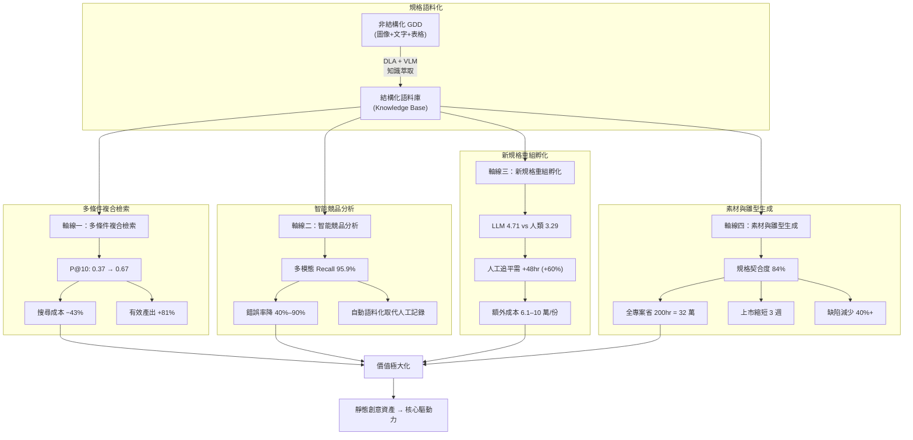
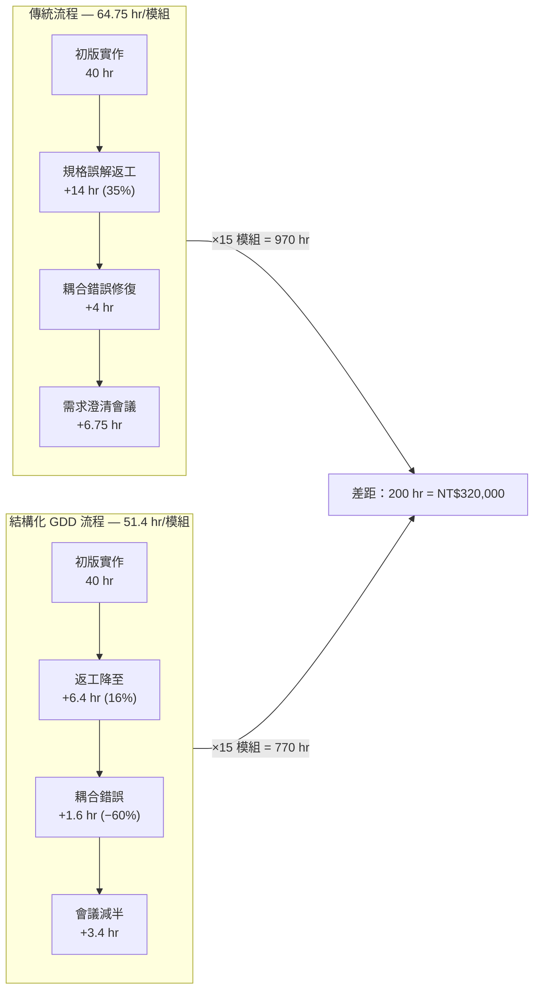
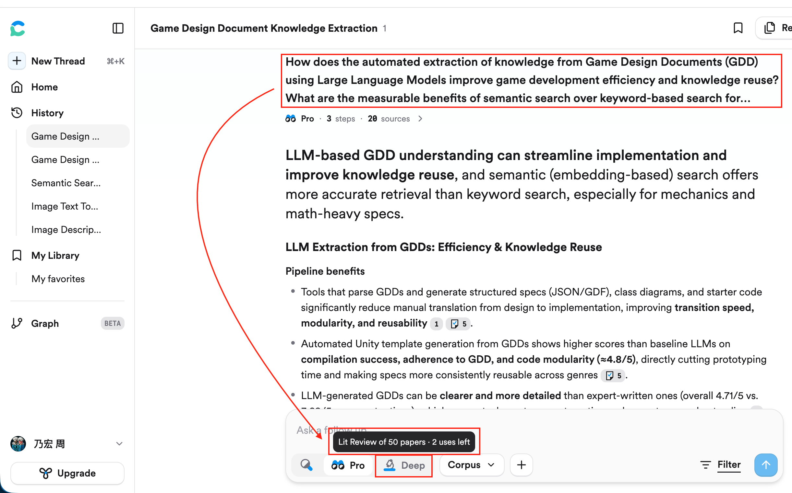

# Quick Links

- [論文口試簡報](https://docs.google.com/presentation/d/11WrCCM0jMamrRyBIVKIV3D5mzhkU88RFZYOG5spg92w/edit?usp=sharing)
- [論文資料維護](https://stuinfosys.ntust.edu.tw/ThesisAdvisor/Home/Index)
- [研究生上傳畢業論文說明](https://drive.google.com/file/d/16TOQ70OxhTPWD12ceztgMJY06MmQCBYp/view?usp=drive_link)
- [《宙斯》規格](https://docs.google.com/spreadsheets/d/1XdilZVbW5-I5X8Mg_FVIxUekvLGPw4TG4eeABJsl2y4/edit?usp=sharing)

# 2026/05/30

- 論文題目更新簽核邀請郵件：
  - 收件者 (To)：戴文凱 老師 (wktai@gapps.ntust.edu.tw)、徐心怡 Carrie (carrie@mail.ntust.edu.tw)
  - 副本 (Cc)：鄭正元 老師 (jeng@mail.ntust.edu.tw)
  - 主旨：[論文簽核] 碩士論文題目更新與重新簽核邀請（周乃宏 M11326915）
  - 附件：
    - [recognition_form.pdf](file:///Users/zhounaihong/project/mp/recognition_form.pdf)
    - [recommendation_form.pdf](file:///Users/zhounaihong/project/mp/recommendation_form.pdf)
  - 內容：
    ```text
    戴老師、Carrie 妳好，鄭老師好：

    我是 EMRD 113 畢業生周乃宏（學號 M11326915）。

    我的碩士論文題目已正式更新為：「利用生成式人工智慧技術最大化遊戲規格書價值的策略」。
    （英文題目：Strategies to maximize the value of game specifications using generative artificial intelligence techniques）

    由於論文題目變更，需要麻煩老師們協助重新簽核以下兩份表單：
    1. 專業領域審查表（recognition_form.pdf）
    2. 論文口試推薦書（recommendation_form.pdf）

    附件為已填寫好新題目的表單檔案，煩請戴老師協助簽核，也麻煩 Carrie 協助鄭老師的簽核事宜。
    若有任何需要修改或配合的地方，請隨時回信告知，謝謝老師與 Carrie 的協助！

    祝好，
    周乃宏 敬上
    學號：M11326915
    EMRD 113 畢業生
    ```

# 2026/04/19

## 簡報提詞

### 要解決的問題

以「論文口試」這樣的場景來規劃一份論文口試簡報所需的脈絡。我大致上想提到的重點是這樣的：

- 規格書在遊戲產品的價值
- 知識難以累計的困境
  - 手抄：難以規模化
  - OCR：正確/理解率不足
  - 不論是哪一種處理法，基本上都是一個「重新生成」的過程，這也就是為何會有這項研究的原因
- 實測過程
  - 語言模型選擇是Gemini 2.5及3.0，但結果大體相同
  - 規格書的長相是高度不對齊的，文字可能散落在不同的儲存格，帶有不同的屬性(e.g. 紅色字體或灰色儲存格底色)，還有內嵌圖片，甚至還有手排的流程圖
  - 測試方式是準備以下題型(這不是層級關係，只是型式不同)
    - 非單純關鍵字搜尋就能找到答案(e.g.Free Game的動畫需求有哪些？)
    - 須真正理解圖片內容才能找到答案(答案可能根本不是文字)
    - 在理解試算表特徵(e.g.合併儲存格)設計才能推論出來的答案
  - 測試結果
    - 文字：完全理解
    - 圖像：完全不行
    - 表格：大致上是正確的，只是無法100%理解人類的隱喻及意圖

其他重點：

- 範圍到這裡就好，不需要結論，解法，效益，「簡報者」，「指導老師」或是「上半部/下半部」等相關資訊，其他的內容我會在另一份簡報處理。
- 優先使用來源資料中的截圖，需要的話你還是可以使用自行生成的圖。佈景主題或底色儘量以淺色系為主，要做滿20頁以上

### 解法及效益

以「論文口試」這樣的場景來規劃一份論文口試簡報所需的脈絡，要解決的問題已經在前一份簡報說明過，接下來大致上想提到的重點是這樣的：

  - 解法：把圖片描述成文字
    - 實測證明可行，但仍然難以規模化
    - 圖太大就超過脈絡空間，文字就無法正確描述細節
    - 策略：分區擊破
      - 文字：OCR
      - 表格：LLM為主的OCR
      - 圖片：要求LLM描述成文字
  - 預期效益(不要插入前人的研究，專注在帶來的效益或是範例本身演示即可)
    - 多條件複合檢索
    - 智能競品分析
    - 新規格重組孵化
    - 有憑有據的素材與雛型生成
  - 結論
    - 生成式AI將能作為強大的槓桿，協助研發團隊與管理層突破傳統文件管理的瓶頸
    - 將靜態的創意資產轉化為推動市場決策與加速產品迭代的核心驅動力

其他重點：

- 範圍到這裡就好，不需要結論，解法，效益，「簡報者」，「指導老師」或是「上半部/下半部」等相關資訊，其他的內容我會在另一份簡報處理
- 優先使用來源資料中的截圖，需要的話你還是可以使用自行生成的圖。佈景主題或底色儘量以淺色系為主，要做滿20頁以上

### 效益量化指標補充

#### 用 NotebookLM 處理

在「知識化後的價值極大化效益」這一段，我加入了一些在實務場景中推論的範例，請圖像化說明這些推論的細節。

#### 用 Coding Agent 處理

在「知識化後的價值極大化效益」這一段，我加入了一些在實務場景中推論的範例，請用表格或是Mermaid Script說明這些推論的細節。然後插入到 @journal.md 72 中。


#### 四條效益軸線：量化推論總覽

| 效益軸線 | 文獻基準 | 關鍵指標 | 實務推論 |
| :--- | :--- | :--- | :--- |
| 多條件複合檢索 | Krasnov 2024 | P@10: 0.37 → 0.67 | 搜尋成本降 43%（3hr → 1.7hr）；相同時間有效結果近 2 倍 |
| 智能競品分析 | De La Fuente 2022 | 多模態 Recall 95.9% | 錯誤率降 40%–90%；自動萃取取代人工記錄與比對 |
| 新規格重組孵化 | Aydinalp 2025 | LLM 4.71/5 vs 人類 3.29/5 | 人工追平需額外 48hr（+60%），成本 6.1–10 萬元/份 |
| 素材與雛型生成 | Hassan 2025 | 精調模型 4.8/5；契合度 84% | 全專案省 200hr＝32 萬元；每版本迭代省 4 萬；上市縮短 3 週 |

#### 軸線一：多條件複合檢索 — 降本增效推論

| 項目 | 關鍵字搜尋 (Baseline) | 語意搜尋 (SE) | 變化 |
| :--- | :---: | :---: | :---: |
| P@10 精確率 | 0.37 | 0.67 | +81% |
| 前 10 筆有效結果 | 3.7 筆 | 6.7 筆 | +81% |
| 取得等量結果所需時間 | 3 小時 | 1.7 小時 | −43% |
| 每小時有效產出 | 1.23 筆 | 2.23 筆 | +81% |

增效面向：(1) 決策依據近 2 倍充分 (2) 跨遊戲查詢變得經濟可行 (3) 檢索-驗證循環加速

#### 軸線三：新規格重組孵化 — 品質提升的隱性成本

| 額外工作項目 | 對應評估標準 | 額外工時 |
| :--- | :--- | :---: |
| 玩家情緒曲線與操作節奏腳本 | 使用者導向 (+2.00) | 10 hr |
| 符號/特效/音效逐幀描述與觸發優先級 | 細節豐富度 (+2.33) | 14 hr |
| 邊界情境與狀態衝突對照表 | 一致性 (+1.67) | 10 hr |
| 跨部門實用性對齊會議及文件修正 | 實用性 (+2.00) | 8 hr |
| 術語表、交叉引用表與版本差異紀錄 | 清晰度/完整性 (+1.67/+1.00) | 6 hr |
| **合計** | | **48 hr (+60%)** |

成本推估：企劃時薪 NT$1,280 × 48hr ≈ **6.1 萬元**；含跨部門會議成本逼近 **10 萬元/份**

#### 軸線四：素材與雛型生成 — 15 模組專案工時比較

| 項目 (每模組) | 傳統流程 | 結構化 GDD 流程 | 節省 |
| :--- | :---: | :---: | :---: |
| 初版實作 | 40 hr | 40 hr | — |
| 規格誤解返工 (35% → 16%) | +14 hr | +6.4 hr | −54% |
| 跨模組耦合錯誤修復 | +4 hr | +1.6 hr | −60% |
| 需求澄清會議 | +6.75 hr | +3.4 hr | −50% |
| **單模組合計** | **64.75 hr** | **51.4 hr** | **−21%** |
| **全專案 (×15)** | **970 hr** | **770 hr** | **−200 hr** |

| 降本/增效維度 | 量化效益 |
| :--- | :--- |
| 首次開發直接節省 | 200 hr × NT$1,600 = **NT$320,000** |
| 版本迭代節省 (每版) | 35hr → 10hr = 省 25hr ≈ **NT$40,000/版** |
| 上市週期縮短 | 200hr ÷ 1.5 人 ≈ **3 週** |
| QA 缺陷減少 | P1/P2 級缺陷預期減少 **40%+** |

#### Mermaid：四條效益軸線的價值鏈流程



#### Mermaid：傳統流程 vs 結構化 GDD 流程（單模組工時對比）



# 2026/04/04

## 「智能競品分析」的量化指標

> 透過截圖與提詞產出結構化規格，並隨著多模態AI技術的成熟，未來能直接輸入競品遊玩影片。系統可自動將競品的教學流程、戰鬥操作或付費設計語料化。在此競品語料庫的基礎上，分析人員能以自然語言直接查詢市場模式與趨勢（例如：「哪些競品的付費禮包同時包含『限時』與『隨機寶箱』？價格區間為何？」），省去大量人工觀看、記錄與比對的時間，顯著降低市場調研成本。

### Multimodal recognition of frustration during game-play with deep neural networks

[Multimodal recognition of frustration during game-play with deep neural networks](https://doi.org/10.1007/s11042-022-13762-7)

Venue: Multimedia Tools and Applications, Vol. 82, 2023
Authors: Carlos de la Fuente, Francisco J. Castellanos, Jose J. Valero-Mas, Jorge Calvo-Zaragoza — University of Alicante

#### Core Contribution
Proposes a non-invasive multimodal framework using Deep Neural Networks (DNNs) to detect player frustration by extracting and fusing features from audio and video recordings. The study demonstrates that synergistically combining these modalities significantly improves recognition accuracy compared to unimodal or traditional hand-crafted feature methods.

#### Methodology
- **Data Source**: Uses the Multimodal Game Frustration Database (over 5 hours of 960x540 video/audio recordings from 67 participants).
- **Audio Processing**: Employs CNNs on Mel spectrograms to automatically extract relevant frequency features, outperforming standard hand-crafted MFCCs.
- **Video Processing**: Uses a combination of CNN and LSTM on trimmed facial images (64x64 pixels) to capture both spatial expressions and temporal dependencies.
- **Fusion Strategies**:
    - **Decision-level Fusion**: Combines the Softmax outputs of individual audio and video models using a weighting factor ($\alpha$).
    - **Feature-level Fusion**: Concatenates internal feature representations from both streams into a single vector before the final classification layer.

#### Key Findings
- **Multimodal Superiority**: Multimodal models consistently outperformed unimodal versions.
- **Winning Model**: **Decision-level fusion** achieved the highest performance with a **Recall of 95.9%** on the test set.
- **Performance Gain**: Shows error rate improvements of **40% to 90%** over existing state-of-the-art approaches (such as those by Song et al. or Meishu et al.).
- **Nuance**: The study confirms that neural networks are better at finding "hidden" descriptors in raw signals than humans are at manual feature selection (e.g., Facial Action Coding System units).

#### Relevance to Research
- Provides quantitative evidence for the "Multi-modal Analysis" axis of the thesis.
- Demonstrates how **automated feature extraction** from gameplay video/audio can replace manual logging, supporting the goal of extracting "in-game frustration" as a form of implicit knowledge.
- Offers a benchmark for integrating player emotional states into competitive analysis or playtest reporting.

## 「搜尋」的量化指標

> 傳統關鍵字搜尋僅能做到「有或沒有」的字面比對，價值有限。當規格書知識化後，其真正的價值在於「可推論、可組合條件的檢索」。例如，策劃人員可直接詢問：「遊戲中的倍率分布為何？」或「中了75倍線獎時是否循環播放特定音效？」。當知識庫中包含多款遊戲規格時，還能進行跨遊戲的條件比對（例如：找出所有最大倍數超過500倍且具備特定進入條件的遊戲），大幅提升研發人員獲取內隱知識的效率。

### Comparative Performance Evaluation of Keyword and Semantic Search Engines using Different Query Set Categories

[Comparative Performance Evaluation of Keyword and Semantic Search Engines using Different Query Set Categories](http://dx.doi.org/10.2174/2213275912666190328202153)

Have no full text, [requesting](https://www.researchgate.net/publication/332135064_Comparative_Performance_Evaluation_of_Keyword_and_Semantic_Search_Engines_using_Different_Query_Set_Categories).

### Embedding-based retrieval: measures of threshold recall and precision to evaluate product search

[Embedding-based retrieval: measures of threshold recall and precision to evaluate product search](https://doi.org/10.17323/2587-814X.2024.2.22.34)

Venue: Business Informatics, Vol. 18, No. 2, 2024
Author: Fedor V. Krasnov — Research Center of WB SK LLC

#### Core Contribution
Investigates the evaluation of product retrieval systems (the first stage of search) using threshold-based metrics: **Recall@k** and **Precision@k**. Develops an automatic procedure to calculate these metrics and compares different model architectures on the WANDS public dataset.

#### Key Concepts
- **Lexical vs. Embedding-based Retrieval**: Lexical methods use token matches (sparse results), while embedding-based methods use dense vector representations. Embedding methods require a **relevance threshold**; a high threshold improves ranking speed but risks lower recall, while a low threshold increases recall but demands more computing resources for the ranking phase.
- **Threshold Metrics**:
    - **R@k (Threshold Recall)**: Measures the completeness of the retrieved list within the top $k$ results.
    - **P@k (Threshold Precision)**: Measures the ratio of relevant items within the top $k$ results.
- **Dependency on Order**: Threshold values are dependent on the order in which results are presented (Lemma 1).

#### Methodology & Results
Tested three architectures on the WANDS dataset (42,994 products, 480 queries):
1. **DE**: Two-tower model with one modality (text).
2. **DE2**: Two-tower model with two modalities.
3. **SE**: Single encoder model with one modality.

| Model | R@1000 (mean) | P@10 (mean) |
| :--- | :---: | :---: |
| DE | 0.75 | 0.68 |
| DE2 | 0.73 | 0.66 |
| **SE (Winner)** | **0.84** | **0.67** |
| Dataset $D_G$ (Baseline) | 0.99 | 0.37 |

- The **SE model**, despite having the fewest parameters, achieved the highest recall ($0.84 \pm 0.09$).
- **DE2** performed worse than expected, suggesting that adding modalities doesn't automatically improve performance if not handled optimally.
- Without retrieval models (Baseline), Precision@10 is very low (0.37), highlighting the necessity of retrieval/ranking systems.

#### Relevance to Research
- Provides a **quantitative framework** to evaluate the "Strategy" part of the thesis (maximizing value through search efficiency).
- Supports the claim that **semantic search (embedding-based)** requires careful threshold tuning to balance recall and system performance.
- Offers a benchmark for what "good" performance looks like in an e-commerce/product search context (R@1000 $\approx$ 84%, P@10 $\approx$ 67%).

# Mar 29, 2026

## ChatGPT and Other Large Language Models as Evolutionary Engines for Online Interactive Collaborative Game Design

Venue: arXiv:2303.02155, Apr 2023
Authors: Pier Luca Lanzi, Daniele Loiacono — Politecnico di Milano

### Core Idea

Propose using LLMs (ChatGPT, GPT-3) as genetic operators inside an interactive evolutionary algorithm for collaborative game design. Game concepts are represented as free-form text; the LLM handles initialization, crossover, and mutation — tasks that require maintaining semantic coherence and would be extremely difficult with traditional evolutionary representations.

### Framework Architecture

Three components:
1. Database: stores active designs, evaluations, and published concepts
2. Evolutionary engine: steady-state genetic algorithm using tournament selection (size 2), LLM-driven crossover (probability 0.7) and mutation
3. Interaction agent: Telegram bot publishes concepts and collects user feedback (positive / neutral / negative votes)

### LLM as Genetic Operators

- Initialization: prompt the LLM to "act as a game designer" and generate a concept matching a design brief
- Crossover: feed two parent designs into a prompt asking the LLM to recombine them into a novel game
- Mutation: ask the LLM to vary a single aspect (e.g., goal, mechanics, level design) of an existing concept

### Evaluation (3 experiments, ~80 participants)

1. Minimalist video game design (4 days, ChatGPT, 35 active users, 1025 evaluations)
2. Board game design (4 days, ChatGPT, 35 active users, 799 evaluations)
3. 2023 Global Game Jam brainstorming (theme: "roots", <24 hours, DaVinci GPT-3, ~35 users)

Human role is purely as a curator/judge — they vote on concepts but never write or edit the text directly. The LLM is the sole author of every game concept. Humans steer evolution indirectly through their preferences.

### Key Findings

- Population drift observed: board game concepts shifted from generic terms (time/cards/room) toward ecosystem/conservation mechanics that were absent in the initial population
- Participants valued novel mechanics and unexpected element combinations that emerged through evolution
- Negative feedback cited similarity between concepts (small population of 10) and occasional LLM incoherence
- Concept descriptions grew longer over generations (board games: ~1600 to ~2200 chars)

### Limitations

- No quantitative comparison with a pure human design process (no time-to-convergence, quality scores, diversity measurements, or cost benchmarks vs. human-only brainstorming)
- No rigorous quantitative comparison between ChatGPT and DaVinci GPT-3 — only anecdotal "no difference noticed"
- Evaluation is self-contained (measures what happened within the framework only)
- Output is a short game concept (~hundreds of chars), not a full game design document (GDD)
- The paper is framed as a "preliminary evaluation" / proof-of-concept

### Relevance to Our Research

- Demonstrates that LLM + evolutionary loop can produce increasingly interesting game concepts over iterative human feedback
- Focuses on the divergent/exploration phase of design (brainstorming), not on producing complete, structured game specifications
- Could complement a more structured GDD generation pipeline by adding a human-in-the-loop selection/refinement cycle

## Game Generation via Large Language Models

This PDF isn't available for now, I'd requested in [Research Gate](https://www.researchgate.net/publication/383501745_Game_Generation_via_Large_Language_Models).

## Large Language Models and Video Games: A Preliminary Scoping Review

Venue: arXiv:2403.02613, Mar 2024
Author: Penny Sweetser — The Australian National University

### Core Contribution

A scoping review surveying 76 papers (from 2,260 Google Scholar results) published between 2022 and early 2024 on LLMs applied to video games. Provides a foundational snapshot of the field, categorizing research into four key themes plus one adjacent topic.

### Key Findings

- Most used LLM: GPT (85.5%), followed by LLaMA (9.2%), Codex and BERT (6.6% each)
- 90.7% of papers were published in 2023, indicating rapid growth
- Positives: human interpretability, social behaviours, empowerment of non-developers, LLM+RL combinations outperforming baselines
- Negatives: lack of logical reasoning, unpredictability in live content generation, inconsistency/incoherence in AI-native games

### Themes

1. Game AI and Agents (35.5%, 27 papers) — agent design/behaviours, LLMs+RL, human-AI collaboration and multi-agent coordination (Voyager, MindAgent, LLM-Co Framework, Overcooked-AI)
2. Game Development and Play (32.9%, 25 papers) — content/level generation, serious games, game design, RPG tools, bug detection
3. Narrative, Story, and Dialogue (22.4%, 17 papers) — NPC dialogue, interactive story, quest generation
4. Game Research and Reviews (9.2%, 7 papers) — game review analysis, synthetic research data generation
5. Recommendation (bonus, 9 papers) — game datasets used in LLM4Rec research

### Game Design Sub-theme (6 papers)

Papers specifically on game design within the "Game Development and Play" theme:

| Ref | Paper | DOI |
|-----|-------|-----|
| [4] | Amresh 2023 — Integrating Reinforcement AI Into the Design of Educational Games | `10.34190/ecgbl.17.1.1709` |
| [27] | Huang & Sun 2023 — Create Ice Cream: Real-time Creative Element Synthesis Framework Based on GPT-3 | `10.1109/CoG57401.2023.10333153` |
| [28] | Gatti Junior et al. 2023 — How ChatGPT can inspire and improve serious board game design | `10.17083/ijsg.v10i4.645` |
| [34] | Lanzi & Loiacono 2023 — ChatGPT as evolutionary engines for online collaborative game design | `10.1145/3583131.3590351` |
| [56] | Saito et al. 2023 — Double Impact: Children's Serious RPG Generation/Play with a LLM | `10.1007/978-3-031-44751-8_21` |
| [70] | Tinterri et al. 2024 — AI in board Game-Based Learning | No DOI (CEUR Workshop Proceedings) |

- Idea generation [34]: collaborative design framework simulating the human design process, using LLMs for recombination and variation of ideas
- Game mechanic design [27]: element synthesis game where LLM evaluates combinations based on physical/chemical properties and logical reasoning; effective but LLM uncertainty can adversely affect game mechanics
- Serious games [4, 28, 56, 70]: LLMs supporting educators in brainstorming, choosing game types, suggesting themes/mechanics aligned with curriculum, and offering feedback on prototypes

## Automated Unity Game Template Generation from GDDs via NLP and Multi-Modal LLMs

Venue: arXiv:2509.08847, Sep 2025
Author: Amna Hassan — UET Taxila

### Core Contribution

End-to-end framework that parses GDDs and generates functional Unity C# game templates using a fine-tuned LLaMA-3-8B-Instruct model. The system combines:

1. A GDD parsing pipeline that extracts structured JSON from PDF/TXT/DOCX
2. A LoRA-fine-tuned LLM for Unity-specific code synthesis
3. A custom Unity Editor package that integrates parsing, script analysis, code generation, and documentation into the editor workflow.

### Data and Fine-tuning

- 57 GDDs collected from GameScrye, GameDocs.org, Al Lowe's collection, PixelProspector — standardized into structured JSON (title, genre, mechanics, characters, levels)
- Unity code dataset sourced from the "Mix and Jam" YouTube channel (high-quality recreations of famous game mechanics). GPT-4 generated corresponding GDDs for each implementation to create paired (GDD, Unity Code) training data
- Fine-tuning: LLaMA-3-8B-Instruct + LoRA via PEFT, ~1.9M trainable parameters, ~120 training steps (single epoch), FP16 precision
- Deployed via Google Colab + ngrok + FastAPI

### Unity Package Architecture

Custom Unity Editor package with 5 components:
1. GDD Parser — uploads and extracts structured info from design documents
2. Script Analyzer — determines required scripts and builds a dependency graph
3. Script Generator — interfaces with the fine-tuned LLM via FastAPI to generate C# scripts
4. Documentation Generator — creates usage instructions and setup guides
5. Unity Editor Integration — in-editor UI for the full workflow

### Evaluation

3 experienced Unity developers scored each model (0–5) across 3 game genres (Platformer, Action RPG, Puzzle Game) on 4 metrics:

- Compilation Success — does the code compile cleanly in Unity?
- GDD Adherence — does the code faithfully implement mechanics specified in the GDD?
- Unity Best Practices — proper use of `MonoBehaviour`, `GetComponent<>()`, Input system, component-based architecture
- Modular Code — logical separation of concerns into distinct classes and methods

| Model | Comp. | Adher. | BestPrac. | Modular. | Avg |
| --- | --- | --- | --- | --- | --- |
| LLaMA 3 8B Inst. | 4.5 | 4.2 | 4.0 | 4.2 | 4.2 |
| Gemma 2 Inst. | 3.8 | 3.5 | 3.5 | 3.2 | 3.5 |
| Qwen 1.5 Chat | 2.0 | 4.8 | 2.5 | 2.8 | 3.0 |
| LLaMA 4 Maverick | 4.8 | 4.8 | 4.5 | 4.6 | 4.7 |
| Theirs (fine-tuned) | 5.0 | 4.9 | 4.5 | 4.8 | 4.8 |

### Key Findings

- Domain-specific fine-tuning on paired GDD-code data beats even larger/newer general-purpose models
- Qwen 1.5 Chat had high GDD adherence (4.8) but terrible compilation (2.0) — understanding requirements ≠ producing working code
- Action RPGs exposed the biggest gap between models due to interdependent systems (inventory, combat, progression)
- Platformers had the smallest gap since platformer patterns are well-represented in training data

### Limitations

- Small scale: 57 GDDs, 3 evaluators, 3 game genres
- No multimodal understanding of diagrams/concept art within GDDs
- No runtime performance evaluation of generated code
- Model deployed via Colab + ngrok — not production-ready infrastructure

## GDD Generation for Hyper-Casual Games Using Large Language Models: A Comparative Evaluation

Venue: BEU Fen Bilimleri Dergisi (Bitlis Eren University Journal of Science), Vol. 14, Issue 3, 2025
Authors: Muhammet Emin Aydinalp, Buket Doğan, Abdullah Bal — Istanbul Sabahattin Zaim University / Marmara University, Türkiye
DOI: 10.17798/bitlisfen.1664312

### Core Contribution

Compares a human-expert-written GDD with an LLM-generated GDD (ChatGPT-4) for the hyper-casual game "Pool Wars". Four domain experts blindly scored both documents on 8 criteria using a 5-point Likert scale. The LLM GDD scored 4.71/5 overall vs. 3.29/5 for the human GDD, with lower standard deviation (0.23 vs. 0.36).

### Prompt Engineering Strategy

Three complementary techniques were used to generate the LLM GDD:

1. Step-by-step instructions — divided the GDD into sections (game summary, basic mechanics, level system, design elements, game economy) and prompted each separately, then combined
2. Example-supported prompts — fed sample GDDs from similar games to guide structure and content
3. Role-playing prompts — "You are a game designer" persona to produce more user-focused, target-audience-aware output

Visual assets were generated with Google's ImageFX (text-to-image).

### Evaluation Criteria and Results

| Criteria | Human GDD | LLM GDD | Difference |
| --- | --- | --- | --- |
| Completeness | 3.67 | 4.67 | +1.00 |
| Clarity | 3.33 | 5.00 | +1.67 |
| Consistency | 3.00 | 4.67 | +1.67 |
| Creativity & Innovation | 4.00 | 4.00 | 0.00 |
| Practicality | 3.00 | 5.00 | +2.00 |
| Level of Detail | 2.67 | 5.00 | +2.33 |
| User-Centric Approach | 3.00 | 5.00 | +2.00 |
| Visual Adequacy | 3.67 | 4.33 | +0.66 |

Largest gaps: Level of Detail (+2.33), Practicality (+2.00), User-Centric (+2.00). No gap: Creativity & Innovation (tied at 4.00). Smallest gap: Visual Adequacy (+0.66).

### What Is NOT Measured

- No time/cost comparison between human and LLM GDD production
- Only one game (Pool Wars), only one genre (hyper-casual), only one LLM (ChatGPT-4 free tier)
- Only 4 evaluators — too few for statistical significance tests
- Creativity tie at 4.00 may reflect a ceiling effect (both scored "good") rather than genuine parity
- Evaluators scored the final documents, not the process — no insight into iteration effort or prompt refinement cycles
- Used free-tier GPT-4 with session interruptions, requiring manual merging across sessions — a paid API would likely yield more consistent output
- No downstream validation: the GDD was never used to actually build the game, so "practicality" is expert opinion, not empirical

### Risks Identified by Authors

- LLMs can introduce conflicting mechanics or technically impossible features across sections
- Over-reliance on LLMs may reduce originality over time
- Copyright/ownership of LLM-generated text is unresolved for commercial use
- Human expert oversight at each step remains essential

### Relevance to My Research

This paper is directly citable as evidence for the "documentation quality" axis:

| Dimension | This paper | My work |
| --- | --- | --- |
| Direction | LLM generates GDD from prompts | LLM extracts knowledge from existing GDDs |
| Game scope | Single hyper-casual game | Multiple slot/casino games with mathematical specs |
| Evaluation | Expert Likert scoring of document quality | Downstream utility (retrieval, competitive analysis, spec incubation) |

The 4.71 vs. 3.29 result supports the claim that LLMs handle structured documentation well — but this paper evaluates GDD generation (writing), not GDD comprehension (reading/extracting). My work requires the inverse capability: can LLMs accurately extract and structure knowledge from existing GDDs? The quality gap this paper demonstrates is encouraging but not directly transferable.

The 8-criterion evaluation framework (completeness, clarity, consistency, creativity, practicality, detail, user-centric, visual adequacy) could be adapted for evaluating extracted knowledge quality, with modifications: replacing "creativity" with "extraction accuracy" and "visual adequacy" with "structural fidelity to source."

## GameGoogle: A Search Engine for Mechanics in Video Games

Venue: AIIDE 2025 (Twenty-First AAAI Conference on Artificial Intelligence and Interactive Digital Entertainment)
Authors: Brooke Szajda, M Charity — University of Richmond

- [LittleBigPlanet 2 Story Mode - Basketball](https://youtu.be/AvyW0J94geE?t=11)
- [Thief Gold - Playing Basketball in the Tutorial (Easter Egg)](https://youtu.be/v8YbhZ9sWXw?t=170)

### Core Contribution

A prototype search engine (GG) that searches within a game's entire gameplay space for specific mechanics, not just by genre or title. Example: searching "basketball" returns not only NBA 2K but also LittleBigPlanet (basketball minigame) and Thief: The Dark Project (basketball easter egg).

### System Architecture

- Dataset: ~4,500 game entries, top 50 rated games per year from 1975–2025 (sourced from GlitchWave.com)
- Text sources: game manuals, walkthroughs, guides from Vimm's Lair, IGN, GameFAQs, Steam Community
- Tokenized using NLTK and SpaCy, extracting only nouns and verbs
- MySQL database with two tables: `gameData` (game info) and `inverseGameWords` (inverted index)
- Hosted on AWS, web frontend with multiple ranking/filter options

### Ranking Formula

`R_i = 0.5(K_i) + 0.2(T_i) + 0.15(G_i) + 0.15(A_i)`

- `K_i`: keyword frequency ratio (query keywords / total words for that game)
- `T_i`: title match percentage
- `G_i`: genre match percentage
- `A_i`: tag match percentage

### Evaluation

- Metric: nDCG@20 (Normalized Discounted Cumulative Gain, top 20 results)
- nDCG meaning: 1.0 = perfect alignment with user expectations, 0.0 = no expected games in top 20
- Ground truth: 60 participants named first game they associated with each of 16 words
- 16 query words: bike, block, castle, city, dice, dog, dungeon, farm, fire, ghost, horse, pizza, puzzle, school, spy, sword
- Random baseline scored 0 across all terms
- Best: `dungeon` and `ghost` (~0.5), worst: `fire` (0, verb/noun ambiguity — "press to fire" dominated older game manuals)
- Most terms landed in the 0.1–0.3 range

### What Is NOT Measured

- No comparison between ranking filters (default vs. exact match vs. date/rating)
- No ablation on ranking formula weights
- No precision/recall or MAP — only nDCG@20
- No comparison against existing systems (IGDB, MobyGames, etc.)
- No dataset coverage statistics
- The nDCG metric only measures whether GG surfaces games users already know — it does NOT evaluate GG's stated core purpose of discovering obscure/hidden mechanics

### Relevance to My Research

Structural parallel: both approaches use natural language text artifacts that describe gameplay as the basis for retrieval/matching, rather than playing or observing the game directly.

| Dimension | GameGoogle | My work |
| --- | --- | --- |
| Source text | Walkthroughs, manuals, community guides (post-release, user-generated) | Game Design Documents (pre-release, authorial intent) |
| Who wrote it | Players and community | Designers |
| Stage in game lifecycle | After ship | Before ship |
| Vocabulary | Casual player language | Domain jargon, tacit knowledge |

If GDD-extracted knowledge were merged into GG's database, the expected nDCG improvement would be minimal (~0.02–0.08) because:

1) the evaluation ground truth comes from player associations, not designer intent; 
2) GDD jargon rarely overlaps with casual query vocabulary; 
3) the bottleneck is ranking algorithm issues, not data coverage; 
4) well-known games already have thorough walkthroughs, so GDD adds redundant keywords.

However, the real value of GDD extraction lies in a dimension GG's current metric cannot capture — finding obscure mechanics that no walkthrough documents. This is qualitatively complementary, not quantitatively better on their metric.

## Digital Game Development Using Large Language Models (LLMs): An Exploratory Study

Venue: SBGames 2025 (XIV Simpósio Brasileiro de Jogos e Entretenimento Digital), Salvador/BA
Authors: Cristiano Barroso Serra, Gabriel Mattos Barroso Serra, Tadeu Moreira de Classe — UNIRIO / UVA, Brazil

### Core Contribution

Proposes PromptingGameCraft (PGC), a pipeline that takes a human-written Game Design Document (GDD) as input and automatically generates:

1. A Game Design File (GDF) — structured JSON formalizing all mechanics and interactions
2. A class diagram — using a custom notation (not standard UML)
3. A directory/file structure
4. Game source code (JavaScript via the Phaser framework)

Backend: DeepSeek-Reasoner model API on Google Cloud + Python web server.

### Pipeline (4 Phases)

| Phase | Output |
| --- | --- |
| Design Input | GDD artifact |
| Semantic Interpretation | Game semantic model |
| Architectural Inference | Architectural blueprint |
| Scaffold Instantiation | System scaffold + executable code |

Four prompt functions drive each phase: `Prompt_GDF`, `Prompt_Pattern`, `Prompt_Structure`, `Prompt_Code`.

### GDF — The Key Intermediary Artifact

The GDF sits between design intent and code. It organizes interactions into three categories: game descriptions, system interactions, and game interactions. Each interaction has structured fields: `id`, `name`, `type`, `description`, `parameters`, `next`. This pre-formalization acts as a semantic control layer that reduces context inconsistency in LLM generation.

### Proof of Concept: Basket Catch Game

A 2D ball-catching game was built entirely from PGC outputs. Only 1% code variation after manual fixes — the only intervention needed was adding `.js` extensions to import paths (ECMAScript module syntax issue). Structured prompt architecture scored 9.5/10 vs. 6.25/10 for single-shot baseline (evaluated independently by GPT-o3).

### Critical Limitations Noted in Discussion

- No before/after human effort comparison. The paper provides zero data on person-months, development hours, or cost savings comparing PGC vs. traditional development. It cannot be cited as evidence for productivity gains.
- The "before/after" in Table 9 compares *raw LLM output* vs. *manually adjusted code* — both within PGC. It is not a comparison against traditional workflows.
- Output quality is tightly coupled to GDD quality — garbage in, garbage out.
- Manual intervention still needed for asset integration and engine-specific adjustments.
- Currently supports only single-game, single-engine (Phaser) workflows.

### What This Paper Is (and Is Not)

Is: A proof-of-concept that GDD → structured intermediate (GDF) → code automation *works*, with structured prompting significantly outperforming single-shot generation.

Is not: A controlled experiment measuring efficiency, effort reduction, or cost savings compared to traditional development.

### Relevance to Research

- Provides a concrete GDD → GDF → class diagram → code pipeline architecture to reference.
- The GDF concept (structured intermediate representation) is a useful design pattern for knowledge extraction systems.
- Empirical evidence that structured multi-stage prompting (9.5) is superior to single-shot (6.25) supports the argument for pipeline-based prompt architecture.
- Cannot support claims about time/effort savings — such evidence must come from other sources (e.g., Hassan et al. on Unity template generation, cited in Consensus lit review).

# Mar 28, 2026

## Deep Lit Review of Consensus get better results

Using LLM to conduct better prompts(questions) about my concepts, then put them all together to the Deep Lit(erature) Review mode:



We can get *much, much better* results than traditional search results. But, what are essential differences between traditonal search and literature review?

A search is a *retrieval* process. It is the act of looking for specific documents or data points using keywords, filters, and databases. The goal is to find relevant items. It is often a technical step where you try to get a list of results that match your criteria. Think of it as *gathering the raw materials* for your work.

A literature review is a **synthesis** process. It is the act of *reading, evaluating, and connecting the items* you found during your search. The goal is to provide a comprehensive overview of a topic. It involves critical thinking to explain how different studies compare, where they disagree, and what is currently missing from the field. *It turns those raw materials into a structured narrative*.

### Lit Review

[How does the automated extraction of knowledge from Game Design Documents (GDD) using Large Language Models improve game development efficiency and knowledge reuse? What are the measurable benefits of semantic search over keyword-based search for retrieving game mechanics and mathematical specifications from game design documentation?](https://consensus.app/search/game-design-document-knowledge-extraction/T2FunD2NSuqZgCcG0-IFKA/?utm_source=share&utm_medium=clipboard)

#### LLM Extraction from GDDs: Efficiency & Knowledge Reuse

##### Pipeline benefits

- Tools that parse GDDs and generate structured specs (JSON/GDF), class diagrams, and starter code significantly reduce manual translation from design to implementation, improving *transition speed, modularity, and reusability* [1](https://consensus.app/papers/digital-game-development-using-large-language-models-llms-serra-serra/a85830304d3d51c0aa2d6c11bfbd5d6c/?search_id=r9ddrY7ZRMeQlr52mIUYsQ)[5](https://consensus.app/papers/automated-unity-game-template-generation-from-gdds-via-nlp-hassan/aada41802a2a55b6ad2bb72351534387/?search_id=r9ddrY7ZRMeQlr52mIUYsQ).
- Automated Unity template generation from GDDs shows higher scores than baseline LLMs on *compilation success, adherence to GDD, and code modularity (≈4.8/5)*, directly cutting prototyping time and making specs more consistently reusable across genres [5](https://consensus.app/papers/automated-unity-game-template-generation-from-gdds-via-nlp-hassan/aada41802a2a55b6ad2bb72351534387/?search_id=r9ddrY7ZRMeQlr52mIUYsQ).
- LLM‑generated GDDs can be *clearer and more detailed* than expert-written ones (overall 4.71/5 vs. 3.29/5 on expert ratings), which supports downstream automation and cross‑team understanding [4](https://consensus.app/papers/gdd-generation-for-hypercasual-games-using-large-language-aydinalp-do%C4%9Fan/bf30b8c2a9cc526ab2b0677d7edbe46e/?search_id=r9ddrY7ZRMeQlr52mIUYsQ).
- Knowledge-graph–enhanced LLM frameworks accumulate structured game knowledge across versions and use it to target playtests more efficiently, reducing test steps for incremental updates [12](https://consensus.app/papers/knowledge-graphenhanced-large-language-model-for-mu-cai/7bfe7e73cd345e2c8677dd00038175b0/?search_id=r9ddrY7ZRMeQlr52mIUYsQ). This illustrates how extracted knowledge supports *incremental reuse* at scale.

##### Example Impacts

| Aspect | Reported Effect | Citations |
| --- | --- | --- |
| Design→code time | Faster pipeline, automated boilerplate/template generation | [1](https://consensus.app/papers/digital-game-development-using-large-language-models-llms-serra-serra/a85830304d3d51c0aa2d6c11bfbd5d6c/?search_id=r9ddrY7ZRMeQlr52mIUYsQ)[5](https://consensus.app/papers/automated-unity-game-template-generation-from-gdds-via-nlp-hassan/aada41802a2a55b6ad2bb72351534387/?search_id=r9ddrY7ZRMeQlr52mIUYsQ) |
| Consistency/modularity | Higher modularity, better alignment with GDD | [1](https://consensus.app/papers/digital-game-development-using-large-language-models-llms-serra-serra/a85830304d3d51c0aa2d6c11bfbd5d6c/?search_id=r9ddrY7ZRMeQlr52mIUYsQ)[5](https://consensus.app/papers/automated-unity-game-template-generation-from-gdds-via-nlp-hassan/aada41802a2a55b6ad2bb72351534387/?search_id=r9ddrY7ZRMeQlr52mIUYsQ) |
| Documentation quality | Higher clarity/detail ratings for LLM GDDs | [4](https://consensus.app/papers/gdd-generation-for-hypercasual-games-using-large-language-aydinalp-do%C4%9Fan/bf30b8c2a9cc526ab2b0677d7edbe46e/?search_id=r9ddrY7ZRMeQlr52mIUYsQ) |
| Testing effort | Fewer steps to cover impacted features via KG+LLM | [12](https://consensus.app/papers/knowledge-graphenhanced-large-language-model-for-mu-cai/7bfe7e73cd345e2c8677dd00038175b0/?search_id=r9ddrY7ZRMeQlr52mIUYsQ) |

Figure 1 Effects of LLM-based GDD extraction on pipeline quality and reuse.

#### Semantic vs. Keyword Search for Mechanics & Math Specs

Direct comparisons in games are scarce, but related work in *semantic models and math embeddings* shows measurable gains:

-   Distributional/semantic similarity metrics predict *faster and more accurate semantic retrieval* in complex word-game search tasks than simpler baselines, suggesting better alignment with human conceptual search [2](https://consensus.app/papers/semantic-memory-search-and-retrieval-in-a-novel-kumar-steyvers/6e86131633ce5c888678d1b01a53b40a/?search_id=r9ddrY7ZRMeQlr52mIUYsQ).
-   Math-word embeddings improve *math-term similarity and search via query expansion*, outperforming purely lexical matching in retrieving relevant mathematical concepts and expressions [16](https://consensus.app/papers/mathword-embedding-in-math-search-and-semantic-extraction-greiner-petter-youssef/ba09fbb1e2a754a4bc4fa973a7a283ed/?search_id=r9ddrY7ZRMeQlr52mIUYsQ).
-   Semantic-web and crowdsourced game-based approaches show that semantic term networks enable *more precise exploratory and facet-like search* than keyword-only engines [6](https://consensus.app/papers/data-linking-for-the-semantic-web-systems-%C5%A1imko/96573f393dce5d1daeda9ac3775e714f/?search_id=r9ddrY7ZRMeQlr52mIUYsQ)[9](https://consensus.app/papers/semantics-discovery-via-human-computation-games-simko-tvarozek/ac0ca415c1c75297b9a9e7bab1c77ee6/?search_id=r9ddrY7ZRMeQlr52mIUYsQ)[19](https://consensus.app/papers/building-a-semantic-search-engine-with-games-and-wieser/10dcffbe9727504db2ea923f88d0b2c9/?search_id=r9ddrY7ZRMeQlr52mIUYsQ).

Applied to GDDs, these results imply that embedding-based semantic search should:

-   Retrieve mechanics described with different wording (e.g., “lock-on targeting” vs. “auto-aim”).
-   Match math specs by conceptual role (e.g., “Elo‑like progression” even if formula differs).
-   Reduce missed results and noisy hits compared to keyword search, especially in heterogeneous, informal GDDs.

#### Conclusion

Current evidence shows that LLM-based extraction and structuring of GDDs can measurably improve development efficiency, modularity, and cross-version knowledge reuse, while semantic/embedding-based search offers clear advantages over keyword search for retrieving conceptually defined mechanics and mathematical specifications. Empirical head‑to‑head evaluations on real GDD corpora remain an open research opportunity.

[Digital Game Development Using Large Language Models (LLMs): An Exploratory Study](https://sol.sbc.org.br/index.php/sbgames/article/view/37365)

[GameGoogle: A Search Engine for Mechanics in Video Games](https://ojs.aaai.org/index.php/AIIDE/article/view/36847)

[GDD Generation for Hyper-Casual Games Using Large Language Models: A Comparative Evaluation](https://dergipark.org.tr/en/pub/bitlisfen/article/1664312)

[Automated Unity Game Template Generation from GDDs via NLP and Multi-Modal LLMs](https://arxiv.org/abs/2509.08847)

[Grammar-Based Game Description Generation Using Large Language Models](https://ieeexplore.ieee.org/document/10807354)

[Large Language Models and Video Games: A Preliminary Scoping Review](https://dl.acm.org/doi/10.1145/3640794.3665582)

[Game Generation via Large Language Models](https://ieeexplore.ieee.org/document/10645597)

# 2026-03-22

## 論文新方向的思考

上次跟老師的會議中，戴老師提到的問題就是我的題目實在過於工程導向，但卻又沒有足夠多的數據做為支撐。做為EMRD學程的論文，以「技術長」為養成角色的核心目標而言，論文還是應該以策略為導向。舉例來說，如果透過我的論文的研究，有足夠的理論或是數據可以佐證，這個策略能為公司帶來夠大的效益，這才是「技術長」真正的價值。

當然，或許我們會覺得沒有”實測”為準，怎麼會知道實際落地的時候會遭遇什麼樣的困難，是不是真的可行？但做為技術長本來就應該要在最小的成本的前提下，獲得最有可信度的決策依據。全數據推論的決策是有風險，但全實驗的決策未嘗不是一種風險？在投入資源驗證之後才發現不可行，所承受的風險就是機會成本的喪失，風險不一定會比較小。

整個論文的題目是定調為「將規格書知識化後帶來的效益」。除了可以用自然語言檢索以外，更進一步可以做到競品比較，新規格重組孵化，遊戲素材甚至是雛型的生成。原來的題目提的是「利用生成式人工智慧技術從遊戲設計規格書進行知識萃取」，那新的題目呢(如果可以改的話)？

新的題目是「**利用生成式人工智慧技術最大化遊戲規格書價值的策略**」，所以整個架構中提到知識管理和知識萃取的部分應該都不用動，重點比較像是後續「最大化效益」的延伸。

首先是*檢索的效益提升*。單純的搜尋並不能體現其價值，多條件式組合的檢索才是知識庫化的優勢。例如，如果要找的是「遊戲中的倍率分布是怎麼樣的？」或是「中了75倍線獎時是播哪個音效，是迴圈播放嗎？」這類需要推論或複合條件的檢索，才是語料化(Textualization)的優勢。這個優勢會在2個以上的遊戲時體現的更明顯，像是A，B兩個遊戲中有共用音效嗎？Free Game進入條件有什麼差別？我們有多少遊戲的最大倍數超過500倍的等這樣的多遊戲及多條件的複合檢索，正是語料化的最大優勢。

再來是論文中提到僅依靠畫面截圖，配合適當提詞，生成遊戲規格的這個過程，可一定程度上輔助「競品分析」需求。因為競品分析很大程度就是規格上的比較，也就是前一個主題中「檢索優化」中帶來的直接效益。隨著LLM的多模態能力持續成熟，影片分析的能力越來越好，在取得競品規格的準確度及成本都會持續下降。本來編導需要針對影片(不論是原廠放出來的或是直接現場錄製回來的)做人工的理解，再用自己的話寫出來，再做簡報同步給所有人，透過AI的技術成熟，這個過程的成本會大幅降低，將競品的規格給語料化，就能更大程度的享受到透過自然語言做競品分析的效率。例如：

1. 畫面截圖 + 提詞生成規格輔助競品分析：
  - 案例： 某遊戲策劃人員想分析競品A中的「技能樹系統」。他可以對遊戲中技能樹的介面進行多張截圖，並搭配「請根據這些截圖，詳細列出技能樹的層級結構、解鎖條件、技能效果和數值」等提詞。LLM隨後可生成結構化的規格文件，直接用於與自家產品的規格進行比較。  
  - 效益： 省去人工逐一記錄技能樹細節的時間，提高了規格比較的效率和準確性。
2. 多模態影片分析優化競品規格檢索：
  - 案例： 某發行商需要快速掌握競品B的「新手教學流程」和「戰鬥系統操作」。他們可以將競品B的遊玩錄製影片（或官方釋出的教學影片）輸入給具備影片分析能力的LLM。  
  - 提詞： 「請分析此影片，產出詳細的新手教學步驟、操作提示文字，以及戰鬥中每個按鈕的功能和連招組合。」  
  - 效益： LLM自動將影片內容「語料化」，產出標準化的文字規格，取代了編導/策劃人員必須耗費數小時觀看、理解、手動撰寫筆記和簡報的過程，大幅降低了資訊獲取的成本。
3. 語料化規格輔助自然語言競品分析：
  - 案例： 透過上述兩種方式，團隊已經累積了數個競品的規格語料庫（例如，所有競品的付費設計、英雄養成系統、社交功能等都被結構化為文字）。  
  - 進一步提問： 策劃人員可以直接向語料庫提問：「在所有競品中，有哪些遊戲的『付費禮包』設計包含了『限時』和『隨機寶箱』兩種機制？它們的價格區間如何？」  
  - 效益： 相比於人工翻閱多份規格文件，透過自然語言直接查詢，競品分析的速度和深度都得到提升，能更快地從大量數據中找出特定規律或設計趨勢。

繼續延伸出來的是新規格的重組孵化。在擁有足夠多的規格語料之後，對於不同的市場及產品偏好，我們就可以讓AI來生成比較受歡迎的規格。如果我們要針對既有的市場推出新產品，AI雖然已有該市場的喜好資料，但在新規格中是否也可以加入和其他市場類似，甚至是重疊的部分？那為什麼他們會有類似的規格？是不是它們是基於更底層的需求才演變出相似的規格？僅管這可能不是規格書上直接會標註上去的內容，但實際上這可以是AI重組孵化的部分。最後是從*基於這份規格的素材或是雛型生成*。和單純僅依靠一次性的提詞生成截然不同，AI此時此刻的生成已經可說是「有憑有據」。圖像或影片都是這個市場的風格偏好，軟體是符合公司既有框架的源碼片段，完成度自然距離產品是更近的。例如：

1. 素材或雛型生成 (Asset/Prototype Generation)

- 案例情境： 遊戲美術團隊需要為一個以「北歐神話」為主題、具有「高波動性」規格的角子機遊戲快速生成視覺概念。  
- 提詞/生成結果： 「基於[北歐神話主題]規格書中定義的『主神Odin』符號視覺風格，生成一套帶有閃電和符文特效的動畫序列（3秒循環）。同時，生成符合此規格定義的『免費遊戲大廳』的基礎程式碼片段（C# Unity）。」  
- 價值/佐證策略： 有憑有據的生成。 AI生成的圖像和代碼片段直接繼承自知識庫中已驗證的規格、風格偏好和技術標準。美術人員無需重新設計風格，工程師得到符合公司架構的模組化代碼，大幅縮短概念驗證和初期開發時間。

1. 競品分析 (Competitive Analysis)

- 案例情境： 產品經理希望將競品C中一個成功的「特殊圖案收集機制」應用到新遊戲。  
- 提詞/生成結果： 「在所有已語料化的[亞洲市場角子機]規格中，找出所有包含『特殊圖案收集條』機制的遊戲。比較它們的收集門檻、獎勵類型，以及在規格書中標註的玩家回饋曲線（RTP Segment）。」  
- 價值/佐證策略： 效率和深度提升。 相比於人工翻閱數十份PDF，自然語言檢索能在數秒內從海量數據中提取出高度結構化的比較結果。這證明了「將規格書知識化」能直接轉化為市場策略洞察的效率。

1. 新規格重組孵化 (New Specification Incubation)

- 案例情境： 策劃團隊正在為進入「拉丁美洲」市場設計一款新品，需要結合當地偏好（例如，喜愛嘉年華風格）與公司既有的成功機制（例如，多層堆疊符號）。  
- 提詞/生成結果： 「分析[拉丁美洲市場偏好]語料與[公司成功遊戲]語料的相似性。生成一套結合『嘉年華視覺主題』和『連鎖反應疊加獎勵』的數學規格草案。特別說明該規格在『最大賠付倍數』上的設計策略。」  
- 價值/佐證策略： 策略導向的創新。 AI的重組不是隨機生成，而是基於兩種不同來源的知識進行推論（例如，找到兩種市場對"慶典"和"高互動性"的底層需求），確保新規格在滿足創新性的同時，具備市場接受度和成功基礎。

## 要找什麼資料？

遊戲規格書（Game Design Document, GDD）與一般的軟體規格書在結構與目的上有很大的不同。GDD 包含了大量的美術風格描述、數值邏輯（如 RTP 計算）、玩家心理預期以及敘事流程，這類資訊的語意模糊性比純技術規格更高，因此語意搜尋的效益會更明顯。

以下是我為你整理，針對 Consensus 服務在遊戲規格書領域的精準搜尋策略：

### 為什麼遊戲規格書需要更精準的語意搜尋？（我已知的部分）

1. 跨媒介的知識特質： GDD 經常混合了文字說明、數值公式與美術參考。傳統搜尋難以理解「類似 Odin 風格的特效」或「高波動性的數值設計」這種模糊概念，但語意搜尋可以透過向量空間找到概念相近的設計。
2. 邏輯鏈條的複雜性： 遊戲中的一個機制（如 Free Game 觸發條件）會影響到多個檔案。語意搜尋能幫技術長在評估改動時，快速找出所有受影響的設計邏輯，這在軟體開發中稱為 Impact Analysis，但在遊戲業中更偏向「遊戲平衡與體驗的一致性」。

### 針對 Consensus 的精準提詞 (Prompt) 建議

在使用 Consensus 時，建議直接鎖定 Game Design 或 Game Development 領域，並嘗試以下提詞：

1. 針對開發效率與知識重用： How does the automated extraction of knowledge from Game Design Documents (GDD) using Large Language Models improve game development efficiency and knowledge reuse?
2. 針對語意搜尋的優勢比較： What are the measurable benefits of semantic search over keyword-based search for retrieving game mechanics and mathematical specifications from game design documentation?
3. 針對決策支撐與市場競爭力： Does AI-driven analysis of competitive game design specifications lead to better strategic decision-making and lower market research costs in the gaming industry?

### 設定搜尋脈絡與目標

1. 設定脈絡 (Context)： 在 Consensus 的進階過濾器中，建議將 Domain 鎖定在 Computer Science 或 Art & Design。雖然遊戲規格書偏技術，但很多關於「設計方法論」的論文會落在藝術設計類別中。
2. 設定目標 (Objective)： 你的目標是尋找「量化數據」。例如：搜尋時間（Search Time）、錯誤率（Error Rate）、或是對機制理解的準確度（Comprehension Accuracy）。這些數據能直接支持你題目中「最大化價值」的說法。

### 搜尋結果

Consensus[沒有直接結果](https://consensus.app/search/semantic-search-vs-keyword-search/0viSRw8lR_er-XUDem2qvQ/),

### 整理給老師的論文修改方向

老師好，我這邊針對上次會議的內容，訂出以下的修訂方向：

1. 題目與主軸

- 原方向：利用生成式 AI「從遊戲設計規格書進行知識萃取」。
- 調整後：**利用生成式人工智慧技術最大化遊戲規格書價值的策略**。
- 意涵：知識管理與知識萃取仍是基礎；敘事重心改為下游的效益延伸與價值極大化，而不只停留在「把知識從文件裡取出來」。

1. 可維持不變的部分

- 知識管理與知識萃取／語料化的架構不必大改，它們支撐後續所有應用。

1. 新增強調：四條效益軸線


| 軸線           | 一句話摘要                                                                 |
| ------------ | --------------------------------------------------------------------- |
| 多條件檢索        | 價值不在「能搜」，而在可推論、可組合條件的檢索（倍率分布、音效是否迴圈、跨遊戲比對等）。語料庫中遊戲數量愈多（例如兩款以上），優勢愈明顯。 |
| 競品分析         | 截圖＋提詞產出結構化規格；隨多模態成熟，影片成為輸入；在競品語料庫上以自然語言做模式與趨勢查詢（例如付費設計、價格區間）。         |
| 新規格重組孵化      | 累積足夠規格語料後，依市場與產品偏好生成較受歡迎的規格；可延伸討論跨市場相似性與更底層需求如何支撐重組，而不只是表層抄規格。        |
| 有憑有據的素材／雛型生成 | 生成錨定在規格書、市場風格、公司框架（「有憑有據」），有別於一次性空泛提詞——更接近可落地的圖像、影片與程式片段。             |


1. 給讀者的一條故事線

- 流程：規格語料化 → 檢索與比較（含競品）→ 重組孵化新規格 → 依該知識繼承式地生成素材與雛型。
- 論點：生成式 AI 是槓桿；價值極大化要透過上述四種用法來論證，而不只論證萃取是否準確。

---

看老師你覺得如何，有沒有需要修整的部分？同時間我會開始搜尋相關的論文，如果有不錯的內容，再同步給老師，謝謝～


# References

- [台科大電子資料庫查詢](https://gssapps.ebscohost.com/customerspecific/s3143671/db/)
- [Graduate Paper](https://drive.google.com/drive/folders/1g5zpQM5e8o_W7Swqtj1XV2GkgMjK9iJg)
- [Turnitin論文比對系統](https://library.ntust.edu.tw/p/404-1049-79245.php?Lang=zh-tw)